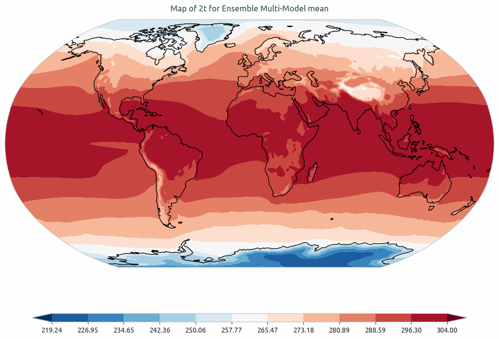

.. _ensemble_latlon:

Ensemble LatLon diagnostic
==========================

Description
-----------

The **EnsembleLatLon** diagnostic provides tools to compute and visualize ensemble statistics of 2D latitude-longitude spatial maps:

- Compute ensemble mean and standard deviation for 2D spatial maps
- Generate separate maps for ensemble mean and standard deviation
- Support multiple map projections

Classes
-------

There is one class for the analysis and one for the plotting:

* **EnsembleLatLon**: computes ensemble mean and standard deviation for 2D latitude-longitude spatial maps.
  Results are saved as class attributes and as NetCDF files.

* **PlotEnsembleLatLon**: provides methods for plotting spatial maps of ensemble mean and standard deviation.
  It generates separate maps for each statistic.

File structure
--------------

* The diagnostic is located in the ``aqua/diagnostics/ensemble`` directory, which contains both the source code and the command line interface (CLI) scripts.
* Template configuration files are available in the ``aqua/diagnostics/templates/diagnostics/config-ensemble_latlon.yaml`` directory.
* Notebooks are available in the ``notebooks/diagnostics/ensemble`` directory and contain examples of how to use the diagnostic.

Input variables and datasets
----------------------------

Before using the diagnostic, input data must be loaded and merged using the ``Reader`` class via 
``aqua.diagnostics.ensemble.util.reader_retrieve_and_merge``. The final merged dataset will contain all the requested ensemble members with appropriate metadata.
Alternatively, data can be provided as a list of NetCDF file paths and merged with ``merge_from_data_files``. 
The merged dataset must contain all ensemble members concatenated along a pseudo-dimension named ``ensemble`` (by default, but customizable).

A variable that is typically used in this diagnostic is:

* ``2t`` (2 metre temperature)
* ``msl`` (mean sea level pressure)

Example: loading and merging a 2D map ensemble into an ``xarray.Dataset``:

.. code-block:: python

   import glob
   from aqua.diagnostics import merge_from_data_files

   file_list = glob.glob(
       '/path/to/latlon/*.nc'
   )
   file_list.sort()

   ens_dataset = merge_from_data_files(
       variable='2t',
       model_names=['IFS-FESOM', 'IFS-NEMO'],
       data_path_list=file_list,
       log_level="WARNING",
       ens_dim="ensemble",
   )

Example: loading via the AQUA Reader

.. code-block:: python

   from aqua.diagnostics import reader_retrieve_and_merge

   ens_dataset = reader_retrieve_and_merge(
       variable='2t',
       catalog_list=['nextgems4', 'climatedt-phase1'],
       models_catalog_list=['IFS-FESOM', 'IFS-NEMO'],
       exps_catalog_list=['historical-1990', 'historical-1990'],
       sources_catalog_list=['aqua-atmglobalmean', 'aqua-atmglobalmean'],
       log_level="WARNING",
       ens_dim="ensemble",
   )

Basic usage
-----------

The basic usage of this diagnostic is explained with a working example in the notebook. 
The ensemble analysis is performed on merged ``2D`` map by ``EnsembleLatLon`` class.
The basic structure is the following: 

.. code-block:: python

    from aqua.diagnostics import EnsembleLatLon, PlotEnsembleLatLon

    atmglobalmean_ens = EnsembleLatLon(
        var='2t',
        dataset=ens_dataset,
        ensemble_dimension_name='ensemble',
    )
    atmglobalmean_ens.run()

    ens_latlon_plot = PlotEnsembleLatLon(
        model_list=['IFS-FESOM', 'IFS-NEMO'],
    )

    ens_latlon_plot.plot(
        var=var,
        save_pdf=True,
        save_png=True,
        title_mean='Map of 2t for Ensemble Multi-Model mean',
        title_std='Map of 2t for Ensemble Multi-Model standard deviation',
        cbar_label='2 meter temperature in K',
        dataset_mean=atmglobalmean_ens.dataset_mean,
        dataset_std=atmglobalmean_ens.dataset_std,
    )

.. note::

    If not specified otherwise, plots will be saved in PNG and PDF format in the current working directory

CLI usage
---------

The diagnostic can be run from the command line interface (CLI) by running the following command:

.. code-block:: bash

    cd $AQUA/aqua/diagnostics/ensemble
    python cli_latlon_ensemble.py --config <path_to_config_file>

Other CLI scripts available:

* ``cli_single_model_latlon_ensemble.py``: for single-model ensemble timeseries analysis

Additionally, the CLI can be run with the following optional arguments:

- ``--config``, ``-c``: Path to the configuration file.
- ``--nworkers``, ``-n``: Number of workers to use for parallel processing.
- ``--cluster``: Cluster to use for parallel processing. By default a local cluster is used.
- ``--loglevel``, ``-l``: Logging level. Default is ``WARNING``.
- ``--catalog``: Catalog to use for the analysis. Can be defined in the config file.
- ``--model``: Model to analyse. Can be defined in the config file.
- ``--exp``: Experiment to analyse. Can be defined in the config file.
- ``--source``: Source to analyse. Can be defined in the config file.
- ``--outputdir``: Output directory for the plots.

Configuration file structure
----------------------------

The configuration file is a YAML file that contains the details on the dataset to analyse or use as reference, the output directory and the diagnostic settings.
Most of the settings are common to all the diagnostics (see :ref:`diagnostics-configuration-files`).
Here we describe only the specific settings for the ensemble diagnostic.

* ``ensemble``: a block (nested in the ``diagnostics`` block) containing options for the Ensemble LatLon diagnostic.
  Variable-specific parameters override the defaults.

    * ``run``: enable/disable the diagnostic.
    * ``diagnostic_name``: name of the diagnostic. ``Ensemble LatLon`` for this diagnostic.
    * ``variable``: list of variables to analyse.
    * ``projection``: map projection (e.g., ``robinson``).
    * ``vmin`` / ``vmax``: colorbar limits for the mean plot.
    * ``vmin_std`` / ``vmax_std``: colorbar limits for the standard deviation plot.
    * ``cmap``: colormap to use.

.. code-block:: yaml

    ensemble:
        run: true
        diagnostic_name: 'Ensemble LatLon'
        variable: ['2t']
        params:
            default:
            tprate:
                standard_name: "tprate"
                long_name: "Precipitation"
                units: "mm/day"
        plot_params:
            default:
                projection: 'robinson'
                projection_params: {}
            2t:
                vmin: null
                vmax: null
                vmin_std: null
                vmax_std: null
                cmap: 'RdBu_r'

Output
------

The diagnostic produces the following outputs:

* 2D spatial map of ensemble mean
* 2D spatial map of ensemble standard deviation

Plots are saved in both PDF and PNG format.
Data outputs are saved as NetCDF files.
 
Example Plots
-------------

All plots can be reproduced using the notebooks in the ``notebooks`` directory on LUMI HPC.

    
    Ensemble mean of multi-model of global mean of 2-meter temperature. Models considered as IFS-NEMO and IFS-FESOM.  

.. figure:: figures/ensemble_2t_LatLon_STD.png
    :align: center
    :width: 100%
    
    Ensemble standard devation of multi-model of the global mean of 2-meter temperature. Models considered as IFS-NEMO and IFS-FESOM.

Available demo notebooks
------------------------

Notebooks are stored in the ``notebooks/diagnostics/ensemble`` directory and contain usage examples.

* `ensemble_global_2D.ipynb <https://github.com/DestinE-Climate-DT/AQUA-diagnostics/tree/main/notebooks/diagnostics/ensemble/ensemble_global_2D.ipynb>`_

Authors and contributors
------------------------

This diagnostic is maintained by Maqsood Mubarak Rajput (`@maqsoodrajput <https://github.com/maqsoodrajput>`_, `maqsoodmubarak.rajput@awi.de <mailto:maqsoodmubarak.rajput@awi.de>`_). 
Contributions are welcome — please open an issue or a pull request.  
For questions or suggestions, contact the AQUA team or the maintainer.

Detailed API
------------

This section provides a detailed reference for the Application Programming Interface (API) of the ``Ensemble LatLon`` diagnostic,
produced from the diagnostic function docstrings.

.. note::
   WORK IN PROGRESS

