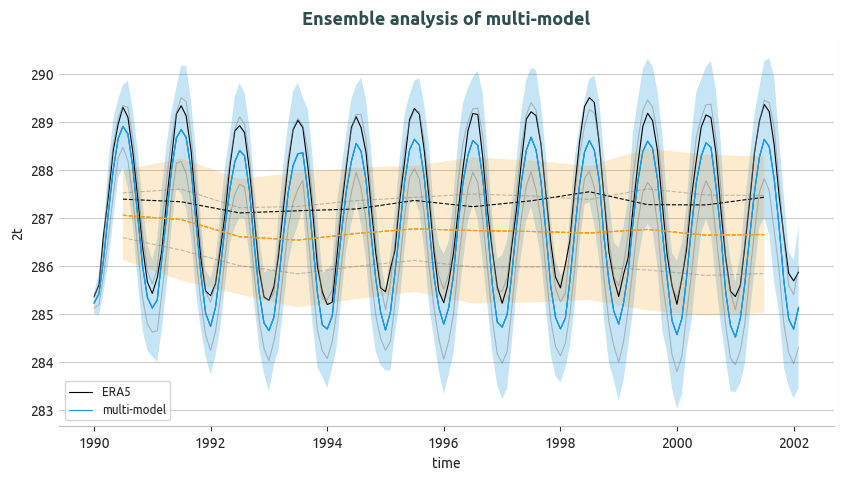

.. _ensemble_timeseries:

Ensemble Time series diagnostic
===============================

Description
-----------

The **Ensemble Time series** diagnostic provides tools to compute and visualize ensemble statistics of 1D time series data:

- Compute ensemble mean and standard deviation for monthly and annual time series
- Generate plots with ensemble mean and ±2 standard deviation envelope
- Compare ensemble statistics with reference datasets (e.g., ERA5)

Classes
-------

There is one class for the analysis and one for the plotting:

* **EnsembleTimeseries**: computes ensemble mean and standard deviation for 1D time series data.
  It handles both monthly and annual data, computing statistics point-wise along the time axis.
  Results are saved as class attributes and as NetCDF files.

.. note::

The standard deviation is computed point-wise along the time axis.  
A reference time series can also be added to the plot.

* **PlotEnsembleTimeseries**: provides methods for plotting time series with ensemble mean and ±2 standard deviation envelope.
  It supports adding a reference time series for comparison.

File structure
--------------

* The diagnostic is located in the ``aqua/diagnostics/ensemble`` directory, which contains both the source code and the command line interface (CLI) scripts.
* Template configuration files are available in the ``aqua/diagnostics/templates/diagnostics/config-ensemble_timeseries.yaml`` directory.
* Notebooks are available in the ``notebooks/diagnostics/ensemble`` directory and contain examples of how to use the diagnostic.

Input variables and datasets
----------------------------

Before using the diagnostic, input data must be loaded and merged using the ``Reader`` class via 
``aqua.diagnostics.ensemble.util.reader_retrieve_and_merge``. The final merged dataset will contain all the requested ensemble members with appropriate metadata.
Alternatively, data can be provided as a list of NetCDF file paths and merged with ``merge_from_data_files``. 
The merged dataset must contain all ensemble members concatenated along a pseudo-dimension named ``ensemble`` (by default, but customizable).

A variable that is typically used in this diagnostic is:

* ``2t`` (2 metre temperature)

Example: loading and merging a 1D monthly time series ensemble into an ``xarray.Dataset``:

.. code-block:: python

   import glob
   from aqua.diagnostics import merge_from_data_files

   file_list = glob.glob(
       '/path/to/monthly/timeseries/*.nc'
   )
   file_list.sort()

   ens_dataset = merge_from_data_files(
       variable='2t',
       model_names=['IFS-FESOM', 'IFS-NEMO'],
       data_path_list=file_list,
       log_level="WARNING",
       ens_dim="ensemble",
   )

Example: loading via the AQUA Reader

.. code-block:: python

   from aqua.diagnostics import reader_retrieve_and_merge

   ens_dataset = reader_retrieve_and_merge(
       variable='2t',
       catalog_list=['nextgems4', 'climatedt-phase1'],
       models_catalog_list=['IFS-FESOM', 'IFS-NEMO'],
       exps_catalog_list=['historical-1990', 'historical-1990'],
       sources_catalog_list=['aqua-atmglobalmean', 'aqua-atmglobalmean'],
       log_level="WARNING",
       ens_dim="ensemble",
   )

Basic usage
-----------

The basic usage of this diagnostic is explained with a working example in the notebook. 
The ensemble analysis is performed on merged ``1D`` timeseries by ``EnsembleTimeseries`` class.
The basic structure is the following:

.. code-block:: python

    from aqua.diagnostics import EnsembleTimeseries, PlotEnsembleTimeseries

    ts = EnsembleTimeseries(
        var='2t',
        model_list=['IFS-FESOM', 'IFS-NEMO'],
        monthly_data=mon_model_dataset,
        annual_data=ann_model_dataset,
        outputdir='./',
        loglevel='WARNING',
    )

    ts.run()

    ts_plot = PlotEnsembleTimeseries(
        model_list=['IFS-FESOM', 'IFS-NEMO'],
        ref_model='ERA5',
        loglevel='WARNING',
    )

    ts_plot.plot(
        var='2t',
        monthly_data=ts.monthly_data,
        monthly_data_mean=ts.monthly_data_mean,
        monthly_data_std=ts.monthly_data_std,
        annual_data=ts.annual_data,
        annual_data_mean=ts.annual_data_mean,
        annual_data_std=ts.annual_data_std,
        ref_monthly_data=mon_ref_data,
        ref_annual_data=ann_ref_data,
    )

.. note::

    Start/end dates and reference dataset can be customized.
    If not specified otherwise, plots will be saved in PNG and PDF format in the current working directory. 

CLI usage
---------

The diagnostic can be run from the command line interface (CLI) by running the following command:

.. code-block:: bash

    cd $AQUA/aqua/diagnostics/ensemble
    python cli_multi_model_timeseries_ensemble.py --config <path_to_config_file>

Other CLI scripts available:

* ``cli_single_model_timeseries_ensemble.py``: for single-model ensemble timeseries analysis

Additionally, the CLI can be run with the following optional arguments:

- ``--config``, ``-c``: Path to the configuration file.
- ``--nworkers``, ``-n``: Number of workers to use for parallel processing.
- ``--cluster``: Cluster to use for parallel processing. By default a local cluster is used.
- ``--loglevel``, ``-l``: Logging level. Default is ``WARNING``.
- ``--catalog``: Catalog to use for the analysis. Can be defined in the config file.
- ``--model``: Model to analyse. Can be defined in the config file.
- ``--exp``: Experiment to analyse. Can be defined in the config file.
- ``--source``: Source to analyse. Can be defined in the config file.
- ``--outputdir``: Output directory for the plots.
- ``--startdate``: Start date for the analysis.
- ``--enddate``: End date for the analysis.

Configuration file structure
----------------------------

The configuration file is a YAML file that contains the details on the dataset to analyse or use as reference, the output directory and the diagnostic settings.
Most of the settings are common to all the diagnostics (see :ref:`diagnostics-configuration-files`).
Here we describe only the specific settings for the Ensemble Time series diagnostic.

* ``ensemble``: a block (nested in the ``diagnostics`` block) containing options for the Ensemble Time series diagnostic.
  Variable-specific parameters override the defaults.

    * ``run``: enable/disable the diagnostic.
    * ``diagnostic_name``: name of the diagnostic. ``Ensemble Time series`` for this diagnostic.
    * ``variable``: list of variables to analyse.
    * ``region``: region to analyse (e.g., ``global``).
    * ``startdate_data`` / ``enddate_data``: time range for the dataset.
    * ``startdate_ref`` / ``enddate_ref``: time range for the reference dataset.
    * ``plot_ensemble_members``: if True, plot individual ensemble members.

.. code-block:: yaml

    ensemble:
        run: true
        diagnostic_name: 'EnsembleTimeseries'
        variable: ['2t']
        region: ['global']
        params:
            default:
                startdate_data: "1990-01-16"
                enddate_data: "2014-11-16"
                startdate_ref: "1990-01-16"
                enddate_ref: "2014-11-16"
        plot_params:
            default:
                title: null
                plot_ensemble_members: True

Output
------

The diagnostic produces the following outputs:

* Time series plots with ensemble mean and ±2 standard deviation envelope
* Optional reference dataset comparison

Plots are saved in both PDF and PNG format.
Data outputs are saved as NetCDF files.

Observations
------------

The default reference dataset is ERA5 reanalysis, provided by ECMWF.

Custom reference datasets can be configured in the configuration file.

Example Plots
-------------

All plots can be reproduced using the notebooks in the ``notebooks`` directory on LUMI HPC.

    
    Ensemble of multi-model global monthly and annual timeseries and compared with ERA5 global monthly and annual average. Models considered as IFS-NEMO and IFS-FESOM.

Available demo notebooks
------------------------

Notebooks are stored in the ``notebooks/diagnostics/ensemble`` directory and contain usage examples.

* `ensemble_timeseries.ipynb <https://github.com/DestinE-Climate-DT/AQUA-diagnostics/tree/main/notebooks/diagnostics/ensemble/ensemble_timeseries.ipynb>`_

Authors and contributors
------------------------

This diagnostic is maintained by Maqsood Mubarak Rajput (`@maqsoodrajput <https://github.com/maqsoodrajput>`_, `maqsoodmubarak.rajput@awi.de <mailto:maqsoodmubarak.rajput@awi.de>`_). 
Contributions are welcome — please open an issue or a pull request.  
For questions or suggestions, contact the AQUA team or the maintainer.

Detailed API
------------

This section provides a detailed reference for the Application Programming Interface (API) of the ``Ensemble Time series`` diagnostic,
produced from the diagnostic function docstrings.

.. note::
   WORK IN PROGRESS

