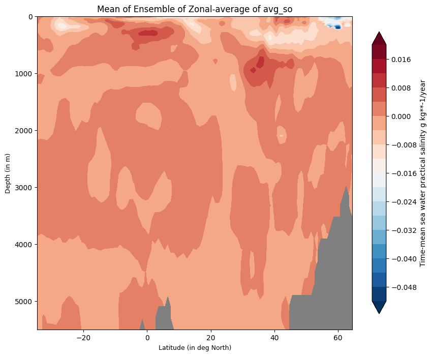
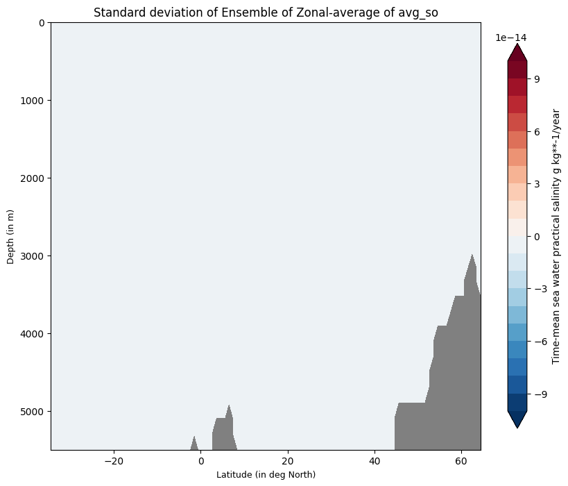

.. _ensemble_zonal:

Ensemble Zonal diagnostic
=========================

Description
-----------

The **EnsembleZonal** diagnostic provides tools to compute and visualize ensemble statistics of zonal-mean level-latitude cross-sections:

- Compute ensemble mean and standard deviation for zonal-mean cross-sections
- Generate contour plots showing ensemble statistics as functions of latitude and depth/level

Classes
-------

There is one class for the analysis and one for the plotting:

* **EnsembleZonal**: computes ensemble mean and standard deviation for zonal-mean level-latitude cross-sections.
  Results are saved as class attributes and as NetCDF files.

* **PlotEnsembleZonal**: provides methods for plotting zonal cross-sections of ensemble mean and standard deviation.

File structure
--------------

* The diagnostic is located in the ``aqua/diagnostics/ensemble`` directory, which contains both the source code and the command line interface (CLI) scripts.
* Template configuration files are available in the ``aqua/diagnostics/templates/diagnostics/config-ensemble_zonalmean.yaml`` directory.
* Notebooks are available in the ``notebooks/diagnostics/ensemble`` directory and contain examples of how to use the diagnostic.

Input variables and datasets
----------------------------

Before using the diagnostic, input data must be loaded and merged using the ``Reader`` class via 
``aqua.diagnostics.ensemble.util.reader_retrieve_and_merge``. The final merged dataset will contain all the requested ensemble members with appropriate metadata.
Alternatively, data can be provided as a list of NetCDF file paths and merged with ``merge_from_data_files``. 
The merged dataset must contain all ensemble members concatenated along a pseudo-dimension named ``ensemble`` (by default, but customizable).

Some of the variables that are typically used in this diagnostic are:

* ``so`` (sea water practical salinity)

Example: loading and merging a zonal ``Lev-Lon`` ensemble into an ``xarray.Dataset``:

.. code-block:: python

   import glob
   from aqua.diagnostics import merge_from_data_files

   file_list = glob.glob(
       '/path/to/LevLon/*.nc'
   )
   file_list.sort()

   ens_dataset = merge_from_data_files(
       variable='2t',
       model_names=['IFS-FESOM', 'IFS-NEMO'],
       data_path_list=file_list,
       log_level="WARNING",
       ens_dim="ensemble",
   )

Example: loading via the AQUA Reader

.. code-block:: python

   from aqua.diagnostics import reader_retrieve_and_merge

   ens_dataset = reader_retrieve_and_merge(
       variable='so',
       catalog_list=['nextgems4', 'climatedt-phase1'],
       models_catalog_list=['IFS-FESOM', 'IFS-NEMO'],
       exps_catalog_list=['historical-1990', 'historical-1990'],
       sources_catalog_list=['aqua-atmglobalmean', 'aqua-atmglobalmean'],
       log_level="WARNING",
       ens_dim="ensemble",
   )

Basic usage
-----------

The basic usage of this diagnostic is explained with a working example in the notebook.
The basic structure of the analysis is the following:

.. code-block:: python

    from aqua.diagnostics import EnsembleZonal, PlotEnsembleZonal

    zonal_ens = EnsembleZonal(
        var='avg_so',
        dataset=ens_dataset,
    )
    zonal_ens.run()

    ens_zm_plot = PlotEnsembleZonal(
        model_list=['IFS-NEMO', 'IFS-NEMO'],
    )

    ens_zm_plot.plot(
        var=var,
        save_pdf=True,
        save_png=True,
        title_mean='Mean of Ensemble of Zonal-average of avg_so',
        title_std='Standard deviation of Ensemble of Zonal-average of avg_so',
        cbar_label='Time-mean sea water practical salinity g kg**-1/year',
        dataset_mean=zonal_ens.dataset_mean,
        dataset_std=zonal_ens.dataset_std,
    )

.. note::

    If not specified otherwise, plots will be saved in PNG and PDF format in the current working directory.

CLI usage
---------

The diagnostic can be run from the command line interface (CLI) by running the following command:

.. code-block:: bash

    cd $AQUA/aqua/diagnostics/ensemble
    python cli_zonal_ensemble.py --config <path_to_config_file>

Additionally, the CLI can be run with the following optional arguments:

- ``--config``, ``-c``: Path to the configuration file.
- ``--nworkers``, ``-n``: Number of workers to use for parallel processing.
- ``--cluster``: Cluster to use for parallel processing. By default a local cluster is used.
- ``--loglevel``, ``-l``: Logging level. Default is ``WARNING``.
- ``--catalog``: Catalog to use for the analysis. Can be defined in the config file.
- ``--model``: Model to analyse. Can be defined in the config file.
- ``--exp``: Experiment to analyse. Can be defined in the config file.
- ``--source``: Source to analyse. Can be defined in the config file.
- ``--outputdir``: Output directory for the plots.
- ``--startdate``: Start date for the analysis.
- ``--enddate``: End date for the analysis.

Output
------

The diagnostic produces three types of plots:

* Time series with ensemble mean and ±2 standard deviation envelope
* 2D spatial maps of ensemble mean and standard deviation
* Zonal cross-section plots of ensemble mean and standard deviation

Plots are saved in both PDF and PNG format.
Data outputs are saved as NetCDF files.

Configuration file structure
----------------------------

The configuration file is a YAML file that contains the details on the dataset to analyse or use as reference, the output directory and the diagnostic settings.
Most of the settings are common to all the diagnostics (see :ref:`diagnostics-configuration-files`).
Here we describe only the specific settings for the ensemble zonal diagnostic.

* ``ensemble``: a block (nested in the ``diagnostics`` block) containing options for the Ensemble Zonal diagnostic.
  Variable-specific parameters override the defaults.

    * ``run``: enable/disable the diagnostic.
    * ``diagnostic_name``: name of the diagnostic. ``EnsembleZonal`` for this diagnostic.
    * ``variable``: list of variables to analyse.
    * ``region``: region to analyse (e.g., ``atlantic``).
    * ``figure_size``: figure size as [width, height].
    * ``mean_title`` / ``std_title``: titles for the plots.
    * ``cbar_label``: colorbar label.

.. code-block:: yaml

    ensemble:
        run: true
        diagnostic_name: 'EnsembleZonal'
        variable: ['so']
        region: ['atlantic']
        params:
            default:
        plot_params:
            default:
                figure_size: [10, 8]
                mean_title: null
                std_title: null
                cbar_label: null

Output
------

The diagnostic produces the following outputs:

* Contour plot of ensemble mean as a function of latitude and depth/level
* Contour plot of ensemble standard deviation as a function of latitude and depth/level

Plots are saved in both PDF and PNG format.
Data outputs are saved as NetCDF files.
 
Example Plots
-------------

All plots can be reproduced using the notebooks in the ``notebooks`` directory on LUMI HPC.

    
    Ensemble-Zonal mean for average Time-mean sea water practical salinity for IFS-NEMO historical-1990.

    Ensemble-Zonal standard deviation for average Time-mean sea water practical salinity for IFS-NEMO historical-1990.

Available demo notebooks
------------------------

Notebooks are stored in the ``notebooks/diagnostics/ensemble`` directory and contain usage examples.

* `ensemble_zonalaverage.ipynb <https://github.com/DestinE-Climate-DT/AQUA-diagnostics/tree/main/notebooks/diagnostics/ensemble/ensemble_zonalaverage.ipynb>`_

Authors and contributors
------------------------

This diagnostic is maintained by Maqsood Mubarak Rajput (`@maqsoodrajput <https://github.com/maqsoodrajput>`_, `maqsoodmubarak.rajput@awi.de <mailto:maqsoodmubarak.rajput@awi.de>`_). 
Contributions are welcome — please open an issue or a pull request.  
For questions or suggestions, contact the AQUA team or the maintainer.

Detailed API
------------

This section provides a detailed reference for the Application Programming Interface (API) of the ``Ensemble Zonal`` diagnostic,
produced from the diagnostic function docstrings.

.. note::
   WORK IN PROGRESS
