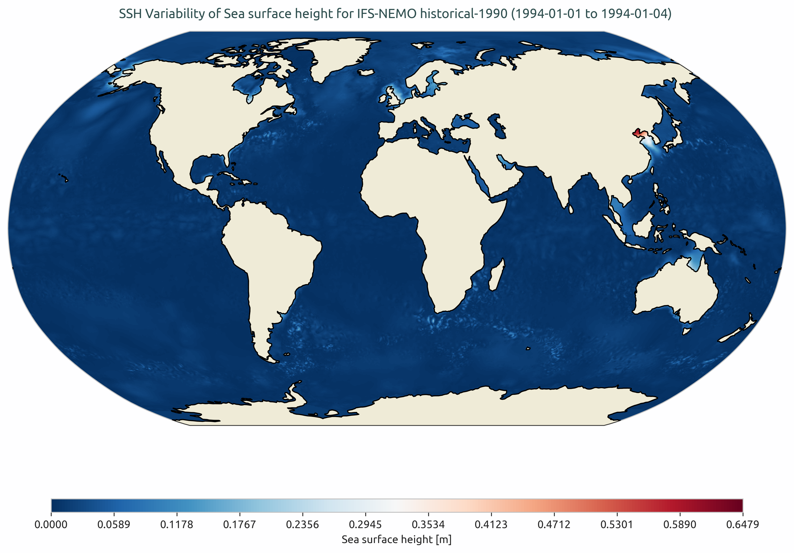
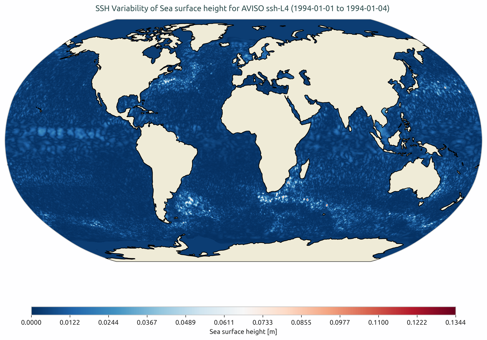
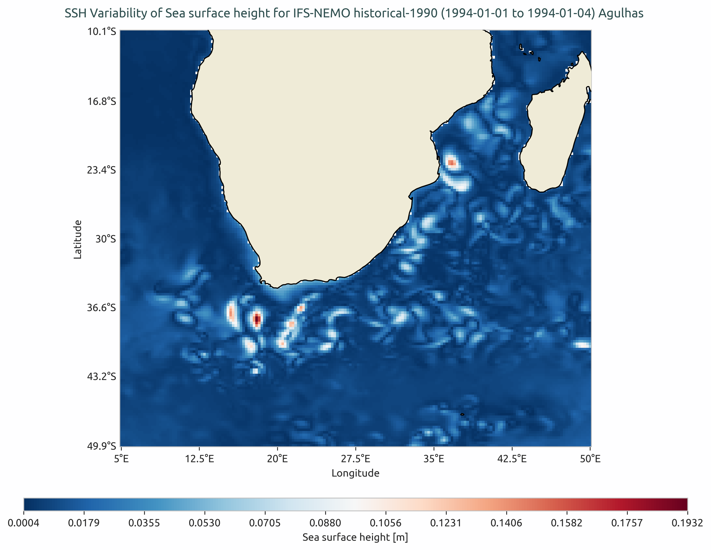
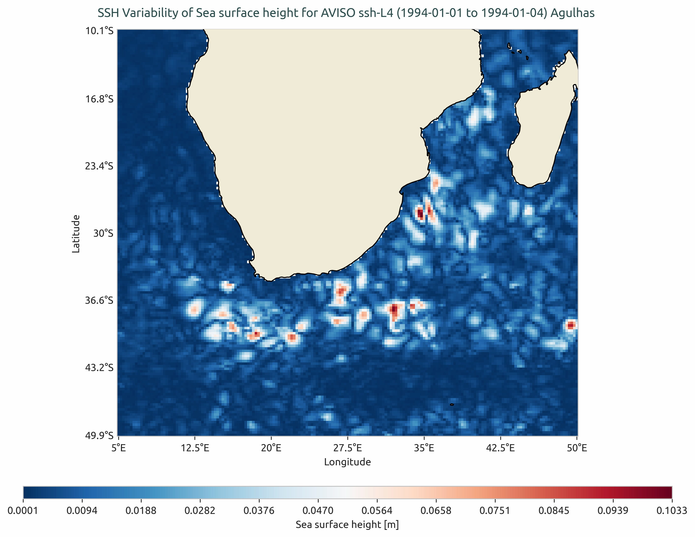
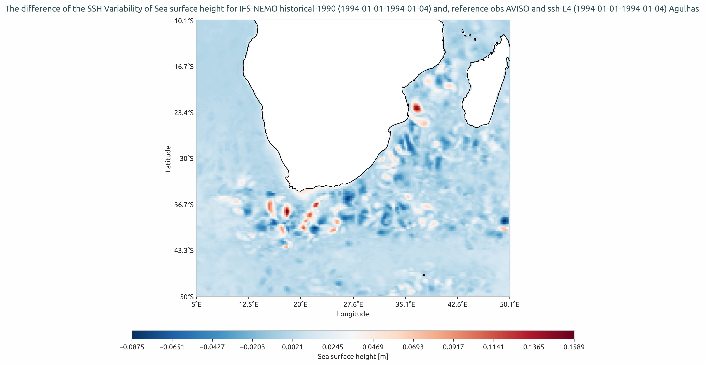

SSH variability
===============
Description
-----------

The **sshVariability** diagnostic is a part of AQUA framework's frontier diagnostic. It calculates the sea surface height (SSH) standard deviation for models (e.g. FESOM, ICON, NEMO)
and compares them against the AVISO model. This diagnotic can work on ``Healpix`` and standard ``Lat-Lon`` grid data. It also provides visualization of the SSH variability for the models. 
SSH variability provides insights into the complex dynamics of the ocean.
It represents the changes in sea surface height over time, which can be influenced by various factors such as ocean currents,
wind patterns, tides, and interactions with the atmosphere.
By studying SSH variability, we can gain a better understanding of oceanic processes and their impact on climate.
High-resolution climate models simulate fine-scale variations in SSH, capturing small-scale features and regional differences
highly relevant in the context of climate adaptation for instance, coastal management such as managing coastal hazards like
flooding or storm surges.

Classes
-------

There are two main classes in this diagnotic namely, **sshVariabilityCompute** and **sshVariabilityPlot**.

* **sshVariabilityCompute**: class to compute the ssh variability.
  It retrieves the data on it original grid with an option of regridding the data on a different resolution.
  Then the ssh standard deviation (point-wise) is computed along the given time interval. 
  If on time interval is provided, standard deviation will be perfromed over the whole domain.
  Then the data is stored in a netcdf file using the ``AQUA`` ``OutputSaver`` class.  

* **sshVariabilityPlot**: class to plot the sshVariability. 
  Once the standard deviation is performed, it can be passed to this class for plotting.
  This class plots the standard deviation for the given model and the reference AVISO data.
  It can also plot the difference between AVISO and the model standard deviation. 
  This class also provides a functionality to plot selected region and the difference plots of the region.
  The user may as well choose the resoution on which they would like to plot the data.  

* **BaseMixin**: this class is called inside the **sshVariabilityCompute** class.
  This class basically retrieves the data using the ``Reader`` class in AQUA core and provides the functionality to save the output as netcdf file.

* **PlotBaseMixin**: this class is called inside the **sshVariabilityPlot** class.
  It mainly provides the functionality to save the plots as ``PNG`` and ``PDF``.

File Structure
--------------

* The diagnostic is located in ``src/aqua_diagnostics/sshVariability`` directory, which contains both the source code and the command line interface (CLI) script.
* The configuration file for the CLI is located in ``config/diagnostics/sshVariability`` directory with default options.
* A notebook is avaliable in the ``notebooks/diagnostics/sshVariability/sshVariability.ipynb`` directory with an example for using this diagnostic.
* ``README.md`` : a readme file which contains technical information on how to install the SSH diagnostic and its environment and, the version of the diagnostic. 

Input variables and datasets
----------------------------

By default, the diagnostic compares against the AVISO dataset but can be configured to use any other dataset as a reference.
``zos`` or ``avg_zos`` is the variable which is used in this diagnostic. The output (netcdf, PNG and PDF) is stored using the ``OutputSaver`` class in both  **BaseMixin** and **PlotBaseMixin** classes.

The diagnostic is designed to work with both the data from the Low Resolution Archive (LRA) and the original high resolution Healpix data. The LRA is generated by the Data reduction OPerator (DROP) of the AQUA project, which provides monthly data at a 1x1 degree resolution. 

Basic Usage
-----------

The basic usage of this diagnostic is explained with a working example in the notebook provided in the ``notebooks/diagnostics/sshVariability`` directory.
The basic structure of the analysis is the following:

Example usage
-------------

.. code-block:: python

    from aqua.diagnostics import sshVariabilityCompute, sshVariabilityPlot

    # You can name these dictionaries as you like
    dataset_dict = {
        "catalog": "climatedt-phase1",
        "model": "IFS-NEMO",
        "exp": "historical-1990",
        "source": "ssh-IFS-NEMO-test",
        "regrid": "r025",
    }

    dataset_dict_ref = {
        "catalog": "obs",
        "model": "AVISO",
        "exp": "ssh-L4",
        "source": "ssh-AVISO-test",
        "regrid": "r025",
    }

    startdate = "1994-01-01"
    enddate = "1994-01-04"

    # Initialize the SSH compute class
    ssh_dataset = sshVariabilityCompute(
        **dataset_dict,
        var="zos",
        startdate=startdate,
        enddate=enddate,
    )

    # Run the compute function and save as NetCDF
    ssh_dataset.run()

    # Initialize the SSH compute class for reference data (AVISO)
    ssh_dataset_ref = sshVariabilityCompute(
        **dataset_dict_ref,
        var="zos",
        startdate=startdate,
        enddate=enddate,
    )

    # Run the compute function and save as NetCDF
    ssh_dataset_ref.run()

    # Initialize the SSH plot class
    plot_class = sshVariabilityPlot()

    # Plot SSH for model dataset
    plot_dataset = {"catalog": "climatedt-phase1", "model": "IFS-NEMO", "exp": "historical-1990"}
    plot_class.plot(
        dataset_std=ssh_dataset.data_std,
        **plot_dataset,
        startdate=startdate,
        enddate=enddate,
    )

    # Plot SSH for reference dataset
    plot_dataset_ref = {"catalog": "obs", "model": "AVISO", "exp": "ssh-L4"}
    plot_class.plot(
        dataset_std=ssh_dataset_ref.data_std,
        **plot_dataset_ref,
        startdate=startdate,
        enddate=enddate,
    )

    # Plot the diference of sub region for model dataset and reference dataset AVISO
    time_intervals = {
        "startdate": "1994-01-01", 
        "enddate": "1994-01-04", 
        "startdate_ref": "1994-01-01", 
        "enddate_ref": "1994-01-04",
    }

    region_selection = {
        "region": "Agulhas", 
        "lon_limits": [5, 50], 
        "lat_limits": [-10, -50], 
        "proj": "plate_carree", 
        "proj_params": {}, 
        "tgt_grid_name": "r3600x1800"
    }

    _dataset_ref = {
        "catalog_ref": "obs", 
        "model_ref": "AVISO", 
        "exp_ref":"ssh-L4",
    }

    _dataset = {
        "catalog": "climatedt-phase1", 
        "model": "IFS-NEMO", 
        "exp":"historical-1990",
    }

    plot_class.plot_diff(
        dataset_std=ssh_dataset.data_std, 
        dataset_std_ref=ssh_dataset_ref.data_std, 
        **_dataset, 
        **_dataset_ref, 
        **region_selection, 
        **time_intervals
    )

.. note::

    The user can also define the start and end date of the analysis and the reference dataset.  
    If not specified otherwise, plots will be saved in PNG and PDF format in the current working directory.

CLI usage
---------

The diagnostic can be run from the command line interface (CLI) by running the following command:

.. code-block:: bash

    cd $AQUA/src/aqua_diagnostics/sshVariability
    python cli_sshVariability.py --config_file <path_to_config_file>

Additionally, the CLI can be run with the following optional arguments:

- ``--config``, ``-c``: Path to the configuration file.
- ``--nworkers``, ``-n``: Number of workers to use for parallel processing.
- ``--cluster``: Cluster to use for parallel processing. By default a local cluster is used.
- ``--loglevel``, ``-l``: Logging level. Default is ``WARNING``.
- ``--catalog``: Catalog to use for the analysis. Can be defined in the config file.
- ``--model``: Model to analyse. Can be defined in the config file.
- ``--exp``: Experiment to analyse. Can be defined in the config file.
- ``--source``: Source to analyse. Can be defined in the config file.
- ``--outputdir``: Output directory for the plots.

Config file structure
---------------------

The configuration file is a YAML file that contains the details on the dataset to analyse or use as reference, the output directory and the diagnostic settings.
Most of the settings are common to all the diagnostics (see :ref:`diagnostics-configuration-files`).
Here we describe only the specific settings for the **sshVariability** diagnostic.

* ``sshVariability``: a block (nested in the ``diagnostics`` block) containing options for the SSH Variability diagnostic.  
  Variable-specific parameters override the defaults.

    * ``run``: enable/disable the diagnostic.
    * ``diagnostic_name``: name of the diagnostic. ``sshVariability`` by default.
    * ``variables``: list of variables to analyse. In ``sshVariability`` this variable is ``zos`` or ``avg_zos``.
    * ``startdate_data`` / ``enddate_data``: time range for the dataset.
    * ``startdate_ref`` / ``enddate_ref``: time range for the reference dataset.

.. code-block:: yaml
    
   diagnostics:
       sshVariability:
       run: true
       diagnostic_name: 'sshVariability'
       variables: 'zos'
       params:
           default:
               startdate_data: '1994-01-01'
               enddate_data: '1994-01-04'
               startdate_ref: '1994-01-01'
               enddate_ref: '1994-01-04'

* ``plot_params``: defines colorbar palette and limits and projection parameters.  
  The default parameters are used if not specified.
  Refer to 'src/aqua/util/projections.py' for available projections.
  Note that the plots can be stored on the original resolution or the data can be regridded to another resolution for a quick plot.
  The default for plotting regrid variable ``tgt_grid_name: 'r360x180'`` with the regridding method ``regrid_method: 'ycon'``. More options for regridding are documented on the topic of `Regridding in AQUA <https://aqua.readthedocs.io/en/latest/regrid.html>_` 

.. code-block:: yaml

   plot_params:
       default: 
           projection: 'robinson'
           projection_params: {}
           vmin: 
           vmax: 
           cmap: 'RdBu_r'
           tgt_grid_name: 'r360x180'
           regrid_method: 'ycon'        
       # sub region selection 
       sub_region : 
           name: Agulhas
           lon_limits: [5, 50]
           lat_limits: [-10, -50]
           projection: 'plate_carree'
           projection_params: {}
       # ONLY FOR ICON: Flags for northern and southern boundaries to mask out specific latitudes.
       # As AVISO does not have data under the sea ice, which ICON does, 
       # to make the datasets comparable - SSH under sea ice for ICON can be masked out.
       mask_options:
           mask_northern_boundary: true
           mask_southern_boundary: true
           northern_boundary_latitude: 70
           southern_boundary_latitude: -62

Output
------

The diagnostic produces four types of plots:

* Global SSH variability plots for the given model and the reference.  
* Global difference plot (model vs reference)  
* Regional SSH variability plots for the given model and the reference.  
* Regional difference plot (model vs reference)

Plots are saved in both PDF and PNG format.

Observations
------------

The default reference dataset is from AVISO Sea Surface Height Data, but custom references can be configured.

References
----------

* Copernicus Climate Change Service, Climate Data Store, (2018): Sea level gridded data from satellite observations for the global ocean from 1993 to present. Copernicus Climate Change Service (C3S) Climate Data Store (CDS). DOI: 10.24381/cds.4c328c78 (Accessed on 01-Mar-2023)

Example Plot(s)
---------------

    SSH Variability for IFS-NEMO historical-1990. 

    SSH Variability for AVISO data.

    SSH Variability for IFS-NEMO in Agulhas region.

    SSH Variability for AVISO in Agulhas region.

    SSH Variability difference between IFS-NEMO and AVISO in Agulhas region.

Available demo notebooks
------------------------

Notebooks are stored in the ``notebooks/diagnostics/sshVariability`` directory and contain usage examples.

* `sshVariability.ipynb <https://github.com/DestinE-Climate-DT/AQUA/blob/main/notebooks/diagnostics/sshVariability/sshVariability.ipynb>`_

Authors and contributors
------------------------
This diagnostic is authored and maintained by Maqsood Mubarak Rajput (`@maqsoodrajput <https://github.com/maqsoodrajput>`_, `maqsoodmubarak.rajput@awi.de <mailto:maqsoodmubarak.rajput@awi.de>`_).
Contributions are welcome — please open an issue or a pull request.  
For questions or suggestions, contact the AQUA team or the maintainers.

Detailed API
------------

This section provides a detailed reference for the Application Programming Interface (API) of the ``sshVariability`` diagnostic,
produced from the diagnostic function docstrings.

.. automodule:: aqua.diagnostics.sshVariability
    :members:
    :undoc-members:
    :show-inheritance:
