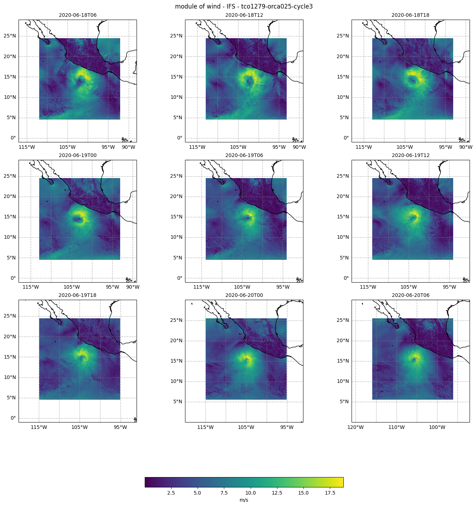
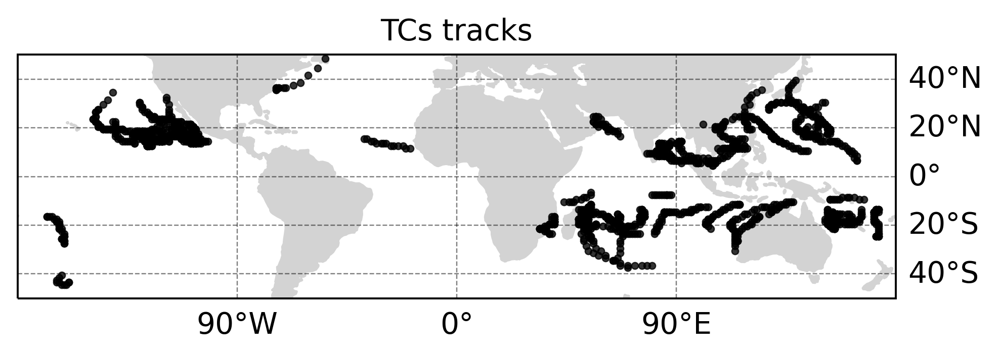

Tropical Cyclones detection, tracking and zoom in diagnostic
============================================================

Description
-----------

This diagnostic package provides a tool to detect tropical cyclones (TCs) and compute their trajectories. Moreover it allows one to save selected variables
in the vicinity of the TCs centres. The purpose of this diagnostic is to analyse how some variables of interest such as pressure, wind, wind gusts and precipitation
associated with tropical cyclones are represented in high-resolution climate simulations, in particular their intensity and spatial pattern. Detection and tracking
of TCs can be also used to compute TCs trajectories and compare them with other climate simulations and observations.

Structure
-----------

The tropical cyclones diagnostic follows a class structure and consists of the files:

* `notebooks/tropical_cyclones.ipynb`: a python notebook which provides an example use of the TCs diagnostic, including the TCs class initialisation, a wrapper function which calls the DetectNodes and StitchNodes functions from tempest-extremes (which now are implemented as methods of the TCs class) and saves the data in the vicinity of the detected TCs at each time step and for the TCs tracks in a considered time interval. Finally some plotting functions are included to plot some selected variables at a few time steps and the TCs tracks in a particular period;
* `tropical_cyclones/tropical_cyclones.py`: a python file in which the TCs class constructor and the other class methods are included; it contains the wrapper function which retrieves data from the reader and prepares them for DetectNodes and StitchNodes, it runs DetectNodes and StitchNodes and finally saves the variables in the vicinity of TCs tracks in a netcdf file;
* `tropical_cyclones/detect_nodes.py`: class with all methods related to DetectNodes;
* `tropical_cyclones/stitch_nodes.py`: class with all methods related to StitchNodes;
* `tropical_cyclones/tools/tempest_utils.py`: a python file which contains some functions (external to the tropical cyclones class) to analyse the output text files produced by running the tempest-extremes methods DetectNodes and StitchNodes;
* `tropical_cyclones/tools/tcs_utils.py`: contains some functions external to the TCs class but called by the TCs class methods;
* `tropical_cyclones/plots/plotting_TCs.py`: a python file which contains the plotting functions;
* `tropical_cyclones/aqua_dask.py`: python file which contains a class to initialise Dask and its methods to set and close Dask when it is needed;
* `cli/tropical_cyclones_cli.py`: a python file with the command line interface for tropical cyclones diagnostic; can be executed as python script or as slurm job;
* `cli/run_TCs_LEVANTE.job`: script to run tropical_cyclones_cli.py as slurm job on LEVANTE. See dedicated README file in the cli folder;
* `cli/run_TCs_LUMI.job`: script to run tropical_cyclones_cli.py as slurm job on LUMI;
* `cli/config_tcs.yml`: a yaml file in which all parameters are configured (including variables to save) and paths are specified. Version for Levante;
* `pyproject.toml` : file to build pyproject of the tropical cyclones diagnostic;
* `README.md` : a readme file which contains some tecnical information on how to install the tropical cyclones diagnostic and its environment. 

Input variables
---------------

* `msl`     (Mean sea level pressure, GRIB paramid 151)
* `z`       (Geopotential height, GRIB paramid 129 at 300 and 500 hPa and at the surface (orography))
* `10u`     (2m zonal wind, GRIB paramid 165)
* `10v`     (2m meridional wind, GRIB paramid 166)

Output 
------

Here is a list of files produced by the tropical cyclones diagnostic. The following files are saved in a "$tmpdir/model_name/exp_name" directory (configured in the configuration yml):

* tempest_output_yyyymmddThh.txt:            text files produced by Tempest DetectNodes with TCs centres coordinates and maximum wind at each time step; 
* tempest_track_yyyymmddThh-yyyymmddThh.txt: text files produced by Tempest StitchNodes with TCs centres coordinates and maximum wind; for each TC trajectory (i.e. after tracking is applied); 

The following files are saved in "$fullres/model_name/exp_name" directory:

* TC_fullres_yyyymmddThh.nc:                 netcdf files with selected variables (at original model resolution) in the vicinity of each TC centre detected at each time step;
* tempest_tracks_yyyymmddThh-yyyymmddThh.nc: netcdf files with selected variables (at original model resolution) in the vicinity of each TC centre following TCs trajectories (includes time dimension, yyyymmddThh-yyyymmddThh states the start-end period considered).

Example of outpud variables saved in the vicinity of TCs centres are:

* `msl`     (Mean sea level pressure, GRIB paramid 151)
* `10u`     (10m zonal wind, GRIB paramid 165)
* `10v`     (10m meridional wind, GRIB paramid 166)
* `pr`      (Total precipitation, GRIB paramid 228)
* `10fg`    (10m wind gust since the last postprocessing, GRIB paramid 49)

Figures include output variables in the vicinity of TCs centres at various time steps (useful to compare wind intensity, precipitation distribution
and intensity between original resolution and a coarser resolution or with observations) and a figure with all the TCs tracks in the period considered.

Methods used
------------

Examples from the TCs class contained in the tropical_cyclones.py and its related detect_nodes.py and stitch_nodes.py files:

* "TCs": the tropical cyclones class;
* "catalog_init": initializes the Reader object for retrieving the atmospheric data needed (i.e. the input and output vars);
* "data_retrieve": retrieves atmospheric data from the Reader and stores them in data arrays. It includes the posibility of simulating the streaming of data. It updates the stream_startdate and stream_enddate attributes if streaming is set to True;
* "loop_streaming": Wrapper for data retrieve, DetectNodes and StitchNodes. Simulates streaming data processing by retrieving data in chunks and performing TCs node detection and stitching looping over time steps;
* "readwrite_from_intake": regrids the atmospheric data, saves it to disk as a netCDF file, and updates the tempest_dictionary and tempest_filein attributes of the Detector object;
* "run_detect_nodes: runs the tempest extremes DetectNodes command on the regridded atmospheric data specified by the tempest_dictionary and tempest_filein attributes, saves the output to disk, and updates the tempest_fileout attribute of the Detector object;
* "detect_nodes_zoomin": wrapper which calls the readwrite_from_intake, run_detect_nodes and store_detect_nodes methods in a time loop;
* "stitch_nodes_zoomin": wrapper which calls the run stitch_nodes and store_stitch_nodes methods in a time loop;
* "lonlatbox": creates a lon lat box of specified width (in degrees). Called to store the original resolution vars only in a box centred over the TCs centres;
* "store_fullres_field": function to write original resolution variables around TCs centres and their trajectories. Output produced in a netcdf file.

Functions used
--------------

The python file tempest_utils.py contains some functions used to analyse the raw output of tempest-extremes:

* "getNodes": Retrieves nodes (i.e. TCs centres in thi s case) from a TempestExtremes file (.txt output from DetectNodes);
* "getTrajectories": Retrieves trajectories from a TempestExtremes file (.txt file generated from StitchNodes).

These functions are largerly based on the ones found in the CyMeP repository by Colin Zarzycki (https://github.com/zarzycki/cymep).

The python file tcs_utils.py contains some functions called by the TCs class and the DetectNodes and StitchNodes classes but external to them:

* "lonlatbox": define the list for the box to retain high res data in the vicinity of the TC centres;
* "write_fullres_field": writes the high resolution file (netcdf) format with values only within the TCs centres box.

Observations
------------

Tropical cyclones tracks and variables structure in the vicinity of TCs are compared with ERA5 reanalysis data.

References
----------

* tempest-extremes GitHub: https://github.com/ClimateGlobalChange/tempestextremes
* CyMeP GitHub: https://github.com/ClimateGlobalChange/tempestextremes
* Ullrich, P.A., C.M. Zarzycki, E.E. McClenny, M.C. Pinheiro, A.M. Stansfield and K.A. Reed (2021) "TempestExtremes v2.1: A community framework for feature detection, tracking and analysis in large datasets" Geosci. Model. Dev. 14, pp. 5023–5048, `DOI <10.5194/gmd-14-5023-2021>`. 
* Zarzycki, C. M., P. A. Ullrich, and K. A. Reed, 2021: Metrics for Evaluating Tropical Cyclones in Climate Data. J. Appl. Meteor. Climatol., 60, 643–660, `DOI <https://doi.org/10.1175/JAMC-D-20-0149.1>`.

Example Plot(s)
---------------

    Module of wind in the vicinity of a tropical cyclone following its trajectory (from the nextGEMS IFStco1279-orca025-cycle3 simulation).

    
    Example of TCs trajectories computed from the nextGEMS IFS simulation tco1279-orca025-cycle3. Note the extratropical cyclone identifided offshore the East Coast of the US which might have been erroneously classified as tropical by the TempestExtremes algorithm.

Available demo notebooks
------------------------

Notebooks are stored in diagnostics/tropical_cyclones/notebooks

* `tropical_cyclones.ipynb <https://github.com/oloapinivad/AQUA/blob/main/diagnostics/tropical_cyclones/notebooks/tropical_cyclones.ipynb>`_

        
Detailed API
------------

This section provides a detailed reference for the Application Programming Interface (API) of the "tropical_cyclones" diagnostic,
produced from the diagnostic function docstrings.

.. automodule:: tropical_cyclones
    :members:
    :undoc-members:
    :show-inheritance:
