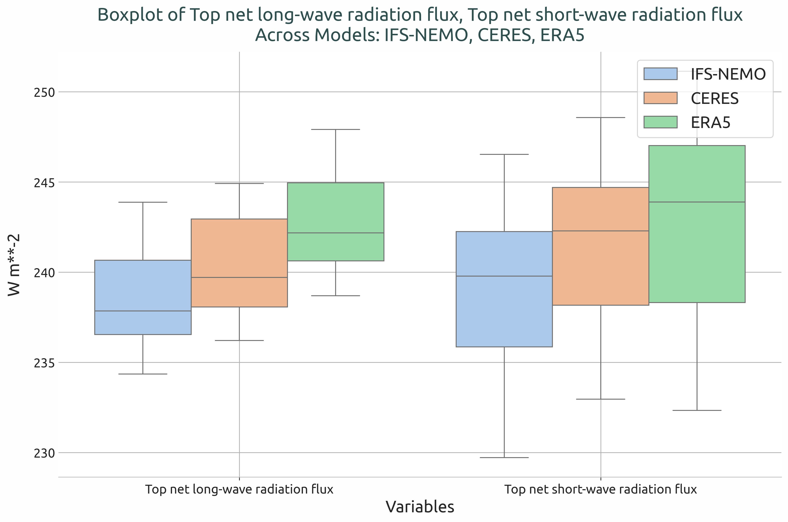
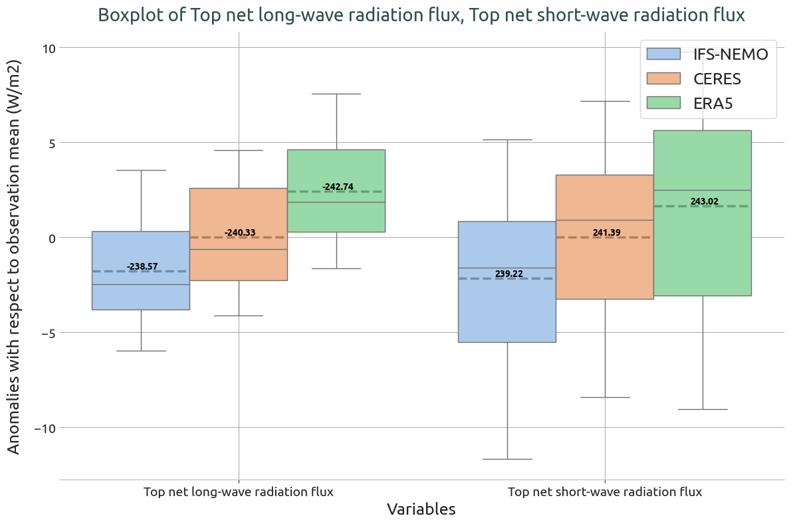

Boxplots Diagnostic
=============================

Description
-----------

The **Boxplots** diagnostic computes and visualizes boxplots of spatial field means 
from climate model datasets, for one or multiple variables, over a specified time period.
The diagnostic is designed with a class that analyzes a single model and generates the NetCDF 
files with the field means, and another class that produces the plots.

Classes
-------

There is one class for the analysis and one for the plotting:

* **Boxplots**: It retrieves the data and prepares it for plotting (e.g., regridding, unit conversion).  
  It also handles the computation of field means, which are saved as class attributes and as NetCDF files.

* **PlotBoxplots**: This class provides methods for plotting the boxplots of the field means computed by the Boxplots class. 

File structure
--------------

* The diagnostic is located in the ``aqua/diagnostics/boxplots`` directory, which contains 
  both the source code and the command line interface (CLI) script.
* A template configuration file is available at ``aqua/diagnostics/templates/diagnostics/config-boxplots.yaml``
* Notebooks are available in the ``notebooks/diagnostics/boxplots`` directory and contain examples 
  of how to use the diagnostic.

Input variables and datasets
----------------------------

The diagnostic can be used with any dataset that contains spatial fields. Multimodel datasets 
can be analyzed, and the diagnostic can be configured to compare against multiple reference 
datasets.
All analyzed variables should share the same units to ensure meaningful comparisons; otherwise, 
the diagnostic will raise an error.
The diagnostic is designed to work with data from the Data Reduction OPerator (DROP) of the AQUA 
project which, in this case, provides monthly data at a 1x1 degree resolution (Low Resolution 
Archive, LRA).  
A higher resolution is not necessary for this diagnostic.

Basic usage
-----------

The basic usage of this diagnostic is explained with a working example in the notebook provided in the ``notebooks/diagnostics/boxplots`` directory.  
The basic structure of the analysis is the following:

.. code-block:: python

    from aqua.diagnostics import Boxplots, PlotBoxplots

    variables = ['-tnlwrf', 'tnswrf']

    boxplots = Boxplots(model='IFS-NEMO', exp='historical-1990', source='lra-r100-monthly')
    boxplots.run(var=variables)

    boxplots_era5 = Boxplots(model='ERA5', exp='era5', source='monthly')
    boxplots_era5.run(var=variables)

    boxplots_ceres = Boxplots(model='CERES', exp='ebaf-toa41', source='monthly', regrid='r100')
    boxplots_ceres.run(var=variables)

    datasets = boxplots.fldmeans
    datasets_ref = [boxplots_ceres.fldmeans, boxplots_era5.fldmeans]

    plot = PlotBoxplots(diagnostic='radiation')
    plot.plot_boxplots(data=datasets, data_ref=datasets_ref, var=variables)

CLI usage
---------

The diagnostic can be run from the command line interface (CLI) by running the following command:

.. code-block:: bash

    cd $AQUA/aqua/diagnostics/boxplots
    python cli_boxplots.py --config_file <path_to_config_file>

Additionally, the CLI can be run with the following optional arguments:

- ``--config``, ``-c``: Path to the configuration file.
- ``--nworkers``, ``-n``: Number of workers to use for parallel processing.
- ``--cluster``: Cluster to use for parallel processing. By default, a local cluster is used.
- ``--loglevel``, ``-l``: Logging level. Default is ``WARNING``.
- ``--catalog``: Catalog to use for the analysis. Can be defined in the config file.
- ``--model``: Model to analyse. Can be defined in the config file.
- ``--exp``: Experiment to analyse. Can be defined in the config file.
- ``--source``: Source to analyse. Can be defined in the config file.
- ``--outputdir``: Output directory for the plots.

Configuration file structure
----------------------------

The configuration file is a YAML file that contains the details on the dataset to analyse or use as reference, the output directory and the diagnostic settings.
Most of the settings are common to all the diagnostics (see :ref:`diagnostics-configuration-files`).
Here we describe only the specific settings for the boxplots diagnostic.

* ``boxplots``: a block (nested in the ``diagnostics`` block) containing options for the Boxplots diagnostic.  
  Variable-specific parameters override the defaults.

    * ``run``: enable/disable the diagnostic.
    * ``diagnostic_name``: name of the diagnostic. ``boxplots`` by default, but can be changed when the boxplots CLI is invoked within another ``recipe`` diagnostic, as is currently done for ``Radiation``.
    * ``variables``: list of variables to analyse.

.. code-block:: yaml

    diagnostics:
      boxplots:
        run: true
        diagnostic_name: 'radiation'
        variables: ['-tnlwrf', 'tnswrf']

Output
------

The diagnostic produces a single plot:

* A boxplot showing the distribution of the field means for each variable across the specified models and reference datasets. 
  If reference datasets are provided and the ``anomalies`` option is set to ``True``, the boxplot will show anomalies with respect to the mean of the selected reference dataset. 
  With the ``add_mean_line`` option set to ``True``, dashed lines indicating the absolute mean values will be added to the boxplots.
  Plots are saved in both PDF and PNG format.

Example plots
-------------

   
   Box plot showing the globally averaged incoming and outgoing TOA radiation of IFS-NEMO historical-1990 with respect to ERA5 and CERES climatologies

   Box plot showing the anomalies of the globally averaged incoming and outgoing TOA radiation of IFS-NEMO historical-1990 with respect to the ERA5 climatology.
   The dashed lines indicates the absolute mean values.

Available demo notebooks
------------------------

Notebooks are stored in ``notebooks/diagnostics/boxplots``:

* `boxplots.ipynb <https://github.com/DestinE-Climate-DT/AQUA-diagnostics/tree/main/notebooks/diagnostics/boxplots/boxplots.ipynb>`_ 

Detailed API
------------

This section provides a detailed reference for the Application Programming Interface (API) of the ``Boxplots`` diagnostic, produced from the diagnostic function docstrings.

.. automodule:: aqua.diagnostics.boxplots
    :members:
    :undoc-members:
    :show-inheritance:
