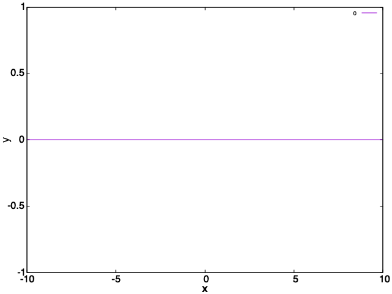

:orphan:

Dummy Diagnostic
================

Dummy diagnostic provides a template for AQUA diagnostics and includes guidance for developers.
It also explains the scientific motivation for the diagnostic, describes its purpose and
clarifies the code structure used for generating the associated plots.
Please try to adhere to the suggested scheme as far as possible.

Description
-----------

Please write here in a clear and concise manner what the diagnostic is about,
what it is supposed to be doing and the motivation behind it (i.e. which phenomenon or physical process 
is diagnosed and why it is important in the context of the analysis of high-resulution climate simulations).
If the diagnostic is based on published material, include references (we have a reference section below).

Example:
    The Dummy diagnostic is a set of tools for analysis and visualisation of [...]
    It supports comparative analysis between a climate model and a reference dataset (e.g., ERA5).

    The diagnostic provides:
    - write the diagnostic-specific functionalities

Classes
-----------

AQUA diagnostics follow a separation between analysis classes and plotting classes.
Classes:

* DummyDiagnostic: retrieves data, regrids, aggregates, computes derived variables.
* PlotDummy: generates plots using data prepared by Dummy.

(see :ref:`diagnostic-class_structure`) for design principles.

File structure
-----------

Directory locations:

* Source code and CLI: ``aqua/diagnostics/dummy/``
* Template configuration file: ``aqua/diagnostics/templates/diagnostics/config-dummy.yaml``
* Notebooks: ``notebooks/diagnostics/dummy/``
* Interface files (optional): ``aqua/diagnostics/config/tools/dummy/`` — for custom regions, variable definitions, or other diagnostic-specific settings.

The source code directory contains the following files:

* ``dummy.py``: the main Python file containing the Dummy analysis class constructor and methods;
* ``plot_dummy.py``: a Python file containing the PlotDummy class for visualization;
* ``util.py``: a Python file containing utility functions used by the diagnostic classes;
* ``cli_dummy.py``: a Python file containing the command line interface (CLI) of the diagnostic;
* ``README.md``: a readme file containing technical information on installation and environment setup.

Input variables and datasets
------------------------------

List here the variables used by this diagnostic. If a reference dataset is used, specify which one.
The list of variables analysed by default is provided in the configuration files.

Example variables:

* ``2t`` (2 metre temperature, GRIB paramid 167)
* ``tprate`` (total precipitation rate, GRIB paramid 260048)

The diagnostic is designed to work with data from the Low Resolution Archive (LRA), generated by
the Data reduction OPerator (DROP) of the AQUA project, which provides monthly data at a 1x1
degree resolution.

Basic usage
-----------

.. code-block:: python

    from aqua.diagnostics import Dummy, PlotDummy

    # Analysis
    diag = Dummy(model='IFS-NEMO', exp='historical-1990', source='lra-r100-monthly')
    diag.retrieve(var='2t')
    diag.compute()

    # Plotting
    plotter = PlotDummy()
    plotter.plot(data=diag.result, var='2t')

.. note::
    Start/end dates and reference dataset can be customized.
    Plots are saved in PNG and PDF format in the current directory by default.

CLI usage
---------

.. code-block:: bash

    cd $AQUA/AQUA-diagnostics/aqua/diagnostics/dummy/
    python cli_dummy.py --config <path_to_config_file>

Common options: ``--model``, ``--exp``, ``--source``, ``--outputdir``, ``--loglevel``, ``--nworkers``.

For the complete list, see :ref:`diagnostics-cli-arguments`.

Configuration file structure
---------------------

The configuration file is a YAML file containing dataset details, output directory, and diagnostic settings.
Common settings are documented in :ref:`diagnostics-configuration-files`.

Diagnostic-specific settings (nested in ``diagnostics`` block):

.. code-block:: yaml

    diagnostics:
      dummy:
        run: true
        diagnostic_name: 'dummy'
        variables: ['2t', 'tprate']
        formulae: []
        params:
          default:
            option1: value1
          2t:
            option1: custom_value  # variable-specific override

    plot_params:
      default:
        cmap: 'RdBu_r'
      2t:
        vmin: -15
        vmax: 15

Output 
------

List here types of files/datasets produced by the diagnostic.
Please keep in mind that diagnostic output should be both figures (PDF format is recommended)
and data (NetCDF file is recommended). 

Observations
------------

If relevant, list the observational datasets used by this diagnostic (e.g. for validation/comparison).
Some examples are ERA5 reanalysis, CERES, MSWEP etc...

Example Plots
---------------

    An illustration of the big void left by this diagnostic

Available demo notebooks
------------------------

* `dummy.ipynb <https://github.com/DestinE-Climate-DT/AQUA/blob/main/notebooks/diagnostics/dummy/dummy.ipynb>`_
        
References
----------

* E. Empty, D. Dummy et al. (2023) The art of saying nothing. Emptyness, 1: 0-1. `DOI <http://doi.org/00.0000/e-00000-000.xxxx>`_

Authors and contributors
------------------------

This diagnostic is maintained by [Name] (`@github_username`_, `email@example.com`_).
Contributions are welcome, please open an issue or a pull request.
For questions or suggestions, contact the AQUA team or the maintainers.

Detailed API
------------

This section provides a detailed reference for the Application Programming Interface (API) of the "dummy" diagnostic,
produced from the diagnostic function docstrings.

.. .. automodule:: dummy
..     :members:
..     :undoc-members:
..     :show-inheritance:
