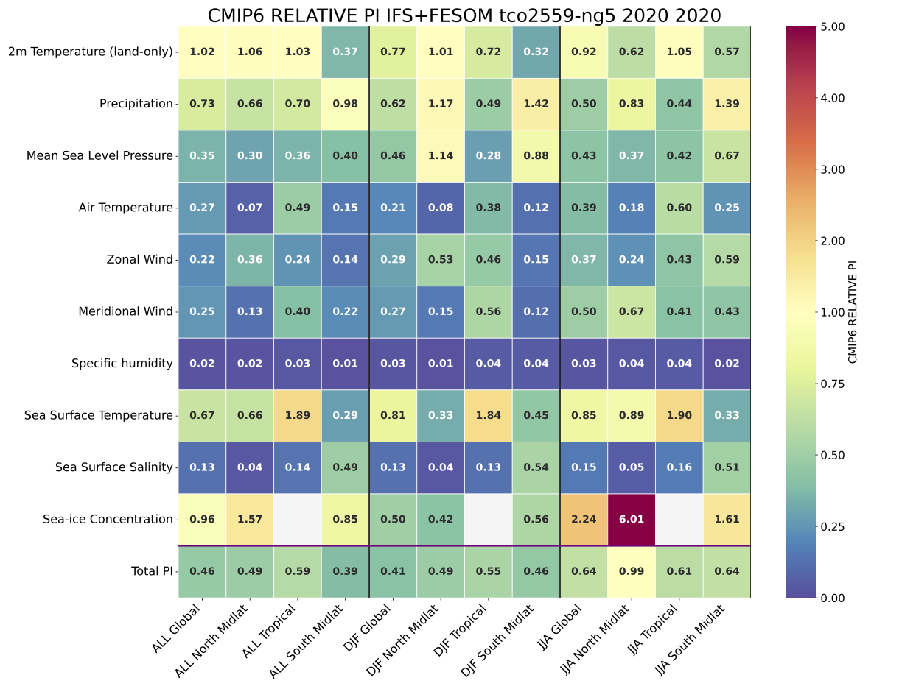

ECmean4 Performance Metrics
===========================

Description
-----------
`ECmean4 <https://pypi.org/project/ECmean4>`_  is an open-source Python package integrated into AQUA to compute a set of baseline performance metrics for climate-model evaluation.
It provides two complementary metrics:

- the Reichler & Kim Performance Indices (PIs)

- the Global Means (GMs)

Together, these metrics quantify the climatological *skill* of atmospheric and oceanic fields relative to observations.

**Performance Indices (PIs)**

PIs follow the Reichler and Kim (2008) `Reichler and Kim Performance Indices <https://journals.ametsoc.org/view/journals/bams/89/3/bams-89-3-303.xml>`_, definition, with the adjustments implemented in ECmean4.
For reference, see also * Reichler, T., and J. Kim, 2008: How Well Do Coupled Models Simulate Today's Climate?. Bull. Amer. Meteor. Soc., 89, 303-312, https://doi.org/10.1175/BAMS-89-3-303.
Key differences from the original formulation include: 

- metrics are computed on a common grid (1x1 deg) instead of the model grid
- updated reference climatologies
- PI estimates available for multiple regions and seasons

Formally, each PI is defined as the root-mean-square error (RMSE) of a 2D field normalized by the interannual variance of the corresponding observations.
Higher values indicate poorer performance (i.e. larger bias).
In ECmean4 plots, PIs are normalized by the precomputed average of CMIP6 climate models:
values < 1 indicate a better performance than the CMIP6 average.

**Global Means (GMs)**


The GM metric consists of global averages of sany dynamical and physical fields, compared against a set of pre-computed climatological values
for both the atmosphere and the ocean (e.g. land temperature, salinity, etc.). 
Multiple observational datasets are taken in consideration for each variable, providing an estimate of the plausible variability in the form of interannual standard deviation.
GMs provides also estimate for the radiative budget  and for the hydrological cycle (including integrals over land and ocean) 
and other quantities useful for fast model assessment and for model tuning.

Classes
-------
For detailed information on the code, please refer to the `official ECmean4 documentation <https://ecmean4.readthedocs.io/en/latest/>`_.  

File structure
--------------
* The diagnostic is located in the ``aqua/diagnostics/ecmean`` directory, which contains the command line interface (CLI) script `cli_ecmean.py`.  
* A template configuration file is available at ``aqua/diagnostics/templates/diagnostics/config-ecmean.yaml``
* The configuration file for ECmean4 specific settings (variables and regions) is located in ``aqua/diagnostics/config/tools/ecmean/ecmean_config_climatedt.yaml``.
* The interface file to map AQUA variable names to ECmean4 standard names is located in ``aqua/diagnostics/config/tools/ecmean/interface/interface_AQUA_climatedt.yaml``.
* Notebooks are available in the ``notebooks/diagnostics/ecmean`` directory and contain examples of how to use the diagnostic.  

For detailed information on the code, please refer to the `official ECmean4 documentation <https://ecmean4.readthedocs.io/en/latest/>`_.  


Input variables and datasets
----------------------------

For **Performance Indices** the following variables are requested:

* ``mtpr`` (Mean total precipitation rate, GRIB paramid 235055)
* ``2t``     (2 metre temperature, GRIB paramid 167)
* ``msl``    (mean sea level pressure, GRIB paramid 151)
* ``metss``  (eastward wind stress, GRIB paramid 180)
* ``mntss``  (northward wind stress, GRIB paramid 181)
* ``t``      (air temperature, GRIB paramid 130)        
* ``u``      (zonal wind, GRIB paramid 131)
* ``v``      (meridional wind, GRIB paramid 132)
* ``q``      (specific humidity, GRIB paramid 133)
* ``avg_tos``    (sea surface temperature, GRIB paramid 263101)
* ``avg_sos``    (sea surface salinity, GRIB paramid 263100)
* ``avg_siconc``     (sea ice concentration, GRIB paramid 263001)
* ``msshf``     (surface sensible heat flux, GRIB paramid 235033, required for net surface flux computation)
* ``mslhf```    (surface latent heat flux, GRIB paramid 235034, required for net surface flux computation)
* ``msnlwrf``  (surface net longwave radiation flux, GRIB paramid 235038, required for net surface flux computation)
* ``msnswrf``   (surface net shortwave radiation flux, GRIB paramid 235037, required for net surface flux computation)
* ``msr``      (snowfall rate, GRIB paramid 235031, required for net surface flux computation)

3D fields are zonally averaged, so that the PIs reports the performance on the zonal field. 

For **Global Means**, the following variables are requested

* ``mtpr`` (Mean total precipitation rate, GRIB paramid 235055)
* ``mer`` (Mean evaporation rate, GRIB paramid 235043)
* ``2t``     (2 metre temperature, GRIB paramid 167)
* ``msl``    (mean sea level pressure, GRIB paramid 151)
* ``metss``  (eastward wind stress, GRIB paramid 180)
* ``mntss``  (northward wind stress, GRIB paramid 181)
* ``t``      (air temperature, GRIB paramid 130)        
* ``u``      (zonal wind, GRIB paramid 131)
* ``v``      (meridional wind, GRIB paramid 132)
* ``q``      (specific humidity, GRIB paramid 133)
* ``tcc``    (total cloud cover, GRIB paramid 228164)
* ``mtnswrf``  (top net shortwave radiation, GRIB paramid 235039)
* ``mtnlwrf``  (top net longwave radiation, GRIB paramid 235040)
* ``avg_tos``    (sea surface temperature, GRIB paramid 263101)
* ``avg_sos``    (sea surface salinity, GRIB paramid 263100)
* ``avg_siconc``     (sea ice concentration, GRIB paramid 263001)
* ``msshf``     (surface sensible heat flux, GRIB paramid 235033, required for net surface flux computation)
* ``mslhf```    (surface latent heat flux, GRIB paramid 235034, required for net surface flux computation)
* ``msnlwrf``  (surface net longwave radiation flux, GRIB paramid 235038, required for net surface flux computation)
* ``msnswrf``   (surface net shortwave radiation flux, GRIB paramid 235037, required for net surface flux computation)
* ``msr``      (snowfall rate, GRIB paramid 235031, required for net surface flux computation)


For both diagnostics, if a variable (or more) is missing, blank line will be reported in the output figures. 

.. note ::
    ECmean4 is made to work with CMOR variables, but can handle name and file conversion with 
    specification of an `interface file <https://ecmean4.readthedocs.io/en/latest/configuration.html#interface-files>`_.
    An AQUA specific one has been designed for this purpose to work with Climate DT Phase 1. 
    Updates in the Data Governance will require updates to the interface file.  
    In addition, although PI and GM can work directly on the model raw output, the interface file 
    is made to work only with the Low Resolution Archive (LRA) data, generated by the AQUA Data Reduction 
    OPerator (DROP), to reduce the amount of computation required. 


Basic usage
-----------
A complete example is provided in the ``notebooks/diagnostics/ecmean`` directory.  
The general structure of the analysis is the following:

 .. code-block:: python
    
    import os
    from aqua import Reader
    from aqua.util import load_yaml, ConfigPath
    from aqua.diagnostics import PerformanceIndices

    models = ['IFS-NEMO', 'ICON']
    exp = 'historical-1990'
    year1 = 1996
    year2 = 2000

    Configurer = ConfigPath()
    machine = Configurer.machine
    ecmeandir = os.path.join(Configurer.configdir, 'diagnostics', 'ecmean')
    interface = os.path.join(ecmeandir, 'interface_AQUA_climatedt.yaml')
    config = os.path.join(ecmeandir, 'ecmean_config_climatedt.yaml')
    config = load_yaml(config)

    config['dirs']['exp'] = ecmeandir

    for model in models: 
        reader = Reader(model=model, exp=exp, source="lra-r100-monthly", fix=False)
        data = reader.retrieve()
        PerformanceIndices(exp, year1, year2, model=model, loglevel='info', xdataset=data, config=load_yaml(config))

Please refer also to the `official ECmean4 documentation <https://ecmean4.readthedocs.io/en/latest/>`_. 

CLI usage
---------

The diagnostic can be run from the command line interface (CLI) by running the following command:

.. code-block:: bash

    cd $AQUA/aqua/diagnostics/ecmean
    python cli_ecmean.py --config_file <path_to_config_file>

Additionally, the CLI can be run with the following optional arguments:

- ``--config``, ``-c``: Path to the configuration file.
- ``--nworkers``, ``-n``: Number of workers to use for parallel processing.
- ``--cluster``: Cluster to use for parallel processing. By default a local cluster is used.
- ``--loglevel``, ``-l``: Logging level. Default is ``WARNING``.
- ``--catalog``: Catalog to use for the analysis. Can be defined in the config file.
- ``--model``: Model to analyse. Can be defined in the config file.
- ``--exp``: Experiment to analyse. Can be defined in the config file.
- ``--source``: Source to analyse. Can be defined in the config file.
- ``--outputdir``: Output directory for the plots.

- ``--nprocs``: Number of multiprocessing processes to use.
- ``--interface``: Path to the interface file to use.
- ``--source_ocean``: Source of the oceanic data, to be used when oceanic data is in a different source than atmospheric data.


Configuration file structure
----------------------------

The configuration file is a YAML file that contains the details on the dataset to analyse or use as reference, the output directory and the diagnostic settings.
Most of the settings are common to all the diagnostics (see :ref:`diagnostics-configuration-files`).
Here we describe only the specific settings for the ecmean diagnostic.

* ``ecmean``: a block (nested in the ``diagnostics`` block) containing options for the ECmean diagnostic.  
  Variable-specific parameters override the defaults.
* ``nprocs``: number of multiprocessing processes to use (default: 1).
* ``interface_file``: path to the ECmean4 interface file to use.
* ``config_file``: path to the ECmean4 configuration file to use.

Two sub-blocks are available, one for Performance Indices and one for Global Means:

* ``run``: enable/disable the diagnostic.
* ``diagnostic_name``: name of the diagnostic. ``climate_metrics`` by default.
* ``atm_vars``: list of atmospheric variables to analyse for PIs and GMs.
* ``oce_vars``: list of oceanic variables to analyse for PIs and GMs.
* ``year1`` / ``year2``: optional year range; if null, the full dataset is used.

.. code-block:: yaml

    diagnostics:
        ecmean: 
            nprocs: 1
            interface_file: 'interface_AQUA_climatedt.yaml'
            config_file: 'ecmean_config_climatedt.yaml'

            global_mean:
            run: true
            diagnostic_name: 'climate_metrics'
            atm_vars: ['2t', 'tprate', 'msl', 'ie', 'iews', 'inss', 'tcc', 'tsrwe',
                'tnswrf', 'tnlwrf', 'snswrf', 'snlwrf', 'ishf', 'slhtf',
                'u', 'v', 't', 'q']
            oce_vars: ['tos', 'siconc', 'sos']
            year1: null #if you want to select some specific years, otherwise use the entire dataset
            year2: null


Output 
------

The result are stored as a YAML file, indicating PIs and GMs for each variable, region and season, 
that can be stored for later evaluation.
Most importantly, a figure for GMs and a figure for PIs (both in PDF format) are produced showing a score card for the 
different regions, variables and seasons.
For the sake of simplicity, the PIs figure is computed as the ratio between the model PI and the 
average value estimated over the (precomputed) ensemble of CMIP6 models. 
Numbers lower than one imply that the model is performing better than the average of CMIP6 models. 

Similarly, the GMs are reported as a score card with the average of the field, together with observational value reported in a 
smaller font, and colorscale which tells how many standard deviations from the interannual variability the model is far from observation. 
The whiter the color, the more reliable is the model output.


Reference datasets
------------------

ECmean4 uses multiple sources as reference climatologies: please refer to the climatology description for `Performance Indices <https://ecmean4.readthedocs.io/en/latest/performanceindices.html#climatologies-available>`_ 
and for `Global Mean <https://ecmean4.readthedocs.io/en/latest/globalmean.html#climatology-computation>`_ to get more insight. 

Example Plot(s)
---------------



    An example of the Performance Indices computed on a single year of the tco2599-ng5 simulation from NextGEMS Cycle2 run.

.. figure:: figures/ecmean-gm.png
    :width: 15cm

    An example of the Global Mean computed on 30 years of the tco2599-ng5 simulation from NextGEMS Cycle4 run.

Available demo notebooks
------------------------

Notebooks are stored in ``notebooks/diagnostics/ecmean``.

* `ecmean-destine.ipynb <https://github.com/DestinE-Climate-DT//AQUA-diagnostics/tree/main/notebooks/diagnostics/ecmean/ecmean-destine.ipynb>`_

Authors and contributors
------------------------

This diagnostic is maintained by Paolo Davini (`@oloapinivad <https://github.com/oloapinivad>`_, `paolo.davini@cnr.it <mailto:paolo.davini@cnr.it>`_).  
Contributions are welcome — please open an issue or a pull request.  
For questions or suggestions, contact the AQUA team or the maintainers.

Detailed API
------------

This section provides a detailed reference for the Application Programming Interface (API) of the ``ecmean`` diagnostic,  
generated from the function docstrings.

.. automodule:: aqua.diagnostics.ecmean
    :members:
    :undoc-members:
    :show-inheritance: