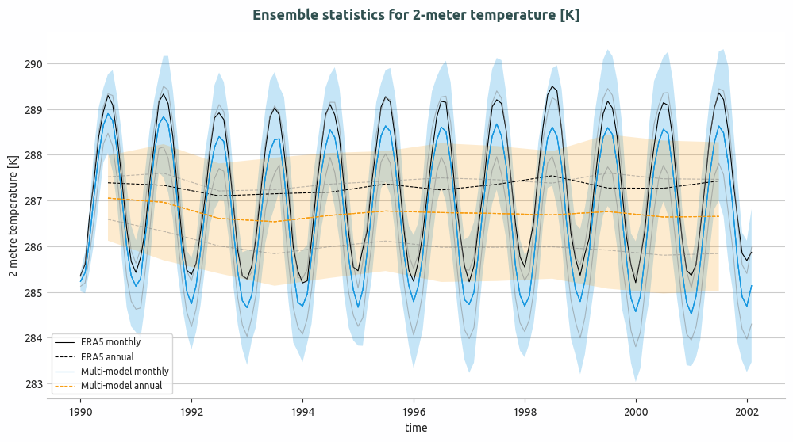
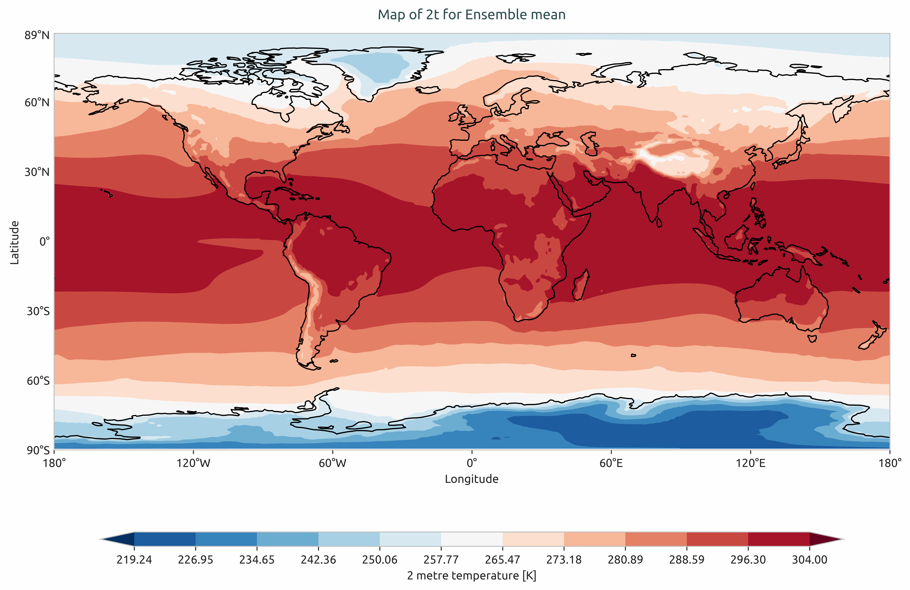
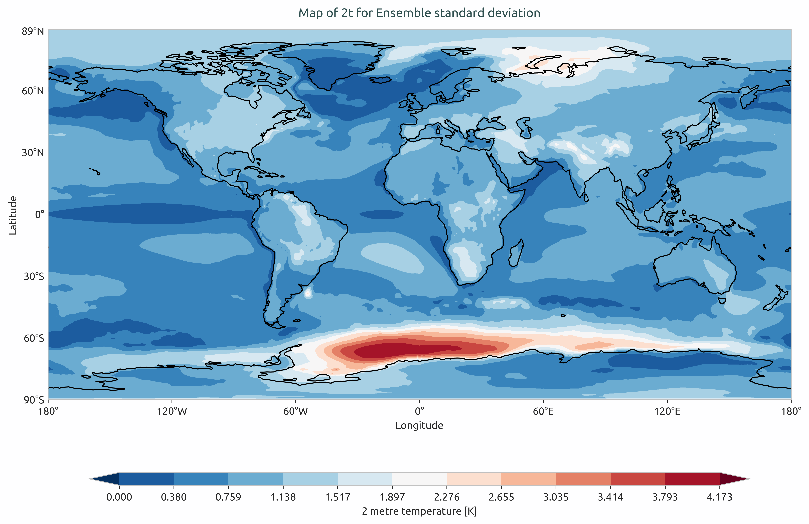
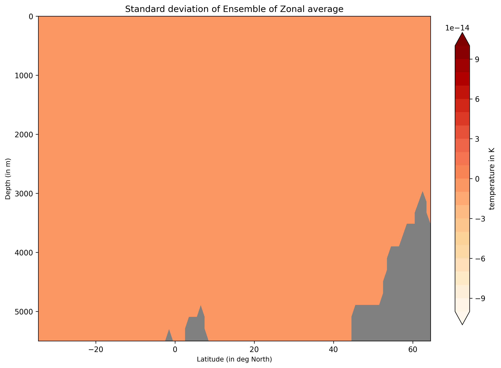

Ensemble Diagnostic
===================

Description
-----------
In many areas of climate research, ensemble analysis is a standard approach to assess the robustness of model results and to quantify the uncertainty linked to numerical simulations.
By combining multiple simulations, whether from different models, parameter choices, or perturbed initial conditions, ensemble methods provide more reliable estimates of the behaviour of the system being studied.

The Ensemble diagnostic offers a set of tools to compute and visualise basic ensemble statistics, such as the mean and standard deviation.
These metrics help users examine both the typical response of the ensemble and the variability across its members, giving an indication of model agreement and the confidence that can be placed in the simulated fields.

The ``Ensemble`` diagnostic supports ensemble analysis for 1D time series, 2D ``LatLon`` maps, and zonal sections ``LevLon``, with the option to use weighted statistics for multi-model ensembles.

The idea is that timeseries data, 2D spatial maps, and zonal cross-sections should be pre-computed and stored as NetCDF files, which can then be loaded and merged into an ``xarray.Dataset`` for ensemble analysis.

Classes
-------
This module contains three main analysis classes, namely ``EnsembleTimeseries``, ``EnsembleLatLon`` and ``EnsembleZonal``. 
Each analysis class is paired with a corresponding plotting class for visualising the computed statistics: 
``PlotEnsembleTimeseries``, ``PlotEnsembleLatLon`` and ``PlotEnsembleZonal``.

The ``EnsembleTimeseries`` class takes ``1D`` ``xarray.Dataset`` time series as input and computes the ensemble mean and standard deviation point-wise along the time axis, for both monthly and annual data.

The ``PlotEnsembleTimeseries`` class takes ``1D`` ``xarray.Dataset`` time series as input and plots the ensemble mean together with the ±2 standard deviation envelope around the mean.

.. note::
   The standard deviation is computed point-wise along the time axis.  
   A reference time series can also be added to the plot.

The ``EnsembleLatLon`` class takes ``2D`` ``LatLon`` ``xarray.Dataset`` fields as input and computes ensemble mean and standard deviation for spatial maps.

The ``PlotEnsembleLatLon`` class takes ``2D`` ``LatLon`` ``xarray.Dataset`` fields as input and produces separate maps for the ensemble mean and the ensemble standard deviation.

The ``EnsembleZonal`` class takes zonal-mean ``Lev-Lon`` ``xarray.Dataset`` fields as input and computes ensemble mean and standard deviation for the given cross-sections.

The ``PlotEnsembleZonal`` class takes zonal-mean ``Lev-Lon`` ``xarray.Dataset`` fields as input and plots the ensemble mean and standard deviation of the computed statistics.

File structure
--------------

* The diagnostic is located in the ``aqua/diagnostics/ensemble`` directory, which contains both the source code and the command line interface (CLI) scripts.
* Default configuration files are available in ``aqua/diagnostics/config/ensemble/config-global_biases.yaml``
* Notebooks are available in the ``notebooks/diagnostics/ensemble`` directory and contain examples of how to use the diagnostic.

Input variables and datasets
----------------------------

Before using the ``Ensemble`` module, a preprocessing step is required. Input data must be loaded and merged using the ``Reader`` class via  
``aqua.diagnostics.ensemble.util.reader_retrieve_and_merge``. The final merged dataset will contain all the requested ensemble members with appropriate metadata
Alternatively, data can be provided as a list of NetCDF file paths and merged with ``merge_from_data_files``. 

In this step, all available datasets, 1D timeseries, 2D latitude-longitude maps, and zonal-mean level-longitude fields, must be merged along a pseudo-dimension.  
By default, this dimension is named ``ensemble``, but it can be customised.

Data can be loaded directly as ``xarray.Dataset`` objects or through the AQUA  ``Reader`` class.

Example: loading and merging a 2D map ensemble into an ``xarray.Dataset``:

.. code-block:: python

   import glob
   from aqua.diagnostics import merge_from_data_files

   file_list = glob.glob(
       '/work/ab0995/a270260/pre_computed_aqua_analysis/*/historical-1990/atmglobalmean/netcdf/atmglobalmean.statistics_maps.2t.*_historical-1990.nc'
   )
   file_list.sort()

   ens_dataset = merge_from_data_files(
       variable='2t',
       model_names=['IFS-FESOM', 'IFS-NEMO'],
       data_path_list=file_list,
       log_level="WARNING",
       ens_dim="ensemble",
   )

Example: loading via the AQUA Reader

.. code-block:: python

   from aqua.diagnostics import reader_retrieve_and_merge

   ens_dataset = reader_retrieve_and_merge(
       variable='2t',
       catalog_list=['nextgems4', 'climatedt-phase1'],
       models_catalog_list=['IFS-FESOM', 'IFS-NEMO'],
       exps_catalog_list=['historical-1990', 'historical-1990'],
       sources_catalog_list=['aqua-atmglobalmean', 'aqua-atmglobalmean'],
       log_level="WARNING",
       ens_dim="ensemble",
   )

Some of the variables that are typically used in this diagnostic are:

* ``2t`` (2 metre temperature)
* ``tprate`` (total precipitation rate)
* ``msl`` (mean sea level pressure)
* ``so`` (sea water practical salinity)

Basic usage
-----------

The basic usage of this diagnostic is explained with a working example in the notebook. 
The basic structure of the analysis is the following:

The ensemble analysis is performed on merged ``1D`` timeseries by ``EnsembleTimeseries``, ``2D`` map by ``EnsembleLatLon``, and zonal ``Lev-Lon`` by ``EnsembleZonal`` classes.
Here is an example of how to use the ``EnsembleTimeseries`` class.

.. code-block:: python

   from aqua.diagnostics import EnsembleTimeseries

   # Check if we need monthly and annual time variables
   ts = EnsembleTimeseries(                                                                               
       var=variable,
       model_list=['IFS-FESOM', 'IFS-NEMO'],
       monthly_data=mon_model_dataset,                                                                      
       annual_data=ann_model_dataset,                                                                        
       outputdir='./',
       loglevel='WARNING',
   )   
                 
   # Compute statistics and save the results as netcdf                                                    
   ts.run() 

Plotting is performed by the ``PlotEnsembleTimeseries`` class.

.. code-block:: python

   from aqua.diagnostics import PlotEnsembleTimeseries
   # PlotEnsembleTimeseries class                                                                         
   plot_class_arguments = {                                                                                     
       "model_list": ['IFS-FESOM', 'IFS-NEMO'],
       "ref_model": 'ERA5',
   }

   plot_arguments = {    
       "var": variable,
       "save_pdf": True,
       "save_png": True,
       "plot_ensemble_members": True,
       "monthly_data": ts.monthly_data,                                                                      
       "monthly_data_mean": ts.monthly_data_mean,                                                            
       "monthly_data_std": ts.monthly_data_std,                                                              
       "annual_data": ts.annual_data,
       "annual_data_mean": ts.annual_data_mean,                                                              
       "annual_data_std": ts.annual_data_std,
       "ref_monthly_data": mon_ref_data,
       "ref_annual_data": ann_ref_data,}

   ensemble_plot = ts_plot.plot(**plot_arguments)

   ts_plot = PlotEnsembleTimeseries(                                                                      
       **plot_class_arguments,   
       loglevel='WARNING',
   ) 

CLI usage
---------

The diagnostic can be run from the command line interface (CLI) by running the following commands:

* ``cli_multi_model_timeseries_ensemble``: the command line interfance (CLI) script to run the ensemble-timeseries ``1D`` diagnostic (mulit-model).
* ``cli_single_model_timeseries_ensemble``: the command line interfance (CLI) script to run the ensemble-timeseries ``1D`` diagnostic (single-model-ensemble).
* ``cli_global_2D_ensemble.py``: the command line interfance (CLI) script to run the ensemble-2D-maps in ``Lat-Lon`` diagnostic.
* ``cli_zonal_ensemble.py``: the command line interfance (CLI) script to run the ensemble-zonal ``Lev-Lon`` diagnostic.

.. code-block:: bash

    cd $AQUA/aqua/diagnostics/ensemble
    python cli_multi_model_timeseries_ensemble.py --config <path_to_config_file>

Additionally, the CLI can be run with the following optional arguments:

- ``--config``, ``-c``: Path to the configuration file.
- ``--nworkers``, ``-n``: Number of workers to use for parallel processing.
- ``--cluster``: Cluster to use for parallel processing. By default a local cluster is used.
- ``--loglevel``, ``-l``: Logging level. Default is ``WARNING``.
- ``--catalog``: Catalog to use for the analysis. Can be defined in the config file.
- ``--model``: Model to analyse. Can be defined in the config file.
- ``--exp``: Experiment to analyse. Can be defined in the config file.
- ``--source``: Source to analyse. Can be defined in the config file.
- ``--outputdir``: Output directory for the plots.

Output
------
The diagnostic produces plots and NetCDF files containing the computed ensemble statistics.
By default, plots are saved in PNG and PDF format in the current working directory, but this can be customized in the configuration file.   

Plots include:
- Time series plots with ensemble mean and ±2 standard deviation envelope.
- 2D spatial maps of ensemble mean and standard deviation.
- Zonal cross-section plots of ensemble mean and standard deviation.

Configuration file structure
----------------------------

The configuration file is a YAML file that contains the details on the dataset to analyse or use as reference, the output directory and the diagnostic settings.
There are default configuration files available in the ``aqua/diagnostics/config/ensemble/`` directory:

* ``config/diagnostics/ensemble/config_global_2D_ensemble.yaml``: config file for ``cli_global_2D_ensemble.py``.
* ``config/diagnostics/ensemble/config_multi_model_timeseries_ensemble.yaml``: config file for ``ensembleTimeseries.py``.
* ``config/diagnostics/ensemble/config_single_model_timeseries_ensemble.yaml``: config file for ``ensembleTimeseries.py``.
* ``config/diagnostics/ensemble/config_zonalmean_ensemble.yaml``: config file for ``ensembleZonal.py``.

Most of the settings are common to all the diagnostics (see :ref:`diagnostics-configuration-files`).
Here we describe only the specific settings for the ensemble diagnostic.

* ``ensemble``: a block (nested in the ``diagnostics`` block) containing options for the Ensemble diagnostic.  
  Variable-specific parameters override the defaults.

    * ``run``: enable/disable the diagnostic.
    * ``diagnostic_name``: name of the diagnostic. ``ensemble`` by default.
    * ``variables``: list of variables to analyse.
    * ``region``: region to analyse (e.g., ``global``).
    * ``formulae``: list of formulae to compute new variables from existing ones (e.g., ``tnlwrf+tnswrf``).
    * ``startdate_data`` / ``enddate_data``: time range for the dataset.
    * ``startdate_ref`` / ``enddate_ref``: time range for the reference dataset.

.. code-block:: yaml

    ensemble:
        run: true
        diagnostic_name: 'ensemble'
        variables: ['2t', 'tprate', 'msl', 'so']
        region: 'global'
        formulae: []
        params:
            default:
                startdate_data: null
                enddate_data: null
                startdate_ref: "1990-01-01"
                enddate_ref: null
        plot_params:
        default:
            title: 
            plot_ensemble_members: True

Observations
------------

The default reference dataset is ERA5, but custom references can be configured.

 
Example Plots
-------------

    
    Ensemble of multi-model global monthly and annual timeseries and compared with ERA5 global monthly and annual average. Models considered as IFS-NEMO and IFS-FESOM.

    
    Ensemble mean of multi-model of global mean of 2-meter temperature. Models considered as IFS-NEMO and IFS-FESOM.  

    
    Ensemble standard devation of multi-model of the global mean of 2-meter temperature. Models considered as IFS-NEMO and IFS-FESOM.

.. figure:: figures/avg_so_LevLon_mean.png
    :align: center
    :width: 100%
    
    Ensemble-Zonal mean for average Time-mean sea water practical salinity for IFS-NEMO historical-1990.

    Ensemble-Zonal standard deviation for average Time-mean sea water practical salinity for IFS-NEMO historical-1990.

Available demo notebooks
-----------------------

Notebooks are stored in the ``notebooks/diagnostics/ensemble`` directory and contain usage examples.

* ``ensemble_timeseries.ipynb <https://github.com/DestinE-Climate-DT/AQUA-diagnostics/tree/main/notebooks/diagnostics/ensemble/ensemble_timeseries.ipynb>`` _
* ``ensemble_global_2D.ipynb <https://github.com/DestinE-Climate-DT/AQUA-diagnostics/tree/main/notebooks/diagnostics/ensemble/ensemble_global_2D.ipynb>`` _
* ``ensemble_zonalaverage.ipynb <https://github.com/DestinE-Climate-DT/AQUA-diagnostics/tree/main/notebooks/diagnostics/ensemble/ensemble_zonalaverage.ipynb>`` _

Authors and contributors
------------------------

This diagnostic is maintained by Maqsood Mubarak Rajput <maqsoodmubarak.rajput@awi.de>
 (`@maqsoodrajput <https://github.com/maqsoodrajput>`_, `maqsoodmubarak.rajput@awi.de <maqsoodmubarak.rajput@awi.de>`_).  
Contributions are welcome — please open an issue or a pull request.  
For questions or suggestions, contact the AQUA team or the maintainers.

Detailed API
------------

This section provides a detailed reference for the Application Programming Interface (API) of the ``ensemble`` diagnostic,
produced from the diagnostic function docstrings.

.. automodule:: aqua.diagnostics.ensemble
    :members:
    :undoc-members:
    :show-inheritance:

