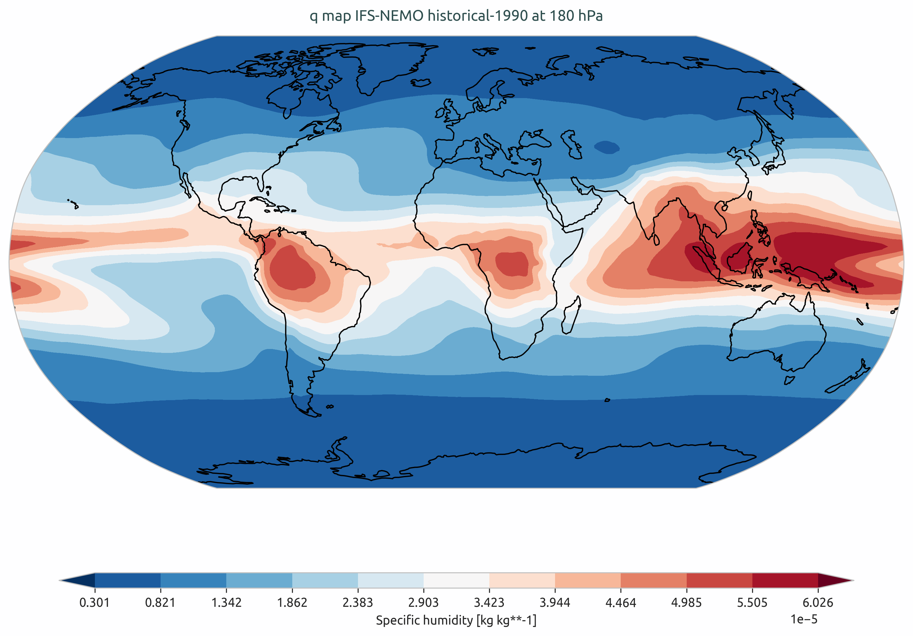
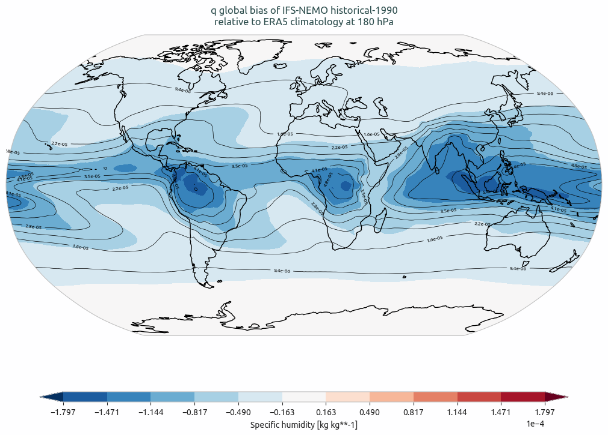
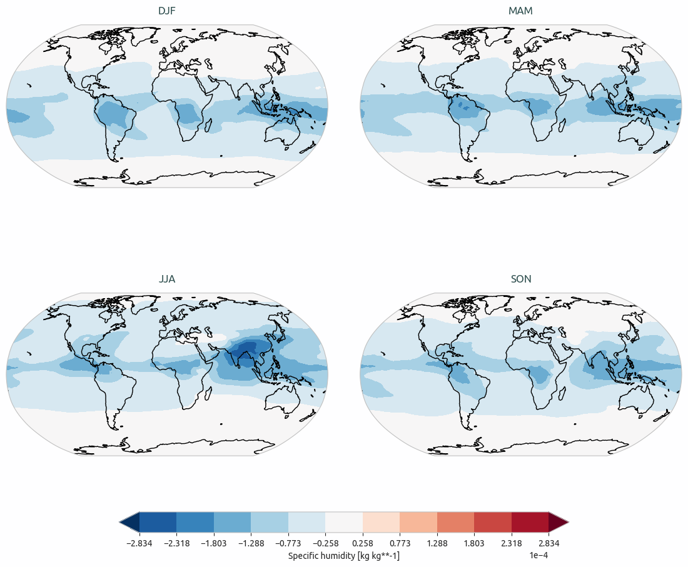
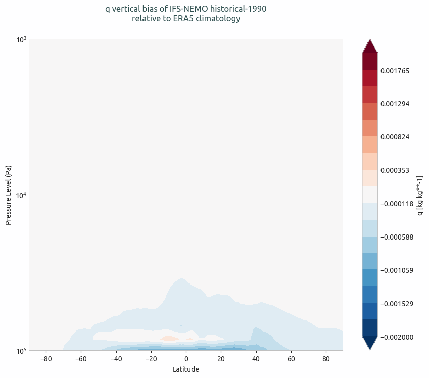

Global Biases Diagnostic
========================

Description
-----------

The **GlobalBiases** diagnostic is a set of tools for the analysis and visualization of 2D spatial biases in climate model outputs.  
It supports comparative analysis between a target dataset (typically a climate model) and a reference dataset, commonly an observational or reanalysis product such as ERA5.  
Alternatively, it can be used to compare outputs from two different model simulations, for example to assess differences between historical and scenario experiments.

GlobalBiases provides tools to plot:

- Climatology maps
- Bias maps
- Seasonal bias maps
- Vertical profiles to assess biases across pressure levels

The diagnostic is designed with a class that analyzes a single model and generates the NetCDF files, and another class that produces the plots.

Classes
-------

There is one class for the analysis and one for the plotting:

* **GlobalBiases**: the main class for the analysis of global biases.  
  It retrieves the data and prepares it for plotting (e.g., regridding, pressure level selection, unit conversion).  
  It also handles the computation of mean climatologies, including seasonal climatologies if requested.  
  Climatologies are saved as class attributes and as NetCDF files.

* **PlotGlobalBiases**: this class provides methods for plotting the global biases, seasonal biases, and vertical profiles.  
  It generates the plots based on the data prepared by the GlobalBiases class.

File structure
--------------

* The diagnostic is located in the ``src/aqua_diagnostics/global_biases`` directory, which contains both the source code and the command line interface (CLI) script.
* The configuration files are located in the ``config/diagnostics/global_biases`` directory and contain the default configuration for the diagnostic.
* Notebooks are available in the ``notebooks/diagnostics/global_biases`` directory and contain examples of how to use the diagnostic.

Input variables and datasets
----------------------------

By default, the diagnostic compares against the ERA5 dataset, but it can be configured to use any other dataset as a reference.  
A list of the variables that are compared automatically when running the full diagnostic is provided in the configuration files  
available in the ``config/diagnostics/global_biases`` directory.

Some of the variables that are typically used in this diagnostic are:

* 2m temperature (2t)
* Total Precipitation (tprate)
* Zonal and meridional wind (u, v)
* Specific humidity (q)

The diagnostic is designed to work with data from the Low Resolution Archive (LRA), generated by 
the Data reduction OPerator (DROP) of the AQUA project, which provides monthly data at a 1x1 
degree resolution.  
A higher resolution is not necessary for this diagnostic.

Basic usage
-----------

The basic usage of this diagnostic is explained with a working example in the notebook provided in the ``notebooks/diagnostics/global_biases`` directory.  
The basic structure of the analysis is the following:

.. code-block:: python

    from aqua.diagnostics import GlobalBiases, PlotGlobalBiases

    biases_ifs_nemo = GlobalBiases(model='IFS-NEMO', exp='historical-1990', source='lra-r100-monthly', loglevel="DEBUG")
    biases_era5 = GlobalBiases(model='ERA5', exp='era5', source='monthly', startdate="1990-01-01", enddate="1999-12-31", loglevel="DEBUG")

    biases_ifs_nemo.retrieve(var='q')
    biases_ifs_nemo.compute_climatology(seasonal=True)

    biases_era5.retrieve(var='q')
    biases_era5.compute_climatology(seasonal=True)
    
    pg = PlotGlobalBiases(loglevel='DEBUG')
    pg.plot_bias(data=biases_ifs_nemo.climatology, data_ref=biases_era5.climatology, var='q', plev=18000)

.. note::

    The user can also define the start and end date of the analysis and the reference dataset.  
    If not specified otherwise, plots will be saved in PNG and PDF format in the current working directory.

CLI usage
---------

The diagnostic can be run from the command line interface (CLI) by running the following command:

.. code-block:: bash

    cd $AQUA/src/aqua_diagnostics/global_biases
    python cli_global_biases.py --config_file <path_to_config_file>

Additionally, the CLI can be run with the following optional arguments:

- ``--config``, ``-c``: Path to the configuration file.
- ``--nworkers``, ``-n``: Number of workers to use for parallel processing.
- ``--cluster``: Cluster to use for parallel processing. By default a local cluster is used.
- ``--loglevel``, ``-l``: Logging level. Default is ``WARNING``.
- ``--catalog``: Catalog to use for the analysis. Can be defined in the config file.
- ``--model``: Model to analyse. Can be defined in the config file.
- ``--exp``: Experiment to analyse. Can be defined in the config file.
- ``--source``: Source to analyse. Can be defined in the config file.
- ``--outputdir``: Output directory for the plots.

Config file structure
---------------------

The configuration file is a YAML file that contains the details on the dataset to analyse or use as reference, the output directory and the diagnostic settings.
Most of the settings are common to all the diagnostics (see :ref:`diagnostics-configuration-files`).
Here we describe only the specific settings for the global biases diagnostic.

* ``globalbiases``: a block (nested in the ``diagnostics`` block) containing options for the Global Biases diagnostic.  
  Variable-specific parameters override the defaults.

    * ``run``: enable/disable the diagnostic.
    * ``diagnostic_name``: name of the diagnostic. ``globalbiases`` by default, but can be changed when the boxplots CLI is invoked within another ``recipe`` diagnostic, as is currently done for ``Radiation``.
    * ``variables``: list of variables to analyse.
    * ``formulae``: list of formulae to compute new variables from existing ones (e.g., ``tnlwrf+tnswrf``).
    * ``plev``: pressure levels to analyse for 3D variables.
    * ``seasons``: enable seasonal analysis.
    * ``seasons_stat``: statistic to use for seasonal climatology (e.g., "mean").
    * ``vertical``: enable vertical profiles.
    * ``startdate_data`` / ``enddate_data``: time range for the dataset.
    * ``startdate_ref`` / ``enddate_ref``: time range for the reference dataset.

.. code-block:: yaml

    globalbiases:
        run: true
        diagnostic_name: 'globalbiases'
        variables: ['tprate', '2t', 'msl', 'tnlwrf', 't', 'u', 'v', 'q', 'tos']
        formulae: ['tnlwrf+tnswrf']
        params:
            default:
                plev: [85000, 20000]
                seasons: true
                seasons_stat: 'mean'
                vertical: true
                startdate_data: null
                enddate_data: null
                startdate_ref: "1990-01-01"
                enddate_ref: "2020-12-31"
            tnlwrf+tnswrf:
                short_name: "tnr"
                long_name: "Top net radiation"

* ``plot_params``: defines colorbar palette and limits and projection parameters for each variable.  
  The default parameters are used if not specified for a specific variable.
  Refer to 'src/aqua/util/projections.py' for available projections.

.. code-block:: yaml

    plot_params:
        default: 
            projection: 'robinson'
            projection_params: {}
        2t:
            cmap: 'RdBu_r'
            vmin: -15
            vmax: 15
        msl:
            vmin: -1000
            vmax: 1000
        u:
            vmin_v: -50
            vmax_v: 50

Output
------

The diagnostic produces four types of plots:

* Global climatology maps  
* Global bias maps (model vs reference)  
* Seasonal bias maps  
* Vertical bias profiles (for 3D variables)

Plots are saved in both PDF and PNG format.

Observations
------------

The default reference dataset is ERA5, but custom references can be configured.

Example Plots
-------------

All plots can be reproduced using the notebooks in the ``notebooks`` directory on LUMI HPC.

    Climatology of q from IFS-NEMO historical-1990.

    Global bias of q from IFS-NEMO historical-1990 with respect to ERA5 climatology.

    Seasonal bias of q from IFS-NEMO historical-1990 with respect to ERA5 climatology.

    Vertical bias of q from IFS-NEMO historical-1990 with respect to ERA5 climatology.

Available demo notebooks
------------------------

Notebooks are stored in the ``notebooks/diagnostics/global_biases`` directory and contain usage examples.

* `global_biases.ipynb <https://github.com/DestinE-Climate-DT/AQUA/blob/main/notebooks/diagnostics/global_biases/global_biases.ipynb>`_

Authors and contributors
------------------------

This diagnostic is maintained by Silvia Caprioli (`@silviacaprioli <https://github.com/silviacaprioli>`_, `silvia.caprioli@polito.it <mailto:silvia.caprioli@polito.it>`_).  
Contributions are welcome — please open an issue or a pull request.  
For questions or suggestions, contact the AQUA team or the maintainers.

Detailed API
------------

This section provides a detailed reference for the Application Programming Interface (API) of the ``global_biases`` diagnostic,  
generated from the function docstrings.

.. automodule:: aqua.diagnostics.global_biases
    :members:
    :undoc-members:
    :show-inheritance:
