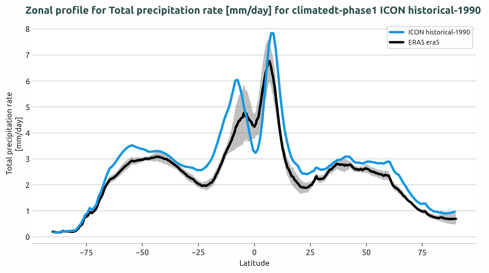
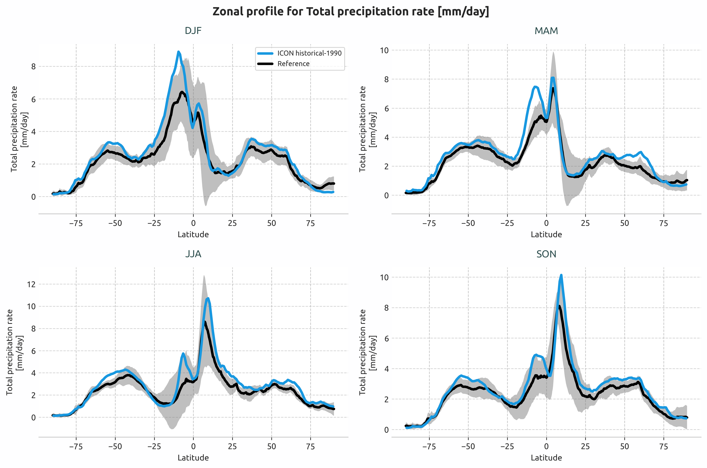
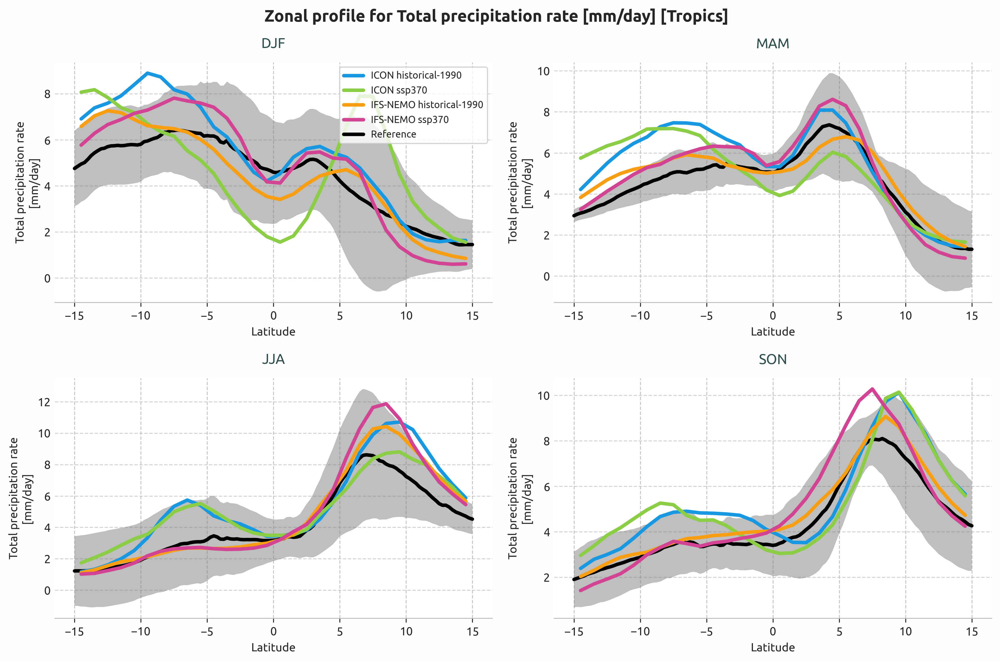

.. _lat_lon_profiles:

LatLonProfiles Diagnostic
=========================

Description
-----------

The **LatLonProfiles** diagnostic computes and plots zonally or meridionally averaged 
profiles of climate variables.

LatLonProfiles provides tools to plot:

- Zonal mean profiles (averaged over longitude, showing latitude profiles)
- Meridional mean profiles (averaged over latitude, showing longitude profiles)
- Seasonal profiles (4-panel: DJF, MAM, JJA, SON)
- Long-term mean profiles (single panel)

Profiles can be computed over specific geographic regions, with default regions available or custom regions definable in the configuration file.

The diagnostic is designed with a class that analyzes a single model and generates the NetCDF files, and another class that produces the plots.

Classes
-------

There is one class for the analysis and one for the plotting:

* **LatLonProfiles**: retrieves the data and computes zonally or meridionally averaged profiles of climate variables.
  It handles spatial averaging, temporal averaging (seasonal or long-term), and optional standard deviation calculation for uncertainty analysis.
  Profiles are saved as class attributes and as NetCDF files.

* **PlotLatLonProfiles**: Produces publication-quality line plots of the computed profiles.
  It generates single-panel plots for long-term means and 4-panel plots for seasonal comparisons.
  It supports multiple model comparison with optional reference data and ±2σ uncertainty bands.

.. note::

    The diagnostic follows a two-step process: **spatial averaging** (zonal/meridional) → 
    **temporal averaging** (seasonal/long-term).

File structure
--------------

* The diagnostic is located in the ``aqua/diagnostics/lat_lon_profiles`` directory, which contains both the source code and 
  the command line interface (CLI) script.
* A template configuration file is available at ``aqua/diagnostics/templates/diagnostics/config-lat_lon_profiles.yaml``.
* Regional definitions are available in ``aqua/diagnostics/config/tools/lat_lon_profiles/definitions/regions.yaml``.
* Notebooks are available in the ``notebooks/diagnostics/lat_lon_profiles`` directory and contain examples of how to use the diagnostic.

Input variables and datasets
----------------------------

The diagnostic works with climate variables on regular latitude-longitude grids.

Some of the variables that are typically used in this diagnostic are:

* ``2t`` (2 metre temperature)
* ``tprate`` (total precipitation rate)

Derived variables can be computed using the ``EvaluateFormula`` syntax (e.g., ``2t - 273.15`` for temperature in °C).

Supported regions include: ``global`` (or ``null``), ``tropics``, ``europe``, ``nh`` (Northern Hemisphere), ``sh`` (Southern Hemisphere).
Custom regions can be defined in ``aqua/diagnostics/config/tools/lat_lon_profiles/definitions/regions.yaml``.

The diagnostic is designed to work with data from the Low Resolution Archive (LRA), generated by
the Data Reduction OPerator (DROP) of the AQUA project, which provides monthly data at a 1x1
degree resolution.

Basic usage
-----------

The basic usage of this diagnostic is explained with a working example in the notebook.
The basic structure of the analysis is the following:

.. code-block:: python

    from aqua.diagnostics.lat_lon_profiles import LatLonProfiles, PlotLatLonProfiles

    lonlat_dataset = LatLonProfiles(
        catalog='climatedt-phase1',
        model='ICON',
        exp='historical-1990',
        source='lra-r100-monthly',
        startdate='1990-01-01',
        enddate='1999-12-31'
        region='tropics',
        mean_type='zonal'  # or 'meridional'
    )
    lonlat_dataset.run(var='tprate', units='mm/day')

    # Plot long-term mean
    plot = PlotLatLonProfiles(data=[lonlat_dataset.longterm], data_type='longterm')
    plot.run(show=True)
  
.. note::

    Start/end dates and reference dataset can be customized.
    If not specified otherwise, plots will be saved in PNG and PDF format in the current working directory.

CLI usage
---------

The diagnostic can be run from the command line interface (CLI) by running the following command:

.. code-block:: bash

    cd $AQUA/aqua/diagnostics/lat_lon_profiles
    python cli_lat_lon_profiles.py --config <path_to_config_file>

Additionally, the CLI can be run with the following optional arguments:

- ``--config``, ``-c``: Path to the configuration file.
- ``--nworkers``, ``-n``: Number of workers to use for parallel processing.
- ``--cluster``: Cluster to use for parallel processing. By default a local cluster is used.
- ``--loglevel``, ``-l``: Logging level. Default is ``WARNING``.
- ``--catalog``: Catalog to use for the analysis. Can be defined in the config file.
- ``--model``: Model to analyse. Can be defined in the config file.
- ``--exp``: Experiment to analyse. Can be defined in the config file.
- ``--source``: Source to analyse. Can be defined in the config file.
- ``--outputdir``: Output directory for the plots.
- ``--startdate``: Start date for the analysis.
- ``--enddate``: End date for the analysis.

Configuration file structure
----------------------------

The configuration file is a YAML file that contains the details on the dataset to analyse or use as reference, the output directory and the diagnostic settings.
Most of the settings are common to all the diagnostics (see :ref:`diagnostics-configuration-files`).
Here we describe only the specific settings for the lat_lon_profiles diagnostic.

* ``lat_lon_profiles``: a block (nested in the ``diagnostics`` block) containing options for the LatLonProfiles diagnostic.
  Variable-specific parameters override the defaults.

    - ``run``: enable/disable the diagnostic.
    - ``diagnostic_name``: name of the diagnostic.
    - ``mean_type``: type of spatial averaging (``zonal`` or ``meridional``).
    - ``seasonal``: enable seasonal profiles computation.
    - ``longterm``: enable long-term mean computation.
    - ``variables``: list of variables to analyse with their regions.

.. code-block:: yaml

    diagnostics:
      lat_lon_profiles:
        run: true
        diagnostic_name: 'atmosphere2d'
        mean_type: 'zonal'
        center_time: true
        exclude_incomplete: true
        box_brd: true
        seasonal: true
        longterm: true
        variables:
          - name: '2t'
            regions: [null, 'tropics']  # global and tropics

Output
------

The diagnostic produces two types of plots:

* Long-term profiles (single panel)
* Seasonal profiles (4-panel: DJF, MAM, JJA, SON)

Plots are saved in both PDF and PNG format.
Data outputs are saved as NetCDF files. 

Observations
------------

The default reference datasets are:

* ERA5 reanalysis for atmospheric variables
* MSWEP for precipitation data
* BERKELEY-EARTH for surface temperature

Details are available on the `MSWEP website <https://www.gloh2o.org/mswep/>`_.

Standard deviation can be computed over a custom period using ``std_startdate`` and 
``std_enddate`` to provide ±2σ uncertainty bands in plots.

Custom reference datasets can be configured in the configuration file.

Example plots
-------------

All plots can be reproduced using the notebooks in the ``notebooks`` directory on LUMI HPC.

   Long-term zonal mean precipitation rate profile for the Tropics region, showing ICON model output compared to ERA5 reference data with ±2σ uncertainty bands.

   Seasonal zonal mean precipitation rate profiles (DJF, MAM, JJA, SON) for the Tropics region.

   Multi-model comparison: ICON and IFS-NEMO historical and SSP3-7.0 scenarios.

Available demo notebooks
------------------------

Notebooks are stored in ``notebooks/diagnostics/lat_lon_profiles``:

- `single_line_profiles.ipynb <https://github.com/DestinE-Climate-DT/AQUA-diagnostics/tree/main/notebooks/diagnostics/lat_lon_profiles/single_line_profiles.ipynb>`_
- `multiple_lines_profiles.ipynb <https://github.com/DestinE-Climate-DT/AQUA-diagnostics/tree/main/notebooks/diagnostics/lat_lon_profiles/multiple_lines_profiles.ipynb>`_

Authors and contributors
------------------------

This diagnostic is maintained by Marco Cadau (`@mcadau <https://github.com/mcadau>`_, `marco.cadau@polito.it <mailto:marco.cadau@polito.it>`_).  
Contributions are welcome — please open an issue or a pull request.  
For questions or suggestions, contact the AQUA team or the maintainers.

Detailed API
------------

This section provides a detailed reference for the Application Programming Interface (API) of the ``lat_lon_profiles`` diagnostic,  
generated from the diagnostic function docstrings.

.. automodule:: aqua.diagnostics.lat_lon_profiles
    :members:
    :undoc-members:
    :show-inheritance: