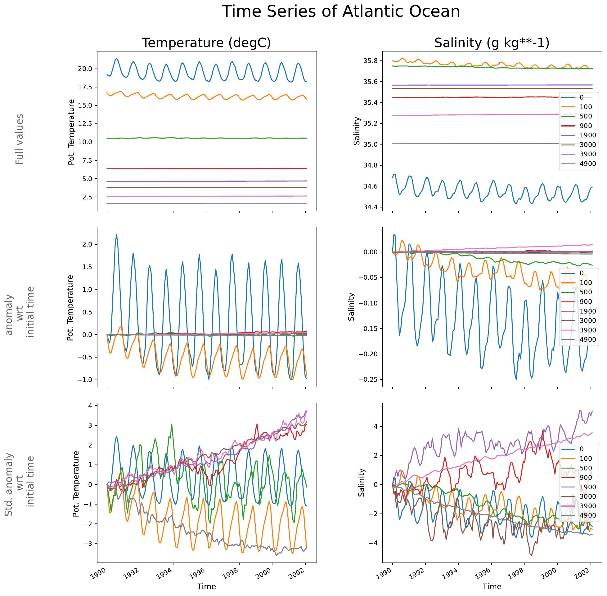
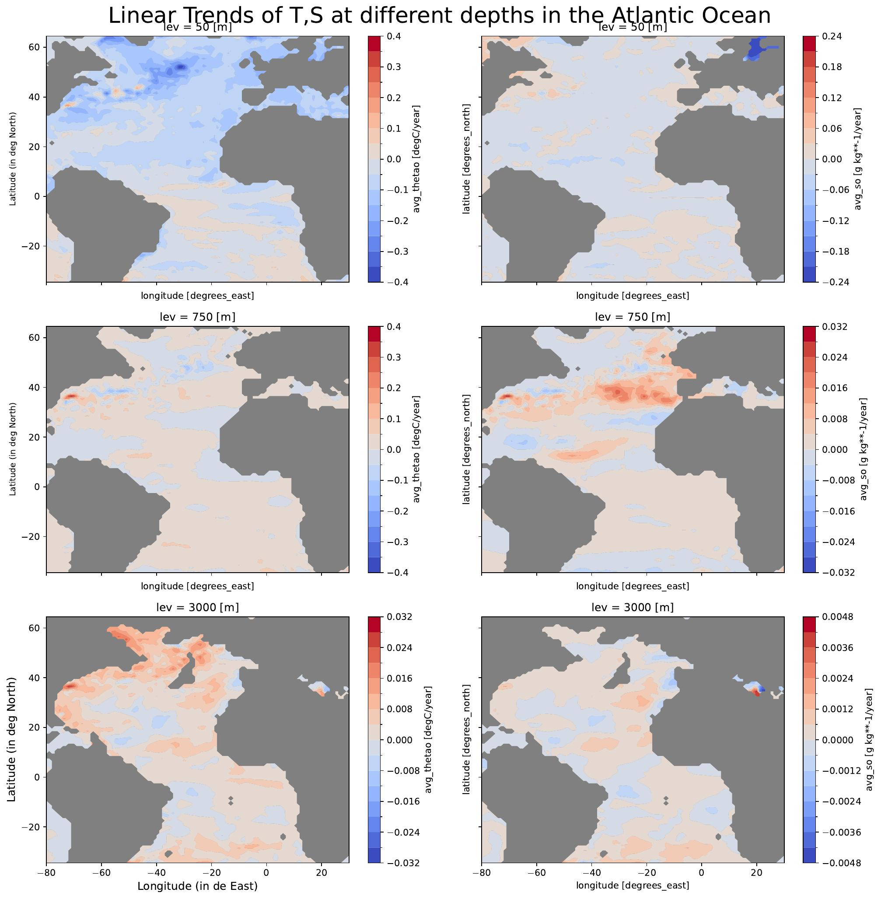
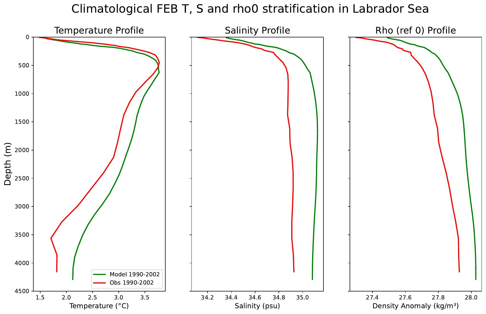
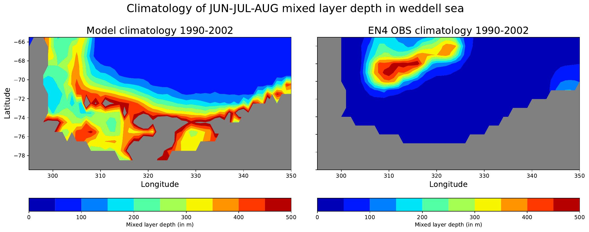
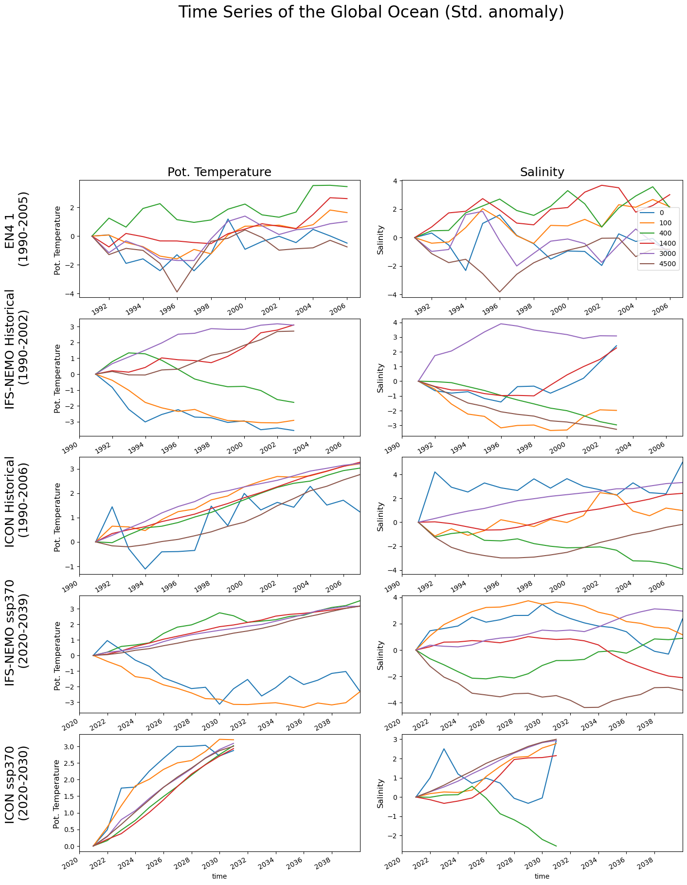
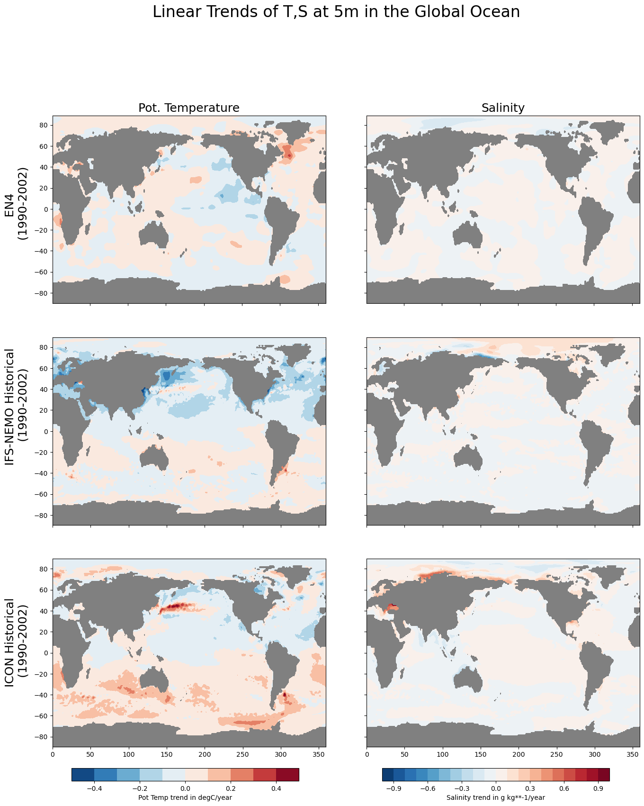
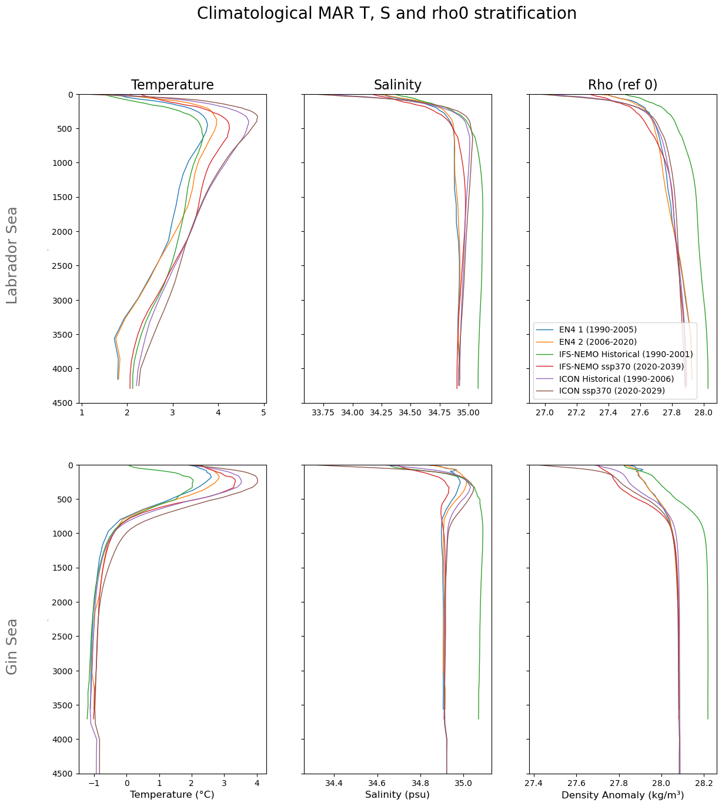
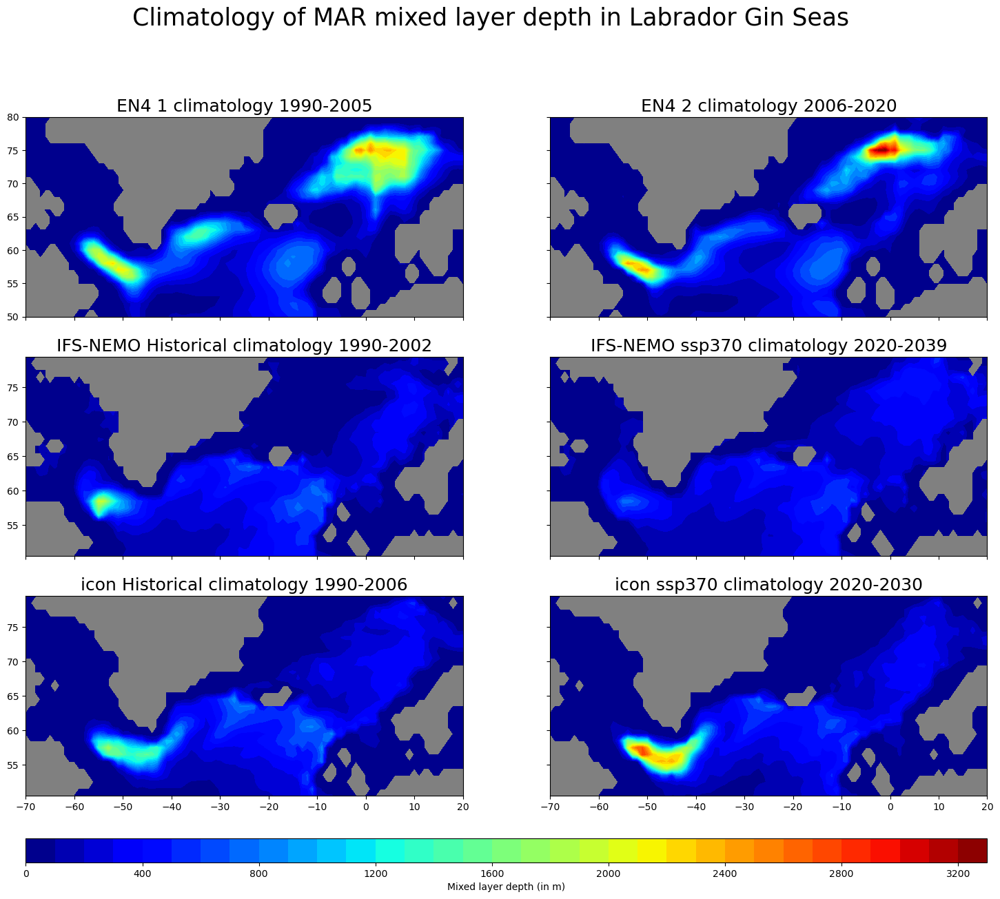

Ocean3D
=======

Description
-----------

This package contains two submodules to monitor and evaluate the 3D ocean evolution and mean state:

- ``Ocean Drifts``: to characterize and monitor model drifts.
- ``Ocean Circulation``: to evaluate the realism of the model in simulating key precursors of the ocean circulation.

All these diagnostics are produced in a consistent way for any selected model simulation.
Additionally, there are newly added multi-model diagnostic functions under both submodules that
allow the comparison of different experiments at once.

Structure
---------

The ocean3d diagnostic follows a class structure and consists of the following files:

- ``cli``: Folder to run the ocean diagnostics from the command line;
    - ``cli_ocean3d.py``: a python file that contains the command line ocean diagnostics;
    - ``config.yaml``: config file containing details for the cli;

- ``config`` : Folder containing necessary information for ocean3d;
    - ``regions.yaml``: yaml file containing the predefined regions where users can also define regions;

- ``notebooks``: Folder contains notebooks demonstrating the functions;
    - ``ocean_drifts.ipynb``: an ipython notebook with examples on how to apply the ocean drift diagnostics;
    - ``ocean_circulation.ipynb``: an ipython notebook with examples on how to apply the ocean circulation diagnostics;
    - ``multi_model_analysis.ipynb``: an ipython notebook with examples on how to apply the multi model diagnostics;

- ``ocean3d``: Folder containing the ocean3d functions;
    - ``ocean_circulation``: Folder containing the ocean circulation functions;
        - ``multi_model``: Folder containing the ocean circulation functions;
        - ``mld.py``: a python file that contains the functions for mixed layer depth;
        - ``stratification.py``: a python file that contains the functions for stratification;
    - ``ocean_drifts``: Folder containing the ocean drift functions;
        - ``multi_model``: Folder containing the ocean drift functions;
        - ``hovmoller_plot.py``: a python file that contains the functions for hovmoller plot;
        - ``time_series.py``: a python file that contains the functions for time series;
        - ``trends.py``: a python file that contains the functions for trends;
    - ``ocean_utils.py``: a python file that contains functions used in both ocean3d diagnostic modules;

- ``README.md``: a readme file that contains some technical information on how to install the ocean3d diagnostic and its environment. 

Input variables example
-----------------------

* ``avg_thetao`` (Ocean potential temperature, GRIB paramid 150129)
* ``avg_so``     (Sea water practical salinity, GRIB paramid 151130)

Output 
------

This module exports all the data and diagnostics used to create the different figures except the multi-model diagnostics.

CLI (Command Line Interface) 
------------------------------

Under the cli folder, upon updating the config file and running the cli_ocean3d.py, users will generate all the ocean3d diagnostics figures. 

.. code-block:: bash

    python cli_ocean3d.py --model <model> --exp <experiment> --source <source> 

The CLI accepts the following arguments:

- ``--catalog``: the catalog to analyze.
- ``--model``: the model to analyze.
- ``--exp``: the experiment to analyze.
- ``--source``: the source to analyze.
- ``--config``: path to the configuration file.
- ``--cluster``: run the diagnostic on a dask cluster already existing (used by aqua-analysis).
- ``-l`` or ``--loglevel``: log level for the logger. Default is WARNING.
- ``-n`` or ``--nworkers``: number of dask workers for parallel computation.
- ``--outputdir``: path to the output folder.
- ``--regrid``: Target grid for regridding.

Prepare the o3d request
---------------------------

Single Model analysis
^^^^^^^^^^^^^^^^^^^^^

``ocean3d`` typical request looks like this, but some details may change depending on the selected function.
Also, the requests for multi-model diagnostics are also different. 
We recommend to look into the notebooks to get a clearer idea of function-specific details. 

.. code-block:: python

    o3d_request= {'model':'IFS-NEMO', 'exp':'historical-1990', 'source': 'lra-r100-monthly',
                  'data': data, 'obs_data': obs_data, 'region':'Labrador Sea',
                  'latS':None, 'latN':None, 'lonW':None, 'lonE':None,
                  'output':True, "time" : "February", 'output_dir':'./output'}

Multi Model analysis
^^^^^^^^^^^^^^^^^^^^

For multi-model analysis, the request looks like this, but some details may change depending on the selected function.
We recommend looking into the notebooks to get a clearer idea of function-specific details. 

.. code-block:: python

    data_dict = {'EN4 1':en4_1, 'EN4 2':en4_2, 'IFS-NEMO Historical':ifs_nemo_historical,
                 'IFS-NEMO ssp370':ifs_nemo_ssp370,
                 'icon Historical':icon_historical,'icon ssp370': icon_ssp370} 
    o3d_request= {'data_dict': data_dict,'region':'Labrador Gin Seas',
                  'latS':None,'latN':None,'lonW':None,'lonE':None,
                  'output':True,"time" : "March",'output_dir':'./output'}

Functions used
--------------

Single Model analysis
^^^^^^^^^^^^^^^^^^^^^

.. code-block:: python

    hovmoller_plot(o3d_request)

*hovmoller_lev_time_plot*: This function requires the input data and a region of choice. 
It produces a Hovmöller plot of regionally averaged temperature and salinity including three types of subplots. 
The region name supports all the major oceans and seas, in case users require a custom region,
they can fill in the values of latitude, and longitude in the boxes as desired.

.. code-block:: python

    time_series(o3d_request)

*time_series*: This function requires the input data and a region of choice.
It produces time series plots of regionally averaged temperature and salinity including three types of subplots
for a predefined or customized list of vertical levels. 
The region name supports all the major oceans and seas, in case users require a custom region,
they can fill in the values of latitude, and longitude in the boxes.

.. code-block:: python

    multilevel_trend(o3d_request)

*multilevel_trend*: This function requires the input data, a region of choice, and (optionally) a choice of depth levels. 
It produces lon-lat maps of linear temporal trends of temperature and salinity over the selected
region for a predefined or customized list of vertical levels. 
The region name supports all the major oceans and seas, in case users require a custom region,
they can fill in the values of latitude, and longitude in the boxes.

.. code-block:: python

   zonal_mean_trend_plot(o3d_request)

*Zonal Mean Trend Plot*: This function requires the input data and a region of choice. 
It produces plots of zonally averaged linear temporal trends plot of temperature and salinity as a function of depth and latitude. 
The zonal average is produced over the selected region, whose name supports all the major oceans and seas;
in case users require a custom region, they can fill in the values of latitude and longitude in the boxes.

.. code-block:: python

    stratification(o3d_request)

*Stratification plot*: This function requires the input data, a region of choice, and a temporal period to compute the climatology. 
It produces a stratification plot of Temperature, salinity and Density, including the overlapped data with the observation. 
The region name supports all the major oceans and seas, in case users require a custom region, they can fill in the values of latitude,
and longitude in the boxes.

.. code-block:: python

    plot_spatial_mld_clim(o3d_request)

Mixed Layer Depth Plot: This function requires the input data, a region of choice, and a temporal period to compute the climatology. 
It produces a time series plot of temperature and salinity.
Users have the option of choosing whether they want to use the whole obs data or overlapped obs data with the model. 
The region name supports all the major oceans and seas; in case users require a custom region,
they can fill in the values of latitude, and longitude in the boxes.

Multi Model analysis
^^^^^^^^^^^^^^^^^^^^

.. code-block:: python

    mld_multi_model(o3d_request)

This function provides the plots for mixed player depth provided the different models or observations and regions. 

.. code-block:: python

    trend_plot = trend(o3d_request)
    trend_plot.plot()

This function provides the plots for trends provided the different models or observations, depth level and regions. 

.. code-block:: python

    strat = stratification(o3d_request)
    strat.plot()

This function provides the plots for stratification (Temperature, salinity, and density profile) provided the different models or observations and regions. 

.. code-block:: python

    timeser = time_series(o3d_request)
    timeser.plot()

This function provides the plots for standardized anomaly time series provided the different models or observations and regions. 

Methods used 
------------

- All regional averages have been produced with area weights.
- Temporal trends are computed as linear trends and estimated over the whole temporal span of the dataset.
- The mixed layer depth is computed by the function ``compute_mld_cont`` from ``sigma0`` monthly fields following the criteria from de Boyer Montegut et al (2004)
- Density fields are computed from absolute salinity and conservative temperature fields using the TEOS-10 equations.
- Absolute salinity and conservative temperature are also computed from practical salinity and potential temperature fields with TEOS-10 equations.

Observations  
---------------

EN4.2.2.g10 ocpt and so observations for the period 1950-2022

References
----------

- de Boyer Montégut, C., Madec, G., Fischer, A. S., Lazar, A., and Iudicone, D. (2004): Mixed layer depth over the global ocean: An examination of profile data and a profile-based climatology. J. Geophys. Res., 109, C12003, doi:10.1029/2004JC002378
- Gouretski and Reseghetti (2010): On depth and temperature biases in bathythermograph data: development of a new correction scheme based on analysis of a global ocean database. Deep-Sea Research I, 57, 6. doi: http://dx.doi.org/10.1016/j.dsr.2010.03.011
- https://www.teos-10.org/

A code to compute very efficiently the linear trends has been adapted from this website:
https://stackoverflow.com/questions/52108417/how-to-apply-linear-regression-to-every-pixel-in-a-large-multi-dimensional-array

Example Plot(s)
---------------

Examples showing an individual simulation refer to the IFS-NEMO historical experiment at Tco1279/eORCA12

* This is an example of the multipanel plots of the spatially averaged T, S timeseries at different levels

* This is an example of the multi-panel plots of lat-lon  maps of temporal trends in T, S at different levels

* This is an example of one of the climatological stratification profiles.

* This is an example of one of the mixed-layer depth climatologies. Unit is meter. 

* This is an example of multi-model time series plot. 

* This is an example of multi-model surface trends of global ocean. 

* This is an example of multi-model stratification of two regions. 

* This is an example of multi-model MLD. 

Available demo notebooks
------------------------

Notebooks are stored in diagnostics/ocean3d/notebooks

* `global_ocean.ipynb <https://github.com/DestinE-Climate-DT/AQUA/blob/main/diagnostics/ocean3d/notebooks/ocean_drifts.ipynb>`_

    
* `ocean_circulation.ipynb <https://github.com/DestinE-Climate-DT/AQUA/blob/main/diagnostics/ocean3d/notebooks/ocean_circulation.ipynb>`_

* `multi_model_analysis.ipynb <https://github.com/DestinE-Climate-DT/AQUA/blob/main/diagnostics/ocean3d/notebooks/multi_model_analysis.ipynb>`_
    
Detailed API
------------

This section provides a detailed reference for the Application Programming Interface (API) of the "ocean3d" diagnostic,
produced from the diagnostic function docstrings.

.. automodule:: ocean3d
    :members:
    :undoc-members:
    :show-inheritance:
