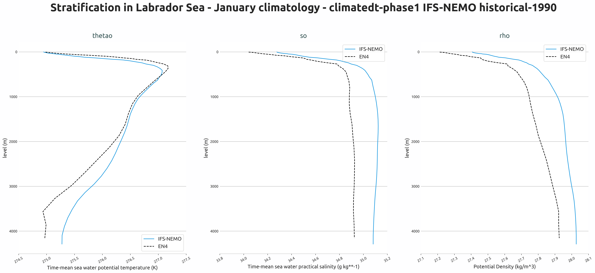
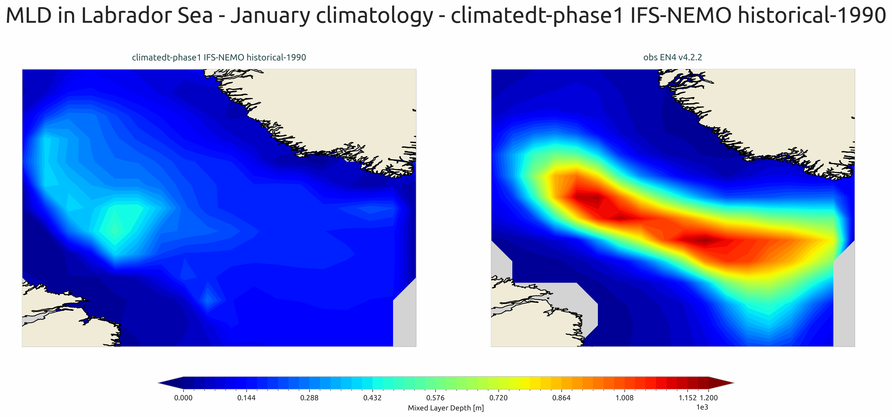

.. _ocean_stratification:

Ocean Stratification Diagnostic
================================

Description
-----------

The **OceanStratification** diagnostic is a set of tools for the analysis and visualization of ocean stratification and mixed layer depth (MLD) in climate model outputs.  
It supports comparative analysis between a target dataset (typically a climate model) and a reference, commonly an observational dataset such as EN4.  

Ocean Stratification provides tools to:

- Compute potential density from temperature and salinity fields
- Calculate mixed layer depth (MLD)
- Generate vertical stratification profiles averaged over specific basins
- Produce climatological analyses (monthly, seasonal, yearly, or total period)

Classes
-------
The diagnostic is designed with a class that analyzes ocean data and computes stratification metrics, and other two classes that produces the plots.

* **Stratification**: retrieves ocean data (temperature, salinity) and computes derived quantities including potential density and mixed layer depth.  
  It handles spatial averaging over specified regions, climatology computation, and unit conversions.  
  Results are saved as class attributes and as NetCDF files.

* **PlotStratification**: provides methods for plotting vertical stratification profiles of temperature, salinity, and density.  
  It generates multi-panel plots comparing model and reference data across different variables.

* **PlotMLD**: specialized class for plotting mixed layer depth maps and statistics.  
  It generates spatial maps and comparative visualizations of MLD fields.

File structure
--------------

* The diagnostic is located in the ``aqua/diagnostics/ocean_stratification`` directory, which contains both the source code and the command line interface (CLI) script.
* A template configuration file is available at ``aqua/diagnostics/templates/diagnostics/config-stratification.yaml``
* Notebooks are available in the ``notebooks/diagnostics/ocean_stratification`` directory and contain examples of how to use the diagnostic.
* Regions definitions are available in ``aqua/diagnostics/config/tools/ocean3d/definitions/regions.yaml``

Input variables and datasets
----------------------------

By default, the diagnostic compares against the EN4 dataset, but it can be configured to use any other dataset as a reference.  
The diagnostic requires 3D ocean data that includes vertical level information (depth or pressure).  

The primary variables used in this diagnostic are:

* ``thetao`` (sea water potential temperature)
* ``so`` (sea water salinity)

Derived variables computed by the diagnostic:

* ``rho`` (potential density anomaly)
* ``mld`` (mixed layer depth)

The diagnostic is designed to work with data from the Low Resolution Archive (LRA), generated by 
the Data reduction OPerator (DROP) of the AQUA project, which provides monthly data at a 1x1 
degree resolution.  
A higher resolution is not necessary for this diagnostic.

Basic usage
-----------

The basic usage of this diagnostic is explained with a working example in the notebook. 
The basic structure of the analysis is the following:

.. code-block:: python

    from aqua.diagnostics import Stratification, PlotStratification, PlotMLD
    
    strat = Stratification(
        catalog='climatedt-phase1',
        model='IFS-NEMO',
        exp='historical-1990',
        source='lra-r100-monthly',
        startdate='01-01-1991',
        enddate='31-05-1992',
        loglevel='DEBUG'
    )
    
    strat.run(
        dim_mean=["lat","lon"],
        outputdir=".",
        var=['thetao', 'so'],
        region="ls",
        mld=False,
        climatology="January",
    )
    
    ps = PlotStratification(
        data=strat.data[['thetao', 'so', 'rho']],
        obs=strat.data[['thetao', 'so', 'rho']]*1.001,  # just to have different data for obs
        loglevel='DEBUG',
    )
    ps.plot_stratification()
    
    ps = PlotMLD(
        data=strat.data[['mld']],
        obs=strat.data[['mld']]*1.1,
        loglevel='DEBUG',
    )
    ps.plot_mld()

CLI usage
---------

The diagnostic can be run from the command line interface (CLI) by running the following command:

.. code-block:: bash

    cd $AQUA/aqua/diagnostics/ocean_stratification
    python cli_ocean_stratification.py --config <path_to_config_file>

Additionally, the CLI can be run with the following optional arguments:

- ``--config``, ``-c``: Path to the configuration file.
- ``--nworkers``, ``-n``: Number of workers to use for parallel processing.
- ``--cluster``: Cluster to use for parallel processing. By default a local cluster is used.
- ``--loglevel``, ``-l``: Logging level. Default is ``WARNING``.
- ``--catalog``: Catalog to use for the analysis. Can be defined in the config file.
- ``--model``: Model to analyse. Can be defined in the config file.
- ``--exp``: Experiment to analyse. Can be defined in the config file.
- ``--source``: Source to analyse. Can be defined in the config file.
- ``--outputdir``: Output directory for the plots.
- ``--startdate``: Start date for the analysis.
- ``--enddate``: End date for the analysis.

Configuration file structure
----------------------------

The configuration file is a YAML file that contains the details on the dataset to analyse or use as reference, the output directory and the diagnostic settings.
Most of the settings are common to all the diagnostics (see :ref:`diagnostics-configuration-files`).
Here we describe only the specific settings for the ocean stratification diagnostic.

* ``ocean_stratification``: a block (nested in the ``diagnostics`` block) containing options for the Ocean Stratification diagnostic.

  * ``stratification``: sub-block containing specific parameters for stratification analysis.

    * ``run``: enable/disable the diagnostic.
    * ``diagnostic_name``: name of the diagnostic. ``ocean3d`` by default.
    * ``var``: list of variables to analyse (typically ``['thetao', 'so']``).
    * ``regions``: list of ocean regions to analyse (e.g., ``['ls', 'is', 'ws', 'gs', 'ros']``).
    * ``climatology``: list of climatology periods corresponding to each region (e.g., ``['DJF', 'JJA', 'JJA', 'DJF', 'DJF']``).
    * ``dim_mean``: dimensions over which to compute spatial averages (typically ``['lat', 'lon']``).

.. note::

    The ``regions`` and ``climatology`` parameters are zipped together, so if you want the same region with different climatologies, you need to repeat the region name.

.. code-block:: yaml

    diagnostics:
      ocean_stratification:
        stratification:
          diagnostic_name: 'ocean3d'
          run: true
          var: ['thetao', 'so']
          regions: ['ls', 'is', 'ws', 'gs', 'ros']
          climatology: ['DJF', 'JJA', 'JJA', 'DJF', 'DJF']

The diagnostic supports analysis over predefined ocean regions. Common regions include:

* ``ls`` - Labrador Sea
* ``is`` - Irminger Sea
* ``ws`` - Weddell Sea
* ``gs`` - Greenland Sea
* ``ros`` - Ross Sea
* ``global`` - Global ocean (default if no region specified)

Additional regions can be defined in ``aqua/diagnostics/config/tools/ocean3d/definitions/regions.yaml``.

Output
------

The diagnostic produces two types of plots:

* Vertical stratification profiles showing temperature, salinity, and density as functions of depth
* Multi-panel Mixed Layer Depth spatial maps

Plots are saved in both PDF and PNG format.
Data outputs (containing ``rho``, ``mld`` and original variables computed over the specified regions) are saved as NetCDF files for further analysis.

Observations
------------

The default reference dataset is EN4.2.2.g10 (from 1950 to 2022), but custom references can be specified in the configuration file.

References
----------

* Potential density calculation is based on polyTEOS-10 see: https://github.com/fabien-roquet/polyTEOS/blob/36b9aef6cd2755823b5d3a7349cfe64a6823a73e/polyTEOS10.py#L57

* de Boyer Montégut, C., Madec, G., Fischer, A. S., Lazar, A., and Iudicone, D. (2004): Mixed layer depth over the global ocean: An examination of profile data and a profile-based climatology. J. Geophys. Res., 109, C12003, doi:10.1029/2004JC002378

* Gouretski and Reseghetti (2010): On depth and temperature biases in bathythermograph data: development of a new correction scheme based on analysis of a global ocean database. Deep-Sea Research I, 57, 6. doi: http://dx.doi.org/10.1016/j.dsr.2010.03.011

* https://www.teos-10.org/

Example Plots
-------------

All plots can be reproduced using the notebooks in the ``notebooks`` directory on LUMI HPC.

    
    Vertical stratification profiles of temperature, salinity, and density in the Labrador Sea (January climatology) from IFS-NEMO historical-1990 experiment compared to EN4 observations.

    Mixed layer depth spatial distribution for January climatology in the Labrador Sea from IFS-NEMO historical-1990 experiment compared to EN4 observations.

Available demo notebooks
------------------------

Notebooks are stored in ``notebooks/diagnostics/ocean_stratification``:

* `stratification.ipynb <https://github.com/DestinE-Climate-DT/AQUA-diagnostics/tree/main/notebooks/diagnostics/ocean_stratification/stratification.ipynb>`_

Authors and contributors
------------------------

This diagnostic is maintained by Supriyo Gosh (`@supriyogosh <https://github.com/supriyogosh>`_, `supriyo.ghosh@bsc.es <mailto:supriyo.ghosh@bsc.es>`_).  
Contributions are welcome — please open an issue or a pull request.  
For questions or suggestions, contact the AQUA team or the maintainer.

Detailed API
------------

This section provides a detailed reference for the Application Programming Interface (API) of the "ocean3d" diagnostic,
produced from the diagnostic function docstrings.

.. automodule:: aqua.diagnostics.ocean_stratification
    :members:
    :undoc-members:
    :show-inheritance: