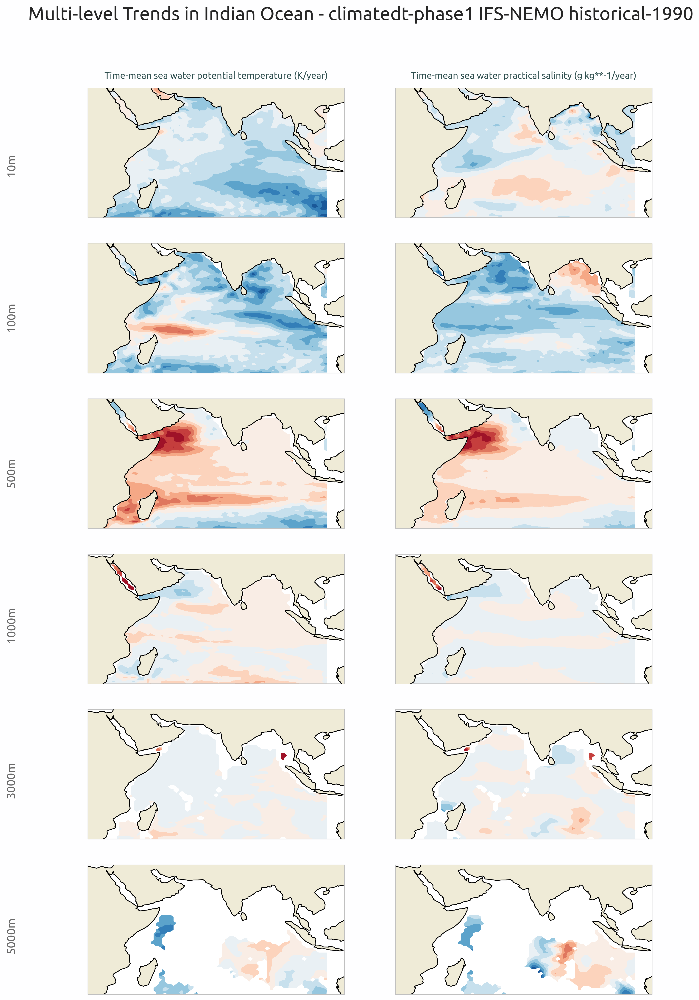
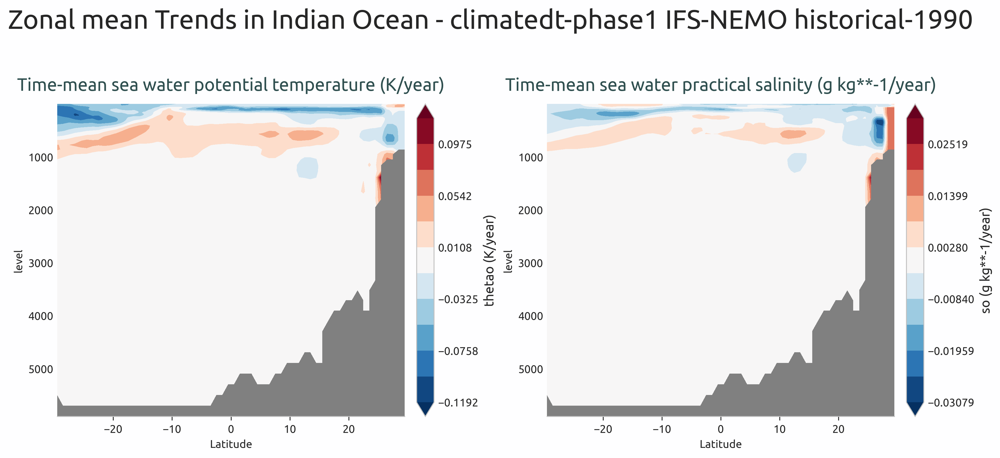

.. _ocean_trends:

Ocean Trends Diagnostic
========================

Description
-----------

The **OceanTrends** diagnostic is a set of tools for the analysis and visualization of linear trends in ocean model outputs over time.  
It computes temporal trends for ocean variables at different depths and provides spatial representations of these trends.  
The diagnostic is designed to identify systematic changes in ocean properties, which can indicate climate drift, model bias evolution, or physical climate change signals.

OceanTrends provides tools to:

- Compute linear trends over time for ocean variables
- Generate multi-level spatial maps showing trend patterns at different depths
- Produce zonal mean vertical sections of trends, particularly useful for identifying depth-dependent trend structures

The diagnostic is designed with a class that computes trend coefficients from ocean data, and another class that produces the plots.

Classes
-------

There are two main classes for analysis and plotting:

* **Trends**: retrieves ocean data and computes linear trend coefficients over time using polynomial fitting.  
  It handles temporal frequency detection, automatic unit conversion to trends per year, and spatial averaging or region selection.
  The diagnostic performs a polynomial fit of degree 1 (linear fit) to the time series at each grid point, after normalizing the time coordinate. 
  Final trend units are expressed as ``[original_units]/year``
  The ``Trender`` class from AQUA's core library, which implements robust polynomial fitting with the option to skip NaN values.
  Results are saved as class attributes and as NetCDF files.
  Regions can be predefined (e.g., Atlantic Ocean, Pacific Ocean, Global Ocean) or custom-defined by the user.

* **PlotTrends**: provides methods for plotting trend coefficients as spatial maps and zonal mean vertical sections.  
  It generates multi-level plots showing trend patterns at different depths and multi-variable comparisons.

File structure
--------------

* The diagnostic is located in the ``aqua/diagnostics/ocean_trends`` directory, which contains both the source code and the command line interface (CLI) script.
* A template configuration file is available at ``aqua/diagnostics/templates/diagnostics/config-trends.yaml``
* Notebooks are available in the ``notebooks/diagnostics/trends`` directory and contain examples of how to use the diagnostic.

Input variables and datasets
----------------------------

The diagnostic works with 3D ocean model outputs and can be applied to any ocean variable.

The primary variables typically used in this diagnostic are:

* ``thetao`` (sea water potential temperature)
* ``so`` (sea water salinity)

The diagnostic is designed to work with data from the Low Resolution Archive (LRA), generated by 
the Data reduction OPerator (DROP) of the AQUA project, which provides monthly data at a 1x1 
degree resolution.  
A higher resolution is not necessary for this diagnostic.

Basic usage
-----------

The basic usage of this diagnostic is explained with a working example in the notebook. 
The basic structure of the analysis is the following:

.. code-block:: python

<<<<<<< HEAD

=======
    
>>>>>>> 69fecb1a0d230ad27009f3531636314d8c70a015
    from aqua.diagnostics import Trends, PlotTrends

    trend = Trends(
        catalog='climatedt-phase1',
        model='IFS-NEMO',
        exp='historical-1990',
        source='lra-r100-monthly',
        startdate='01-01-1991',
        enddate='31-05-1991',
        loglevel='INFO'
    )

    trend.run(
        outputdir=".",
        var=['thetao', 'so'],
        region="io"
    )

    # Generate multi-level spatial maps
    plot_trends = PlotTrends(data = trend.trend_coef)
<<<<<<< HEAD
    plot_trends.plot_multilevel()
=======
    plot_trends.plot_multilevel(
            levels=[10, 100, 500, 1000, 3000, 5000],
            save_pdf=True,
            save_png=True,
            dpi=300
        )

>>>>>>> 69fecb1a0d230ad27009f3531636314d8c70a015

.. note::

    Trend coefficients are automatically adjusted based on the detected temporal frequency of the input data.
    If not specified otherwise, plots will be saved in PNG and PDF format in the current working directory.

    The multi-level analysis generates spatial maps of trends at specified depth levels. Default levels are:

    * **10 m** - Near-surface layer
    * **100 m** - Seasonal mixed layer base
    * **500 m** - Intermediate waters
    * **1000 m** - Deep intermediate waters
    * **3000 m** - Deep waters
    * **5000 m** - Abyssal waters

CLI usage
---------

The diagnostic can be run from the command line interface (CLI) by running the following command:

.. code-block:: bash

    cd $AQUA/aqua/diagnostics/ocean_trends
    python cli_ocean_trends.py --config <path_to_config_file>

Additionally, the CLI can be run with the following optional arguments:

- ``--config``, ``-c``: Path to the configuration file.
- ``--nworkers``, ``-n``: Number of workers to use for parallel processing.
- ``--cluster``: Cluster to use for parallel processing. By default a local cluster is used.
- ``--loglevel``, ``-l``: Logging level. Default is ``WARNING``.
- ``--catalog``: Catalog to use for the analysis. Can be defined in the config file.
- ``--model``: Model to analyse. Can be defined in the config file.
- ``--exp``: Experiment to analyse. Can be defined in the config file.
- ``--source``: Source to analyse. Can be defined in the config file.
- ``--outputdir``: Output directory for the plots.
- ``--startdate``: Start date for the analysis.
- ``--enddate``: End date for the analysis.

Configuration file structure
----------------------------

The configuration file is a YAML file that contains the details on the dataset to analyse, the output directory and the diagnostic settings.
Most of the settings are common to all the diagnostics (see :ref:`diagnostics-configuration-files`).
Here we describe only the specific settings for the ocean trends diagnostic.

* ``ocean_trends``: a block (nested in the ``diagnostics`` block) containing options for the Ocean Trends diagnostic.

  * ``multilevel``: sub-block containing specific parameters for multi-level trend analysis.

    * ``run``: enable/disable the diagnostic.
    * ``diagnostic_name``: name of the diagnostic. ``ocean3d`` by default.
    * ``var``: list of variables to analyse (typically ``['thetao', 'so']``).
    * ``regions``: list of ocean regions to analyse (e.g., ``['go', 'io', 'ao', 'so', 'arc_o', 'po']``).
    * ``dim_mean``: dimensions over which to compute spatial averages (optional, typically not used for trend maps).

.. code-block:: yaml

    diagnostics:
      ocean_trends:
        multilevel:
          diagnostic_name: 'ocean3d'
          run: true
          var: ['thetao', 'so']
          regions: ['io', 'ao', 'so', 'arc_o', 'po', 'go']

The diagnostic supports analysis over predefined ocean regions. Common regions include:

* ``io`` - Indian Ocean
* ``ao`` - Atlantic Ocean
* ``so`` - Southern Ocean
* ``arc_o`` - Arctic Ocean
* ``po`` - Pacific Ocean
* ``go`` - Global Ocean

Additional regions can be defined in ``aqua/diagnostics/config/tools/ocean3d/definitions/regions.yaml``.

Output
------

The diagnostic produces two types of plots:

* Multi-level trend maps: Spatial maps showing trend patterns at multiple depth levels. 
* Zonal mean vertical sections: Meridional-depth cross-sections showing the vertical and latitudinal structure of trends

Plots are saved in both PDF and PNG format.
Trend values for each variable at each grid point are saved as NetCDF files for further analysis.

Example Plots
-------------

All plots can be reproduced using the notebooks in the ``notebooks`` directory on LUMI HPC.

    Multi-level trend maps of sea water potential temperature and sea water practical salinity in the Indian Ocean.
    Rows show different depth levels (10m, 100m, 500m, 1000m, 3000m, 5000m). Positive values indicate warming trends.

    Zonal mean vertical section of potential temperature and practical salinity trends showing the meridional and depth structure.

Available demo notebooks
------------------------

Notebooks are stored in ``notebooks/diagnostics/ocean_trends``:

- `trends.ipynb <https://github.com/DestinE-Climate-DT/AQUA-diagnostics/tree/main/notebooks/diagnostics/ocean_trends/trends.ipynb>`_

Authors and contributors
------------------------

This diagnostic is maintained by Supriyo Gosh (`@supriyogosh <https://github.com/supriyogosh>`_, `supriyo.ghosh@bsc.es <mailto:supriyo.ghosh@bsc.es>`_).  
Contributions are welcome — please open an issue or a pull request.  
For questions or suggestions, contact the AQUA team or the maintainer.

Detailed API
------------

This section provides a detailed reference for the Application Programming Interface (API) of the "ocean3d" diagnostic,
produced from the diagnostic function docstrings.

.. automodule:: aqua.diagnostics.ocean_trends
    :members:
    :undoc-members:
    :show-inheritance: