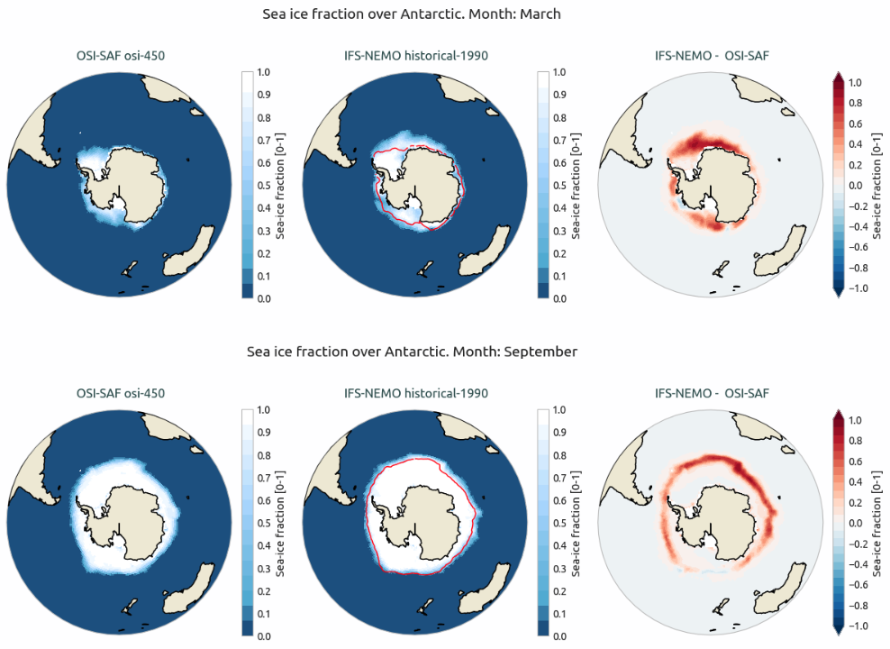
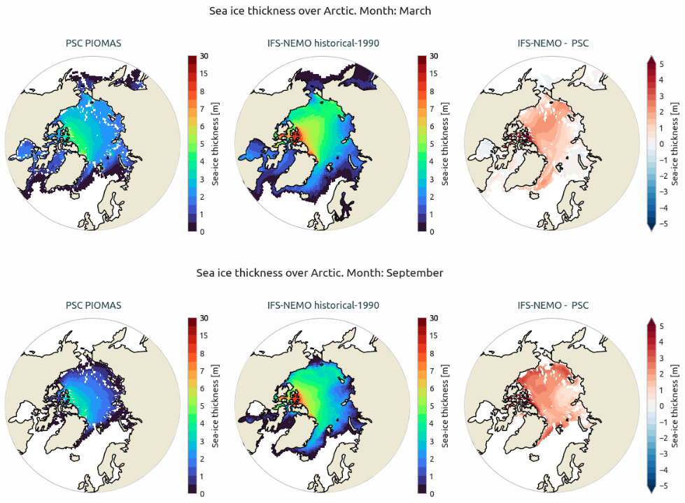

Sea ice 
=======

Description
-----------

The Sea Ice diagnostic is a set of tools to compute and plot time series, seasonal cycles and 2D spatial maps of sea ice metrics.
The diagnostic supports analysis of sea ice extent, volume, fraction, and thickness.
Time series and seasonal cycles can be computed over a specific region of the Northern or Southern Hemisphere.

The diagnostic can produce time series, seasonal cycles, 2D climatology maps, and bias maps between models and reference datasets. 
Analyses can be performed over predefined regions (Arctic, Antarctic) or custom user-defined regions specified in the configuration file.
Two main components are included:
- A class that performs the computations and prepares the data (including saving NetCDF files)
- Separate classes for producing 1D (time series) and 2D (maps) visualizations

Classes
-------

The diagnostic is organized around one main analysis class and two plotting classes:

* **SeaIce**: The SeaIce class performs all core computations for sea ice metrics — ``extent``, ``volume``, ``fraction``, and ``thickness`` metrics — for a single model or reference dataset.
It manages data loading, regional masking, spatial integration, and statistical processing.
It supports time series analysis and seasonal cycle computation with optional standard deviation calculations.

  - **Time-series methods** (compute integrated values over user-defined regions):

    - **extent**: computes the area of ocean grid cells a configurable sea-ice concentration ``threshold`` (default: 15%). 
   
    - **volume**: computes the integrated sea-ice thickness across each region.

  - **2D spatial methods** (compute monthly climatological maps):

    - **fraction**: returns monthly mean maps of sea-ice concentration (0-1).

    - **thickness**: returns monthly mean maps of sea-ice thickness (in meters).  

* **PlotSeaIce**: The PlotSeaIce class generates time-series and seasonal-cycle visualizations.
It can receive a ``xarray.DataArray``, a ``xarray.Dataset``, or a list of ``xarray.Dataset`` objects containing sea-ice diagnostics from multiple models and a reference dataset, enabling direct comparisons.

* **Plot2DSeaIce**: The Plot2DSeaIce class produces visualizations for 2D spatial climatologies and corresponding biases across all months.
It supports the same data formats as PlotSeaIce, allowing side-by-side evaluation of multiple models against observations or a chosen reference.

.. note::

    The ``extent`` and ``volume`` *methods* produce time series data, while ``fraction`` and ``thickness`` *methods* is associated to 2D spatial maps.

File structure
--------------

* The diagnostic is located in the ``aqua/diagnostics/seaice`` directory, which contains both the source code and the command line interface (CLI) script `cli_seaice.py`.  
* A template configuration file is available at ``aqua/diagnostics/templates/diagnostics/config-seaice.yaml``
* The regional definitions are defined in ``aqua/diagnostics/config/tools/seaice/definitions/regions.yaml``.
* Notebooks are available in ``notebooks/diagnostics/seaice`` directory and contain examples of how to use the diagnostic.  

Input variables and datasets
----------------------------

The classes support the following variables, although the `Fixer` class of AQUA-core can convert the acceptable 
different variable names into the following accepted variables:  

* ``siconc`` (sea ice concentration, GRIB parameter id 31)  
* ``sithick`` (sea ice thickness, GRIB parameter id 32)  
* ``sivol`` (sea ice volume, GRIB parameter id 33)  

The default reference dataset for sea ice concentration is OSI-SAF, but custom references can be provided in the configuration file.

Basic usage
-----------

A complete example is provided in the ``notebooks/diagnostics/seaice`` directory.  
The general workflow is:

**Time Series Analysis:**

.. code-block:: python

    from aqua.diagnostics import SeaIce, PlotSeaIce

    # Compute sea ice extent (time series calculation)
    si = SeaIce(model='IFS-NEMO', exp='historical-1990', source='lra-r100-monthly', loglevel="DEBUG")
    result = si.compute_seaice(method='extent', var='siconc')
    
    # Plot time series
    psi = PlotSeaIce(monthly_models=result, loglevel='DEBUG')
    psi.plot_seaice(plot_type='timeseries', save_pdf=True, save_png=True)

**2D Spatial Analysis:**

.. code-block:: python

    from aqua.diagnostics import SeaIce, Plot2DSeaIce

    # Compute sea ice fraction (2D maps calculation)
    si = SeaIce(model='IFS-NEMO', exp='historical-1990', source='lra-r100-monthly', loglevel="DEBUG")
    result = si.compute_seaice(method='fraction', var='siconc', stat='mean', freq='monthly')
    
    # Plot 2D maps
    psi_2d = Plot2DSeaIce(models=result, loglevel='DEBUG')
    psi_2d.plot_2d_seaice(plot_type='var', method='fraction', months=[3,9], 
                          projkw={'projname': 'orthographic'}, save_pdf=True, save_png=True)

.. note::

   Start/end dates, reference datasets, and regional subsets may be specified in the configuration.
   If not specified otherwise, plots will be saved in PNG and PDF format in the current working directory.

CLI usage
---------

The diagnostic can be run from the command line interface (CLI) by running the following command:

.. code-block:: bash

    cd $AQUA/aqua/diagnostics/seaice
    python cli_seaice.py --config <path_to_config_file>

Additionally, the CLI can be run with the following optional arguments:

* ``--config``, ``-c``: Path to the configuration file. Default are ``aqua/diagnostics/config/diagnostics/seaice/config_seaice-osi.yaml`` and ``config_seaice-psc.yaml``.
A template for the configuration file can be found in ``aqua/diagnostics/templates/diagnostics/config-seaice.yaml``.
* ``--nworkers``, ``-n``: Number of workers to use for parallel processing.
* ``--cluster``: Cluster to use for parallel processing. By default a local cluster is used.
* ``--loglevel``, ``-l``: Logging level. Default is ``WARNING``.
* ``--catalog``: Catalog to use for the analysis. Can be defined in the config file.
* ``--model``: Model to analyse. Can be defined in the config file.
* ``--exp``: Experiment to analyse. Can be defined in the config file.
* ``--source``: Source to analyse. Can be defined in the config file.
* ``--outputdir``: Output directory for the plots.
* ``--proj``: Projection type for 2D plots. Choices are 'orthographic' or 'azimuthal_equidistant'. Default is 'orthographic'.

Configuration file structure 
----------------------------

The configuration file is a YAML file that contains the details on the dataset to analyse or use as reference, 
the output directory and the diagnostic settings.
Most of the settings are common to all the diagnostics (see :ref:`diagnostics-configuration-files`).
Here we describe only the specific settings for the sea ice diagnostic.

The sea ice configuration file is organized into several main sections

**Dataset Configuration:**

.. code-block:: yaml

    datasets:
      - catalog: null              # mandatory as null
        model: 'IFS-NEMO'          # mandatory
        exp: 'historical-1990'     # mandatory
        source: 'lra-r100-monthly' # mandatory
        regrid: null               # if the diagnostic supports it

**Reference Datasets:**

.. code-block:: yaml

    references:
      # ---- Extent in NH ----
      - &ref_osi_nh
        catalog: 'obs'             # mandatory
        model: 'OSI-SAF'           # mandatory
        exp: 'osi-450'             # mandatory
        source: 'nh-monthly'       # mandatory
        regrid: 'r100'
        domain: "nh"

The reference datasets are defined using YAML anchors (``&ref_osi_nh``) and can be reused across different diagnostic blocks. Each reference dataset specifies:  

- ``catalog``: Data catalog identifier  
- ``model``: Reference model name (e.g., OSI-SAF, PSC)  
- ``exp``: Experiment identifier  
- ``source``: Data source specification  
- ``regrid``: Regridding target resolution  
- ``domain``: Geographic domain (nh=Northern Hemisphere, sh=Southern Hemisphere)  

**Diagnostic Blocks:**

Each diagnostic block in ``config-seaice-osi.yaml``:  

- ``seaice_timeseries``  
- ``seaice_seasonal_cycle``  
- ``seaice_2d_bias``  

contains the following parameters such as:

.. code-block:: yaml

    seaice_timeseries:
      run: true
      methods: ["extent", "volume"]   # Methods to compute
      regions: ['arctic','antarctic'] # Regions to analyze
      startdate: '1991-01-01'         # Analysis start date
      enddate: '2000-01-01'           # Analysis end date
      calc_ref_std: true              # Calculate reference standard deviation
      ref_std_freq: 'monthly'         # Standard deviation frequency
      varname:                        # Variable mapping for each method
        extent: 'siconc'
        volume: 'sithick'
        fraction: 'siconc'
        thickness: 'sithick'

**Method-specific variable mapping:**  

- ``extent`` and ``fraction``: Use ``siconc`` as variable name (sea ice concentration)
- ``volume`` and ``thickness``: Use ``sithick`` as variable name (sea ice thickness)

**Reference dataset assignment:**  

Each diagnostic block includes a ``references`` section that assigns specific reference datasets to methods:

.. code-block:: yaml

    references:
      - <<: *ref_osi_nh
        use_for_method: "extent"    # Use this reference for extent analysis
        varname: "siconc"
      - <<: *ref_psc_nh
        use_for_method: "volume"    # Use this reference for volume analysis
        varname: "sithick"

**2D Bias Configuration:**
The ``seaice_2d_bias`` block includes additional parameters for spatial analysis:

.. code-block:: yaml

    seaice_2d_bias:
      months: [3, 9]                # Months to plot (March and September)
      projections:                  # Map projection options
        orthographic:
          projname: "orthographic"
          projpars:
            central_longitude: 0.0
            central_latitude: "max_lat_signed"
        extent_regions:             # Geographic extent for each region
          Arctic: [-180, 180, 50, 90]
          Antarctic: [-180, 180, -50, -90]

``projections`` can be tuned to the user according to the section 'Projections and custom maps' in :ref:`graphic-tools`.  

**Output Configuration:**  

.. code-block:: yaml

    output:
      outputdir: "./"               # Output directory
      rebuild: true                 # Overwrite existing files
      save_netcdf: true             # Save NetCDF files
      save_pdf: true                # Save PDF plots
      save_png: true                # Save PNG plots
      dpi: 300                      # Plot resolution

.. note::

    The configuration file uses YAML anchors (``&ref_osi_nh``) and references (``<<: *ref_osi_nh``) to avoid duplication. 
    This allows the same reference dataset definition to be reused across different diagnostic blocks with method-specific assignments.

Output
------

The diagnostic produces:

* **NetCDF files**: Integrated sea ice extent/volume time series, seasonal cycles, 2D climatological maps (fraction, thickness)  

* **Time series plots**: Monthly time series of sea ice extent and volume for specified regions.  
* **Seasonal cycle plots**: Monthly climatology of sea ice metrics with optional standard deviation bands.  
* **2D spatial maps**: Climatological maps of sea ice fraction and thickness for specific months and regions.  
* **Bias maps**: Spatial differences between model and reference sea ice data for specific months and regions.  

Plots are saved in both PDF and PNG format.

Reference datasets
------------

The default reference dataset is OSI-SAF.
Details on the reference dataset are available on the website of the Ocean and Sea Ice Satellite Application Facility (OSI-SAF) `here <https://osi-saf.eumetsat.int/>`_.  
An updated version is available in AQUA ``obs`` catalog named ``exp=osi-saf-aqua``, which concatentes OSI-SAF osi-450-a1 (1979 - 2021) and OSI-SAF osi-430 (2022 - 2024) datasets.  

See also: 

* Lavergne, T., Sørensen, A. M., Kern, S., Tonboe, R., Notz, D., Aaboe, S., Bell, L., Dybkjær, G., Eastwood, S., Gabarro, C., Heygster, G., Killie, M. A., Brandt Kreiner, M., Lavelle, J., Saldo, R., Sandven, S., & Pedersen, L. T. (2019). Version 2 of the EUMETSAT OSI SAF and ESA CCI sea-ice concentration climate data records. The Cryosphere, 13(1), 49-78. https://doi.org/10.5194/tc-13-49-2019.  

* Knowles, K., E. G. Njoku, R. Armstrong, and M. J. Brodzik. 2000. Nimbus-7 SMMR Pathfinder Daily EASE-Grid Brightness Temperatures, Version 1. Boulder, Colorado USA. NASA National Snow and Ice Data Center Distributed Active Archive Center. https://doi.org/10.5067/36SLCSCZU7N6.

Example Plots
---------------

.. figure:: figures/seaice_ts_volume_Arctic_Antarctic.png
   :width: 100%

.. figure:: figures/seaice_seasonalcycle_extent_Arctic_Antarctic.png
   :width: 100%

.. figure:: figures/seaice_2d_fraction_Arctic_3-9.png
   :width: 100%

.. figure:: figures/seaice_2d_thickness_Antarctic_3-9.png
   :width: 100%

Available demo notebooks
------------------------

Notebooks are stored in `diagnostics/seaice/notebooks`

* `seaice_timeseries.ipynb <https://github.com/DestinE-Climate-DT/AQUA-diagnostics/tree/main/notebooks/diagnostics/seaice/seaice_timeseries.ipynb>`_
* `seaice_seasonalcycle.ipynb <https://github.com/DestinE-Climate-DT/AQUA-diagnostics/tree/main/notebooks/diagnostics/seaice/seaice_seasonalcycle.ipynb>`_
* `seaice_2d.ipynb <https://github.com/DestinE-Climate-DT/AQUA-diagnostics/tree/main/notebooks/diagnostics/seaice/seaice_2d.ipynb>`_

Authors and contributors
------------------------

This diagnostic is maintained by Emanuele Tovazzi (@tovaz92, emanueletovazzi [at] cnr.it), member of the AQUA team.
Contributions are welcome — please open an issue or a pull request. For questions or suggestions, contact the AQUA team or the maintainers.

Detailed API
------------

This section provides a detailed reference for the Application Programming Interface (API) of the Seaice diagnostic, produced from the diagnostic function docstrings.

.. automodule:: aqua.diagnostics.seaice
    :members:
    :undoc-members:
    :show-inheritance:
