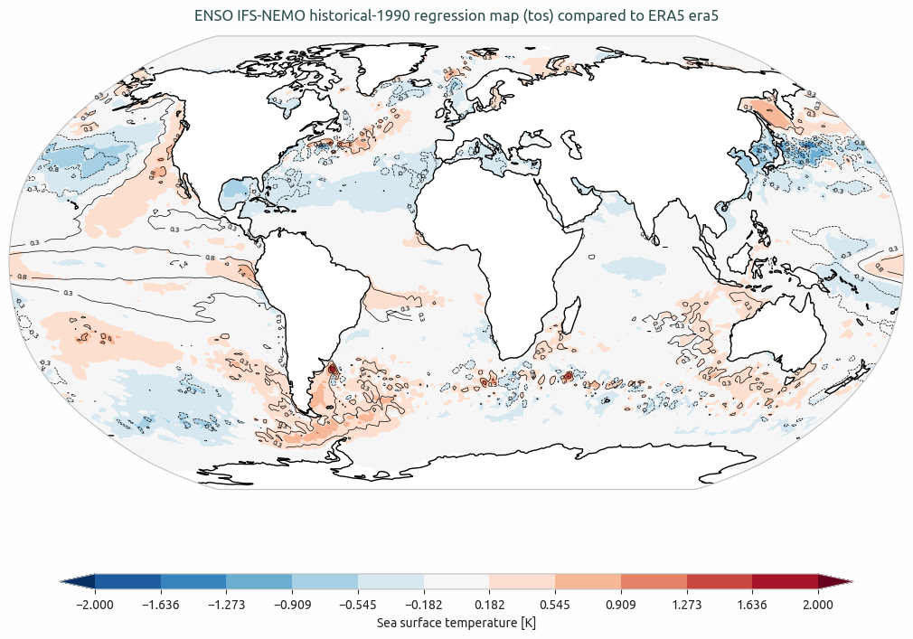

.. _teleconnections:

Teleconnections
===============

Description
-----------

The teleconnections diagnostic is a set of tool to compute the most relevant teleconnections.
NAO (North Atlantic Oscillation), ENSO (El Niño Southern Oscillation) and MJO (Madden-Julian Oscillation) are the teleconnections currently implemented.
The diagnostic is build to evaluate the teleconnections indices and to compute regression and correlation maps with respect to the teleconnection index.

.. note::
    MJO is currently missing a command line interface and it is not operational yet.

Classes
-------

There are three classes to compute the netCDF files:

- **NAO**: a class that computes the NAO index based on the mean sea level pressure (msl) variable with the station based
  method, and computes the regression and correlation maps with respect to the NAO index.
- **ENSO**: a class that computes the ENSO index based on the sea surface temperature (tos) variable with the Nino3.4 region
  and computes the regression and correlation maps with respect to the ENSO index.
- **MJO**: a class that allows to compute the MJO Hovmoeller plots based on the top net thermal radiation flux (tnlwrf) variable.

There are three other classes to produce the plots:

- **PlotNAO**: a class that ingests xarrays and produces the NAO index time series and the regression and correlation maps.
- **PlotENSO**: a class that ingests xarrays and produces the ENSO index time series and the regression and correlation maps.
- **PlotMJO**: a class that ingests xarrays and produces the MJO Hovmoeller plots.

File structure
--------------

* The diagnostic is located in the ``aqua/diagnostics/teleconnections`` directory, which contains the source code and the command line interface (CLI) script.
* A template configuration file is available at ``aqua/diagnostics/templates/diagnostics/config-teleconnections.yaml``
* Notebooks are available in the ``notebooks/diagnostics/teleconnections`` directory and contain examples of how to use the diagnostic.
* Interface files to specify custom regions or other variable names for the index evaluation are available in the ``aqua/diagnostics/config/tools/teleconnections/definitions`` directory.

.. note::
    A command line to evaluate with the bootstrap method the concordance maps of regression and correlation is available in the ``cli_bootstrap.py`` file.
    This is not included in any automatic run of the diagnostic because it is a time-consuming process.

Input variables and datasets
----------------------------

By default, the diagnostics compare against the ERA5 dataset, with the index evaluated over the entire available period (1940 to present).

The necessary variables for the default evaluation are:
- **NAO**: Sea level pressure (msl).
- **ENSO**: Sea surface temperature (tos).
- **MJO**: Top net thermal radiation flux (tnlwrf).

Other variables can be used for the regression and correlation maps.

CLI usage
---------

The diagnostic can be run from the command line interface (CLI) by running the following command:

.. code-block:: bash

    cd $AQUA/aqua/diagnostics/teleconnections
    python cli_teleconnections.py --config <path_to_config_file>

Three configuration files are provided and run when executing the aqua-analysis (see :ref:`aqua_analysis`).
Two configuration files are for atmospheric and oceanic teleconnections.

Additionally the CLI can be run with the following optional arguments:

- ``--config``, ``-c``: Path to the configuration file.
- ``--nworkers``, ``-n``: Number of workers to use for parallel processing.
- ``--cluster``: Cluster to use for parallel processing. By default a local cluster is used.
- ``--loglevel``, ``-l``: Logging level. Default is ``WARNING``.
- ``--catalog``: Catalog to use for the analysis. It can be defined in the config file.
- ``--model``: Model to analyse. It can be defined in the config file.
- ``--exp``: Experiment to analyse. It can be defined in the config file.
- ``--source``: Source to analyse. It can be defined in the config file.
- ``--outputdir``: Output directory for the plots.

Configuration file structure
---------------------

The configuration file is a YAML file that contains the details on the dataset to analyse or use as reference, the output directory and the diagnostic settings.
Most of the settings are common to all the diagnostics (see :ref:`diagnostics-configuration-files`).
Here we describe only the specific settings for the teleconnections diagnostic.

* ``teleconnections``: a block, nested in the ``diagnostics`` block, that contains the details required for the teleconnections.
    It allows to specify which teleconnections to run, the months window for the rolling mean, the seasons to consider, and the color bar range for the plots.
    It contains the following blocks:
    
        * ``NAO``: a block, nested in the ``teleconnections`` block, that contains the details required for the NAO teleconnection.
        * ``ENSO``: a block, nested in the ``teleconnections`` block, that contains the details required for the ENSO teleconnection.

.. code-block:: yaml

    diagnostics:
        teleconnections:
            NAO:
                run: true
                months_window: 3
                seasons: ['DJF']
                cbar_range: [-5, 5]
            ENSO:
                run: true
                months_window: 3
                seasons: ['annual']
                cbar_range: [-2, 2]

Output
------

The diagnostic produces the following outputs:

- `NAO`: North Atlantic Oscillation index, regression and correlation maps.
- `ENSO`: El Niño Southern Oscillation index, regression and correlation maps.
- `MJO`: Madden-Julian Oscillation Hovmoeller plots of the Mean top net thermal radiation flux variable.

All these outputs can be stored both as images (pdf format) and as netCDF files.
If a reference dataset is provided, the automatic maps consist of contour lines for the model regression map 
and filled contour map for the difference between the model and the reference regression map.

Example Plots
-------------

   ENSO IFS-NEMO ssp370 regression map (avg_tos) compared to ERA5.
   The contour lines are the model regression map and the filled contour map is the difference between the model and the reference regression map (ERA5).

.. _teleconnections_notebooks:

Available demo notebooks
------------------------

- `NAO <https://github.com/DestinE-Climate-DT/AQUA-diagnostics/tree/main/notebooks/diagnostics/teleconnections/NAO.ipynb>`_
- `ENSO <https://github.com/DestinE-Climate-DT/AQUA-diagnostics/tree/main/notebooks/diagnostics/teleconnections/ENSO.ipynb>`_
- `statistical_validation <https://github.com/DestinE-Climate-DT/AQUA-diagnostics/tree/main/notebooks/diagnostics/teleconnections/statistical_validation.ipynb>`_
- `MJO <https://github.com/DestinE-Climate-DT/AQUA-diagnostics/tree/main/notebooks/diagnostics/teleconnections/MJO.ipynb>`_

Authors and contributors
------------------------

This diagnostic is maintained by Matteo Nurisso (`@mnurisso <https://github.com/mnurisso>`_, `m.nurisso@isac.cnr.it <mailto:m.nurisso@isac.cnr.it>`_).
Contributions are welcome, please open an issue or a pull request.
If you have any doubt or suggestion, please contact the AQUA team or the maintainers.

Detailed API
------------

This section provides a detailed reference for the Application Programming Interface (API) of the Teleconnections diagnostic,
produced from the diagnostic function docstrings.

.. automodule:: aqua.diagnostics.teleconnections
    :members:
    :undoc-members:
    :show-inheritance:
