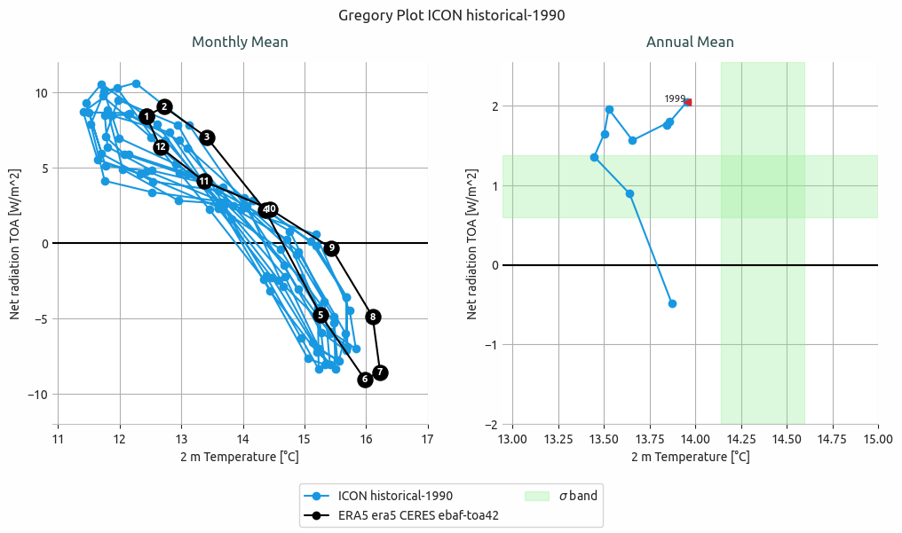
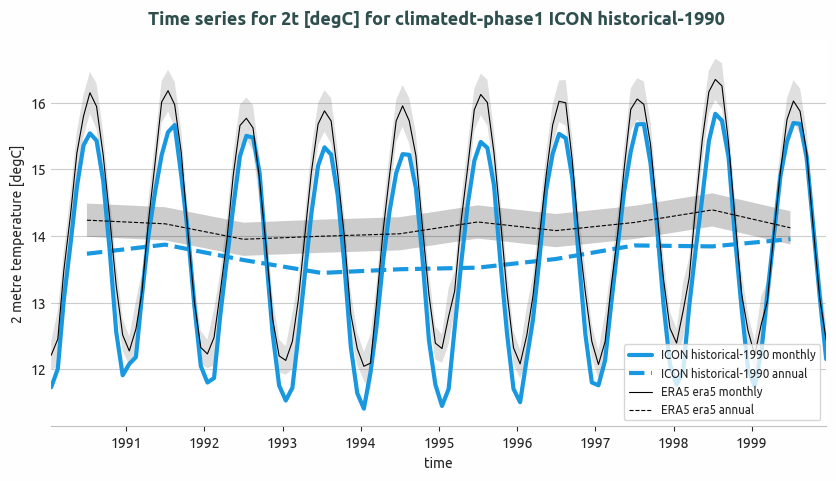
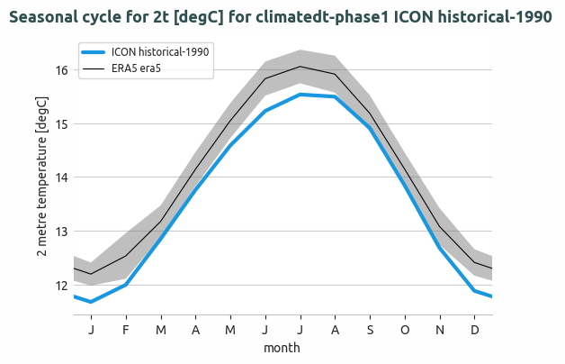

.. _timeseries:

Timeseries Diagnostic
=====================

Description
-----------

The Timeseries diagnostic is a set of tools to compute and plot time series, seasonal cycles and Gregory-like plot of a given variable or formula for a given model or list of models.
Time series and seasonal cycles can be computed globally or for a specific area.
The three functionalities are designed to have a class which analyse a single model to produce the netCDF files and another class to produce the plots.
The diagnostic can compare the model time series with a reference dataset, which is defined in the configuration file.

Classes
-------

There are three classes for the analysis:

* **Timeseries**: computes time series of a given variable or formula for a given model or dataset. 
  Comparison with a reference dataset is also possible. It supports hourly, daily, monthly and yearly time series and area selection.
  It can also compute the standard deviation of the time series.
* **SeasonalCycles**: computes the seasonal cycle of a given variable or formula for a given model or dataset.
  Comparison with a reference dataset is also possible. It can also compute the standard deviation of the seasonal cycle. It supports area selection.
* **Gregory**: computes the monthly and annual time series necessary for the Gregory-like plot of net radiation TOA and 2 metre temperature.
  It can also compute the standard deviation of the time series.

There are three other classes for the plotting:

* **PlotTimeseries**: ingests xarrays and produces the plots for the time series.
  Info necessary for titles, legends and captions are deduced from the xarray attributes.
* **PlotSeasonalCycles**: ingests xarrays and produces the plots for the seasonal cycle.
  Info necessary for titles, legends and captions are deduced from the xarray attributes.
* **PlotGregory**: ingests xarrays and produces the Gregory-like plot.
  Info necessary for titles, legends and captions are deduced from the xarray attributes.

.. warning::

    Hourly and daily plots are not available yet, while the netCDF files are produced.

File structure
--------------

* The diagnostic is located in the ``aqua/diagnostics/timeseries`` directory, which contains both the source code and the command line interface (CLI) script.
* A template configuration file is available at ``aqua/diagnostics/templates/diagnostics/config-timeseries.yaml``
* Notebooks are available in the ``notebooks/diagnostics/timeseries`` directory and contain examples of how to use the diagnostic.
* A list of available regions is available in the ``aqua/diagnostics/config/tools/timeseries/definitions/regions.yaml`` file.

Input variables and datasets
----------------------------

By default, the diagnostic compares against the ERA5 dataset, with standard deviation calculated over the period 1990-2020.
The Gregory-like plot uses the CERES dataset for the Net radiation TOA and the BERKELEY-EARTH dataset for the 2 metre temperature.

Default variables used for the timeseries and seasonal cycles analyses can be found in the configuration file.
The Gregory-like plot requires the Net radiation TOA and the 2 metre temperature.

Basic usage
-----------

The basic usage of this diagnostic is explained with a working example in the notebook. 
The basic structure of the analysis is the following:

.. code-block:: python

    from aqua.diagnostics import Timeseries, PlotTimeseries

    ts_dataset = Timeseries(catalog='climatedt-phase1',
                model= 'ICON',
                exp='historical-1990',
                source= 'lra-r100-monthly')

    ts_obs = Timeseries(catalog='obs',
                model= 'ERA5',
                exp= 'era5',
                source= 'monthly',)

    ts_dataset.run(var= '2t', units= 'degC')
    ts_obs.run(var= '2t', units= 'degC', std=True)

    plot_dict = {'monthly_data': ts_dataset.monthly,
                  'annual_data': ts_dataset.annual,
                  'ref_monthly_data': ts_obs.monthly,
                  'ref_annual_data': ts_obs.annual,
                  'std_monthly_data': ts_obs.std_monthly,
                  'std_annual_data': ts_obs.std_annual,
                  'loglevel': 'INFO'}

    plot = PlotTimeseries(**plot_dict)
    fig, _ = plot.plot_timeseries()

CLI usage
---------

The diagnostic can be run from the command line interface (CLI) by running the following command:

.. code-block:: bash

    cd $AQUA/aqua/diagnostics/timeseries
    python cli_timeseries.py --config <path_to_config_file>

Three configuration files are provided and run when executing the aqua-analysis (see :ref:`aqua_analysis`).

Additionally CLI arguments are described in the :ref:`diagnostics-cli-arguments` section.

Configuration file structure
----------------------------

The configuration file is a YAML file that contains the details on the dataset to analyse or use as reference, the output directory and the diagnostic settings.
Most of the settings are common to all the diagnostics (see :ref:`diagnostics-configuration-files`).
Here we describe only the specific settings for the time series diagnostic.

* ``timeseries``: a block, nested in the ``diagnostics`` block, that contains the details required for the time series.
  The parameters specific to a single variable are merged with the default parameters, giving priority to the specific ones.

.. code-block:: yaml

    diagnostics:
      timeseries:
        run: true # to enable the time series
        diagnostic_name: 'atmosphere'
        variables: ['2t', 'tprate']
        formulae: ['tnlwrf+tnswrf']
        center_time: true # center the time axis of the time series
        extend: true # extend the time series with climatology if data is missing at the beginning or end
        exclude_incomplete: true # check if all chunks are complete present before computing the time average
        params:
          default:
            hourly: false # Frequency to enable
            daily: false
            monthly: true
            annual: true
            std_startdate: '1990-01-01'
            std_enddate: '2020-12-31'
          tnlwrf+tnswrf:
            short_name: "net_top_radiation"
            long_name: "Net top radiation"
          tprate:
            units: 'mm/day'
            short_name: 'tprate'
            long_name: 'Total precipitation rate'
            regions: ['tropics', 'europe'] # regions to plot the time series other than global

* ``seasonalcycles``: a block, nested in the ``diagnostics`` block, that contains the details required for the seasonal cycle.
  The parameters specific to a single variable are merged with the default parameters, giving priority to the specific ones.

.. code-block:: yaml

    diagnostics:
      seasonalcycles:
        run: true # to enable the seasonal cycle
        diagnostic_name: 'atmosphere'
        variables: ['2t', 'tprate']
        center_time: true # center the time axis of the seasonal cycle
        exclude_incomplete: true # check if all chunks are complete present before computing the time average
        params:
          default:
            std_startdate: '1990-01-01'
            std_enddate: '2020-12-31'
          tprate:
            units: 'mm/day'
            long_name: 'Total precipitation rate'

* ``gregory``: a block, nested in the ``diagnostics`` block, that contains the details required for the Gregory-like plot.

.. code-block:: yaml

    diagnostics:
      gregory:
        run: true # to enable the Gregory plot
        diagnostic_name: 'climate_metrics'
        t2m: '2t' # variable name for the 2 metre temperature
        net_toa_name: 'tnlwrf+tnswrf' # formula or variable name for the Net radiation TOA
        monthly: true
        annual: true
        std: true
        std_startdate: '1990-01-01'
        std_enddate: '2020-12-31'
        # Gregory needs 2 datasets and do not care about the references block above
        t2m_ref: {'catalog': 'obs', 'model': 'BERKELEY-EARTH', 'exp': 'aqua-filled', 'source': 'r100-monthly'}
        net_toa_ref: {'catalog': 'obs', 'model': 'CERES', 'exp': 'ebaf-toa421', 'source': 'monthly'}    

Output
------

The diagnostic produces three types of plots (see :ref:`timeseries_examples`):

* A comparison of monthly and/or annual global mean time series of the model and the reference dataset.
* A comparison of the seasonal cycle of the model and the reference dataset.
* A Gregory-like plot of the model and the reference dataset as bands.

The timeseries, reference timeseries and standard deviation timeseries are also saved in the output directory as netCDF files.

Observations
------------

The default reference dataset is ERA5 reanalysis, provided by ECMWF.

The diagnostic uses ERA5 monthly averages from the AQUA ``obs`` catalog (``model=ERA5``, ``exp=era5``, ``source=monthly``) for the global mean time series and seasonal cycle.

The Gregory-like plot uses BERKELEY-EARTH for the 2m temperature and CERES for the Net radiation TOA.

Custom reference datasets can be configured in the configuration file.

.. note::

    Multiple reference time series and seasonal cycles plot are planned for the future.

.. _timeseries_examples:

Example Plots
-------------

A plot for each class is shown below.
All these plots can be produced by running the notebooks in the ``notebooks`` directory on LUMI HPC.

    Gregory plot of ICON historical-1990 simulation.

    Global mean temperature time series of ICON historical-1990 and comparison with ERA5.
    Both monthly and annual timeseries are shown. A 2 sigma confidence interval is evaluated for ERA5 data (1990-2020).

    Seasonal cycle of the global mean temperature of IFS-NEMO historical-1990 and comparison with ERA5.
    The 2 sigma confidence interval is evaluated for ERA5 data (1990-2020).

Available demo notebooks
------------------------

Notebooks are stored in ``notebooks/diagnostics/timeseries``:

* `timeseries.ipynb <https://github.com/DestinE-Climate-DT/AQUA-diagnostics/tree/main/notebooks/diagnostics/timeseries/timeseries.ipynb>`_
* `seasonalcycles.ipynb <https://github.com/DestinE-Climate-DT/AQUA-diagnostics/tree/main/notebooks/diagnostics/timeseries/seasonalcycles.ipynb>`_
* `gregory.ipynb <https://github.com/DestinE-Climate-DT/AQUA-diagnostics/tree/main/notebooks/diagnostics/timeseries/gregory.ipynb>`_

Authors and contributors
------------------------

This diagnostic is maintained by Matteo Nurisso (`@mnurisso <https://github.com/mnurisso>`_, `matteo.nurisso@polito.it <mailto:matteo.nurisso@polito.it>`_).
Contributions are welcome — please open an issue or a pull request.
For questions or suggestions, contact the AQUA team or the maintainer.

Detailed API
------------

This section provides a detailed reference for the Application Programming Interface (API) of the ``timeseries`` diagnostic,
produced from the diagnostic function docstrings.

.. automodule:: aqua.diagnostics.timeseries
    :members:
    :undoc-members:
    :show-inheritance:
